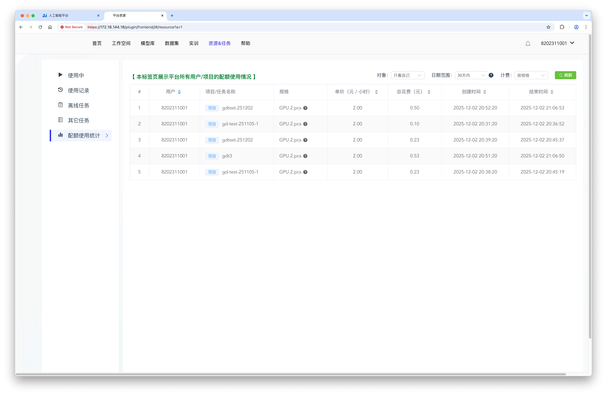
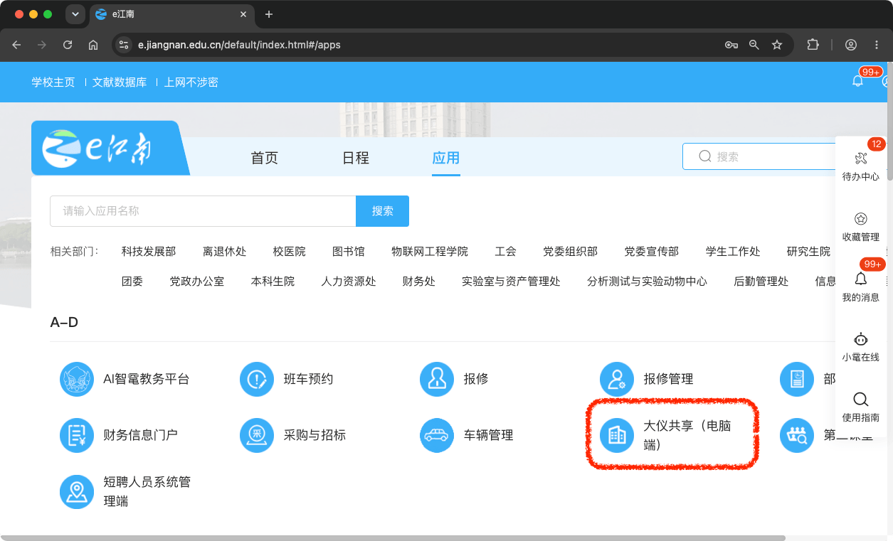
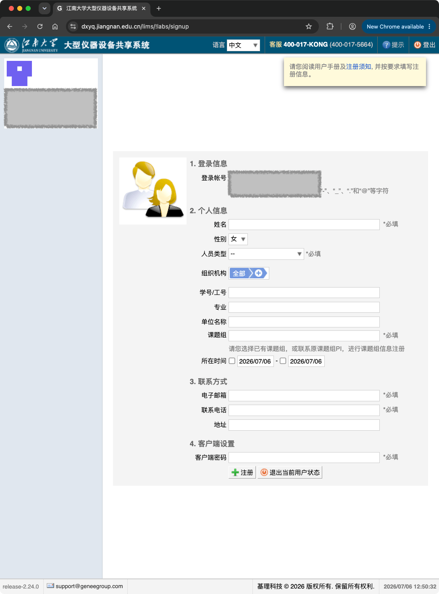
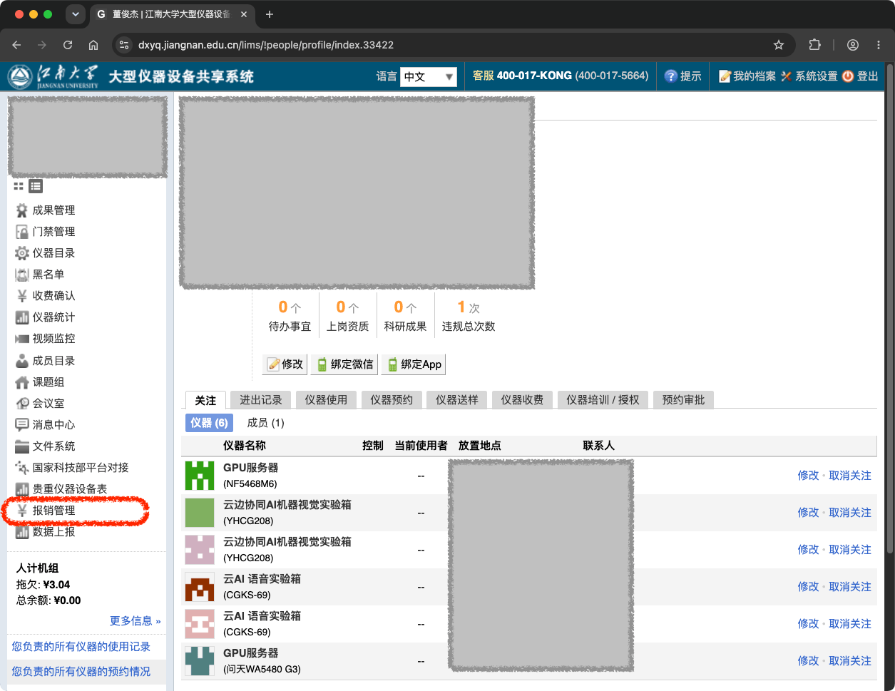
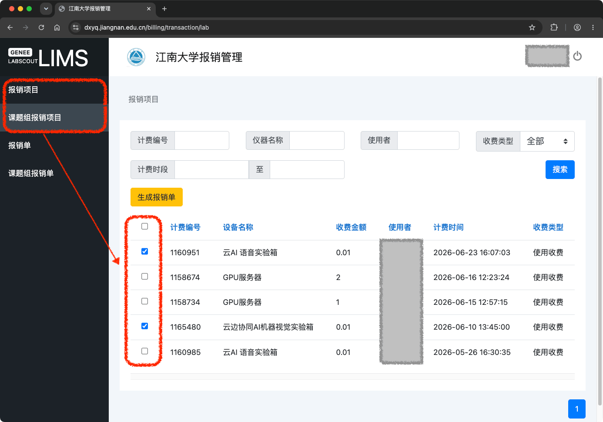
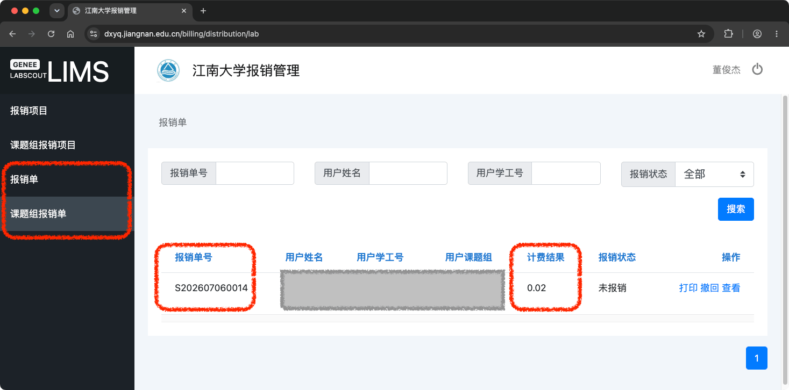

# 人工智能算力平台
{: .no_toc }

<!--  -->

  
✳️ 目录

- TOC
{:toc}

<!--  -->

  
ℹ️ 更新历史

 

**260706**
- 新增：[多人同时使用开发板（昇腾）](#多人同时使用开发板昇腾)
- 新增：[多人同时使用开发板（鲲鹏）](#多人同时使用开发板鲲鹏)

关于学院算力平台的使用说明、费用查看，以及转账充值。

---

## 使用简要说明
 
下载链接：[算力平台使用简要说明-v1.30-221107](./aicr.assets/算力平台使用简要说明-v1.30-251107.pdf)

---

## 费用查看
 
L40 和 A100 费用，可在相应功能中查看。

### L40费用查看
 
L40 的费用，可在 `资源&任务 | 配额使用统计` 中查看。

### A100费用查看
 
A100 的费用，可在 `计费管理 | 账单管理` 中查看。

---

## 转账充值全攻略
`[aka] transfer`

转账充值全攻略，请参考：[【江南大仪共享】大仪开放共享系统转账充值全攻略](https://mp.weixin.qq.com/s/O6HFNKmMqv9C-ygCutl_KA)

以下是简要说明，供参考。

### 0-关注微信通知
 
算力平台管理员，将在月初发信息给老师，关于上个月的费用。收到信息后，可进行后续步骤操作。

✳️ 当年度的费用，需要在当年 12月份之前完成转账。

### 1-登录大仪共享平台
`[aka] sinup`

e江南  → 大仪共享（电脑端）

如尚未注册大仪共享平台，则要求先注册，如下所示：

- ✳️ 加入已有课题组的，申请账号的时候，选择对应课题组就好，由课题组负责人激活。
- ✳️ 需成立新课题组的，老师注册好后，将老师名字/工号/电话发给算力平台管理员（董老师）。将联系大仪共享平台管理员（管老师）处理。
- 课题组负责人对本课题组成员的费用负责。

### 2-生成报销单
 
按以下步骤，在大仪共享平台，生成报销单。

**1、点击“报销管理”**

**2、选择收费记录并生成报销单**

点击“报销项目（或课题组报销项目）” → 选择收费记录 → 点击“生成报销单”按钮 

**3、查看报销单，并记录单号和金额**

点击“报销单（或课题组报销单）” → 查看并记录“<ins>报销单号</ins>”和金额（“<ins>计费结果</ins>”）

<!--  -->
<!-- 

1、Nvidia L40，32张

参考资料：https://images.nvidia.cn/content/Solutions/data-center/vgpu-L40-datasheet.pdf

Nvidia L40, 90.5 TFLOPS(FP32) / 48GB

L40 算力，共：2896 TFLOPS(FP32)

2、NVIDIA A100 80GB PCIe，3张

参考资料：https://www.nvidia.com/content/dam/en-zz/Solutions/Data-Center/a100/pdf/nvidia-a100-datasheet-nvidia-us-2188504-web.pdf

Nvidia A100，19.5 TFLOPS(FP32) / 80GB
Nvidia A100，312 TFLOPS(FP16) / 80GB

A100 算力，共：58.5 TFLOPS(FP32)

3、Nvidia H100 80GB，1张

参考资料：https://resources.nvidia.com/en-us-hopper-architecture/nvidia-tensor-core-gpu-datasheet?ncid=no-ncid

Nvidia H100，67 TFLOPS(FP32) / 80GB
Nvidia H100，1979 TFLOPS(FP16) / 80GB

H100 算力，共：67 TFLOPS(FP32)
 -->