# 鲲鹏开发板
{: .no_toc }
`更新-260507` \| `发布-260420`

本文档描述 **鲲鹏开发板** 的相关信息，用于快速熟悉和入门教具。

<!--  -->
<details markdown="block">
  <summary>✳️ 目录</summary>
- TOC
{:toc}
</details>

<details markdown="block">
  <summary>ℹ️ 更新历史</summary>
<br>
**260506**
- 新增：[连接外网](#连接外网)
</details>

---

## 默认信息
<br>
操作系统烧录后，有以下默认信息：

### 默认账号密码
<br>
鲲鹏开发板的默认账号密码如下：

- 账号：`HwHiAiUser` \| 密码：`Mind@123`
- 账号：`root` \| 密码：`Mind@123`

### 默认IP
<br>
鲲鹏开发板的默认 IP 如下：

- IP地址：`192.168.137.200`
- 子网掩码：`255.255.255.0`

---

<span id="nets"></span>
## 连接外网
<br>
可参考开发板官网的 [通过PC共享网络联网（Windows）↗](https://www.hiascend.com/document/detail/zh/Atlas200IDKA2DeveloperKit/23.0.RC2/Hardware%20Interfaces/hiug/hiug_0010.html)

上述指导，以“可以访问互联网的 WiFi，共享给开发板”为例。也可以将“本地电脑可以访问互联网的以太网（插网线的），共享给开发板”，操作步骤是一样的。

本地电脑连2个网线（以太网），1个连开发板：**以太网（连开发板）**，1个连外网（可以访问互联网）：**以太网（连外网）**。

以太网（连外网）：
- 点击 **更多适配器选项** 右边的 **编辑** 按钮
- 在 **以太网（连外网）属性** 界面中，有2个 tab 页：网络和共享，选择 **共享** tab页
- 中间的**请选一个专用网络连接**，选择 **以太网（连开发板）**
- 2个 **允许其他网络用户……**，都勾选上
- 按 **确定** 按钮

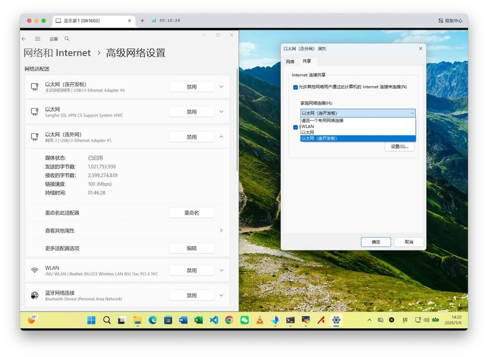

提示框显示：“Internet 连接共享被启用时……”，点击 **是(Y)**

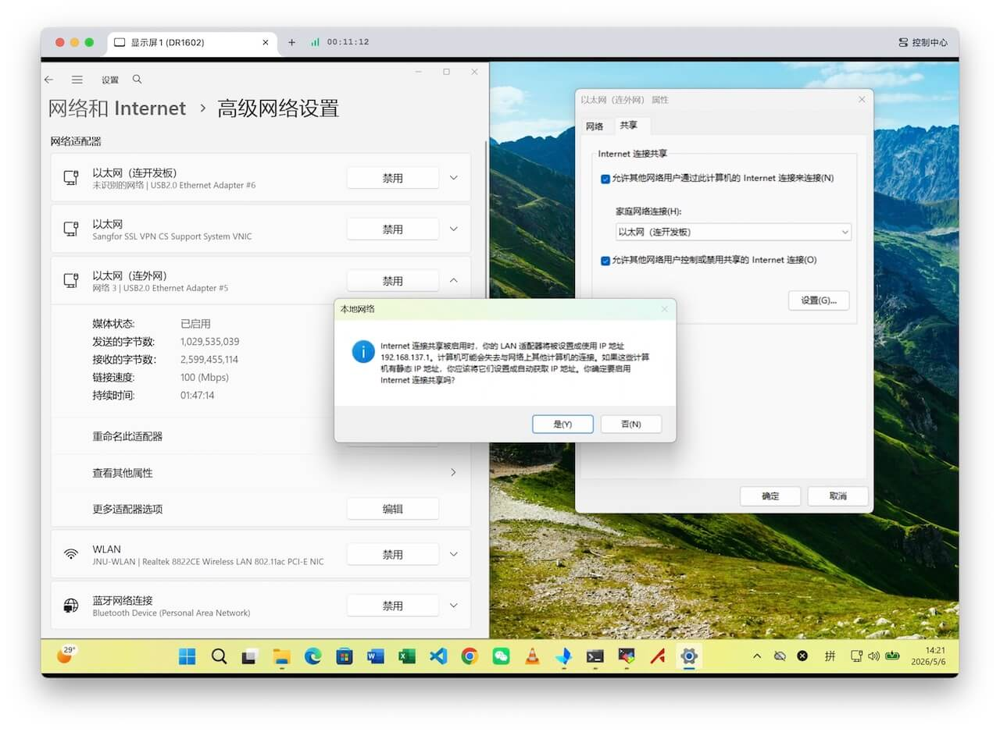

---

## 体验样例代码
<br>
除了可体验鲲鹏开发板自带的预置样例外，还可以通过如下方式体验升腾开发板的预置样例。

1. 点击下载：[昇腾开发板预置样例代码↗]

2. 建议放到开发板指定目录下。zip 包名为 `samples_aidk.zip`，600多MB，网速不同下载耗时不同。将下载的 zip 包上传 / 移动到用户 `HwHiAiUser` 的 HOME 目录下，完整路径是  `/home/HwHiAiUser`。

3. 解压缩。依次执行以下命令：

    先切换到 HOME 目录

    ```bash
    cd ~
    ```

    然后解压缩

    ```bash
    unzip samples_aidk.zip
    ```

    解压缩完成后，生成目录 samples_aidk，完整路径是  `/home/HwHiAiUser/samples_aidk`。

4. 启动样例代码服务端。依次执行以下命令：

    先切换样例所在目录

    ```bash
    cd ~/samples_aidk/notebook
    ```

    然后启动 Jupyter lab 服务端

    ```bash
    ./start_notebook.sh 192.168.137.200
    ```

    ✳️ 然后复制界面上出现的 `http://192.168.137.100:8888/lab?token=一串数字字母`。

5. 本地电脑 Web 浏览器体验。在本地电脑 Web 浏览器访问刚才复制的 `http://192.168.137.100:8888/lab?token=一串数字字母`

    ✳️ 后续体验步骤，可参考：[熟悉昇腾开发者套件↗]。

6. 部分截图

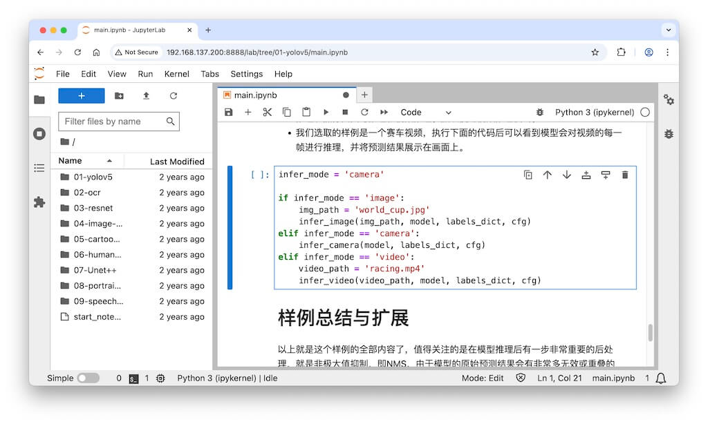
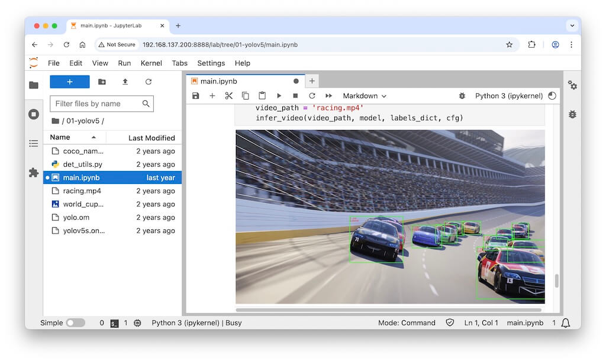
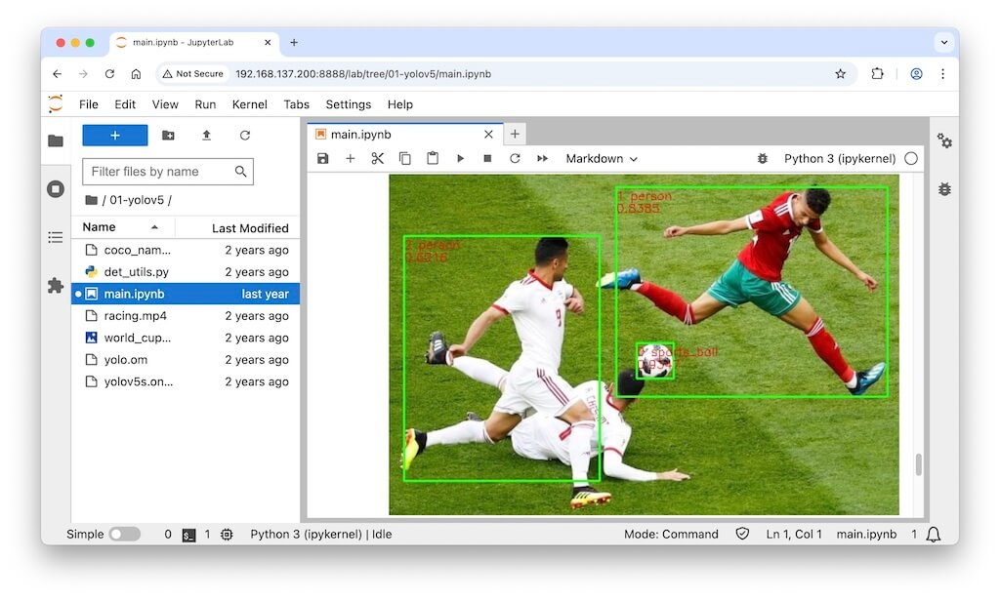
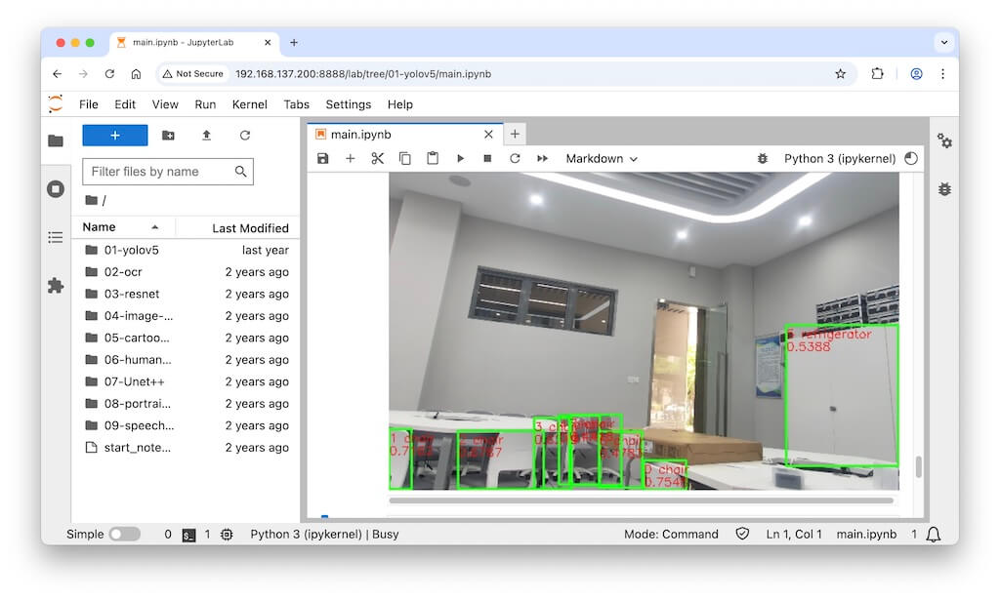
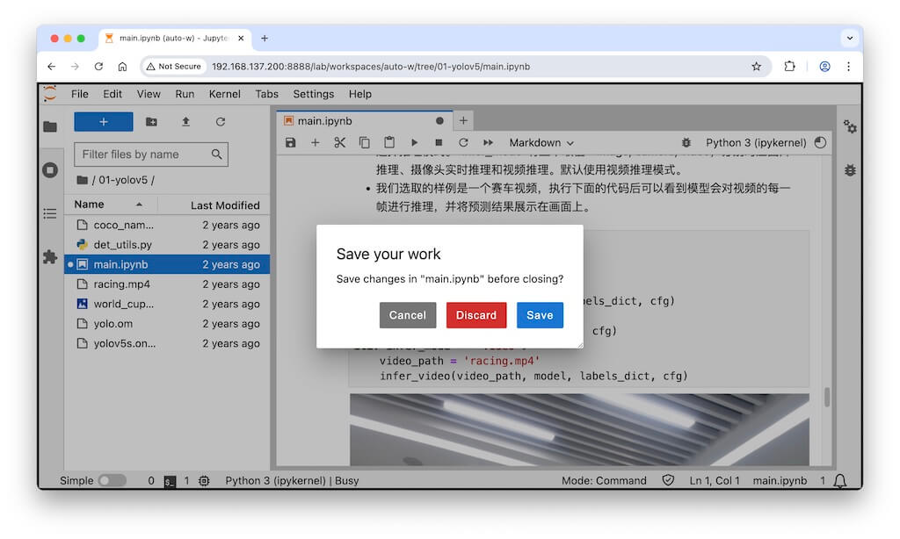
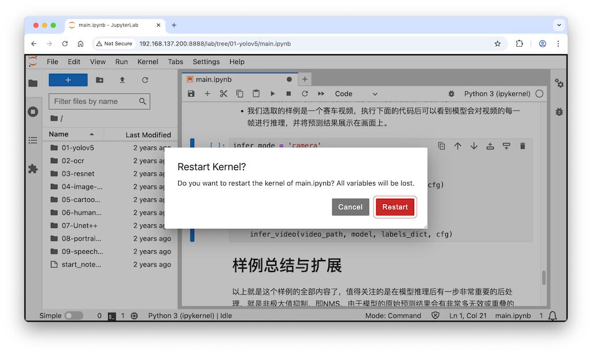
<!-- 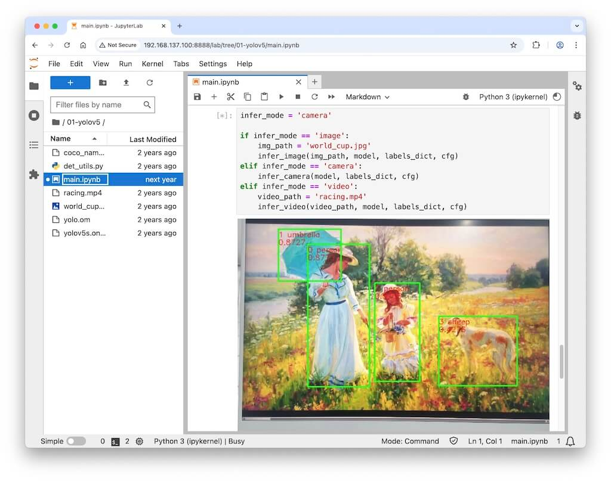
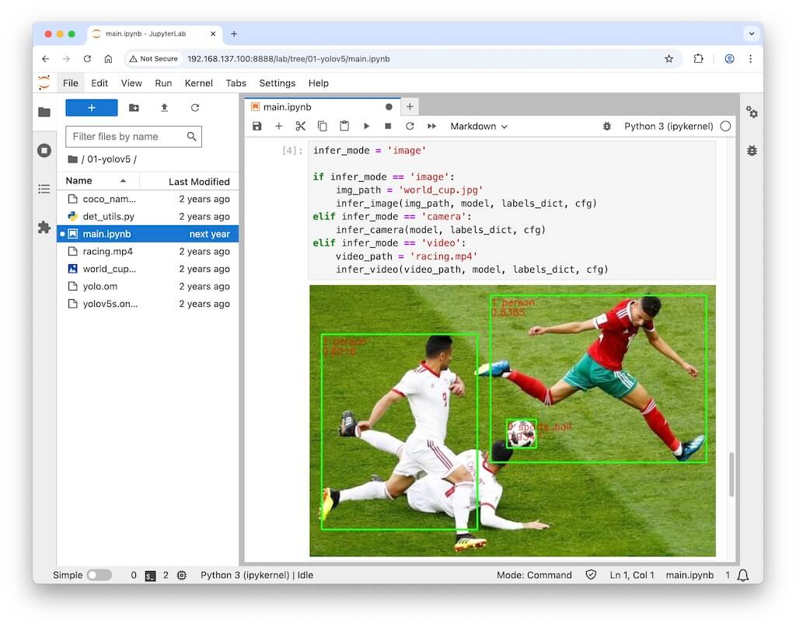
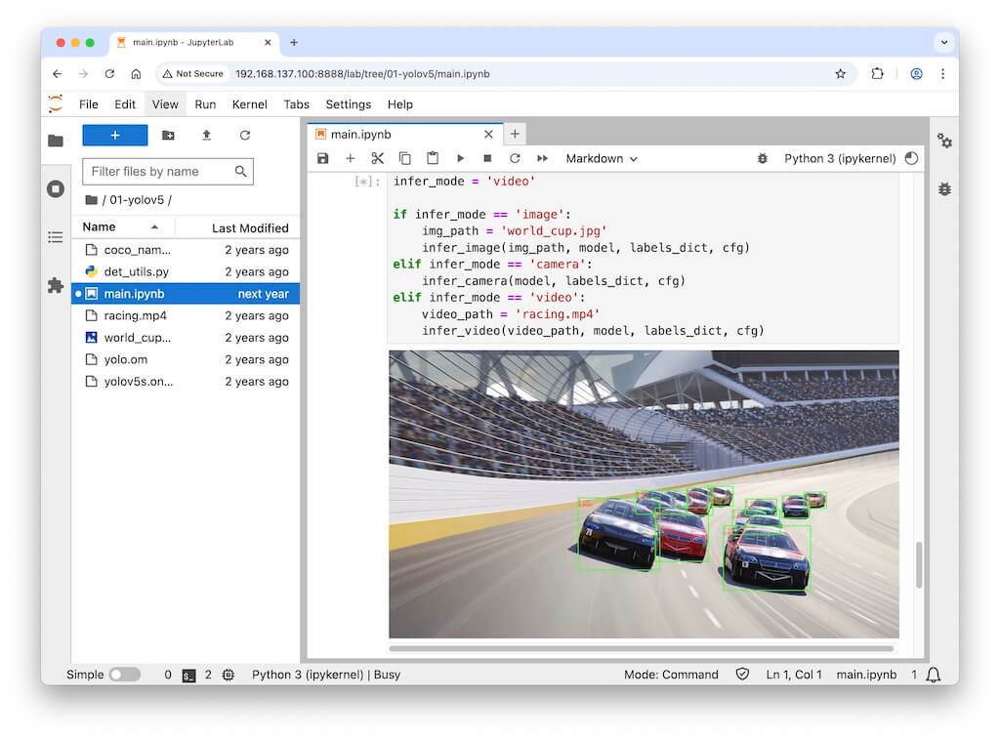
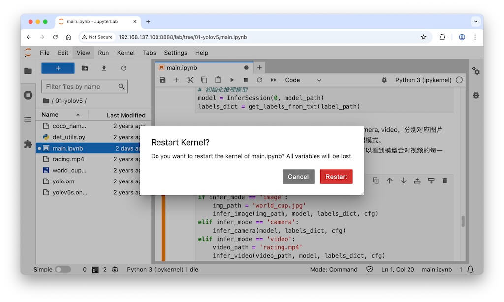
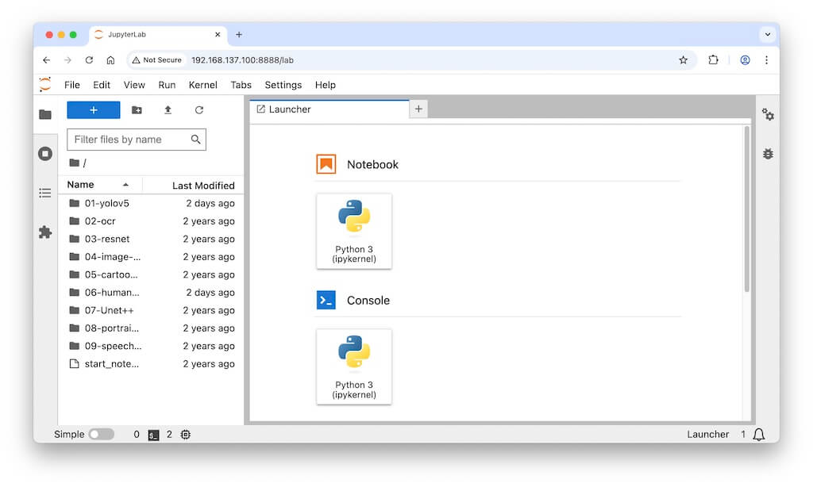 -->

---

<span id="onoff"></span>

## 关机、断电和开机
<br>
✴️ 完成实验后，请先关机，再断电（拔掉电源）。

✳️ 实验期间如需重启开发板，可先关机，再开机。

### 关机
<br>
**方法一：按关机按钮**

开发板盒子的绿灯边上有个**关机按钮**。按一下，就可以关机。

**方法二：poweroff关机**

或者执行以下命令也可关机：

```bash
su - root        # 切换到 root，密码是 Mind@123
poweroff
```

**方法三：shutdown关机**

或者执行以下命令也可关机：

```bash
su - root        # 如果不是 root 用户，先切换到 root，密码是 Mind@123
shutdown -h now  # shutdown 马上关机
```

✳️ 可以拿掉顶部的磁吸盖子，就可以看到散热风扇，**散热风扇停止转动**则表示已安全关机。


### 断电
<br>
待关机后 **（散热风扇停止转动）**，从电源接口处拔掉电源线切断外部电源，将开发板完全断电。

🚫 严禁开机状态直接拔电源（不能散热风扇还在转动，就拔电源）。在 Linux 系统运行的过程中，如果直接拔掉电源断电，可能会导致文件系统丢失某些数据。

### 开机
<br>
插上电源即可开机。

✳️ 可以在本地电脑执行 `~ % ping 192.168.137.200`，ping 通了就表示开机完成。

✳️ 也可以拿掉顶部的磁吸盖子，看到2个绿灯亮，就表示开机完成。

✴️ **关机按钮** 只能关机，不能开机。

<!--  -->
[昇腾开发板预置样例代码↗]: https://pan.jiangnan.edu.cn/link/AA3111BE7AEEE54D8486377047D3375185
[熟悉昇腾开发者套件↗]: https://tnt.gdvzz.com/ailab/aidk2604.html

<!--  -->
<span style="font-size:12px; color:#999">THE END</span>