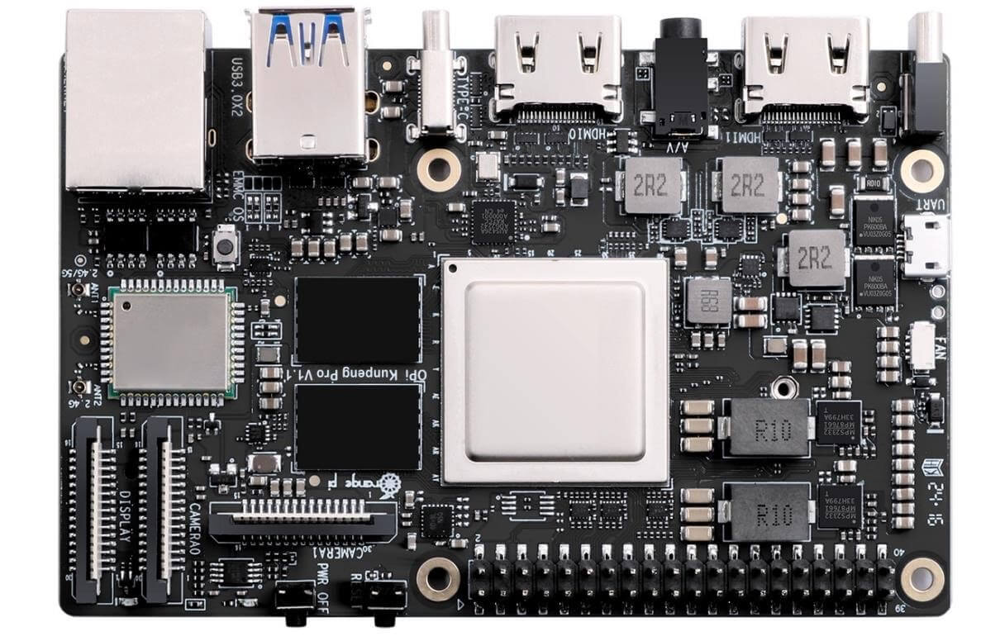
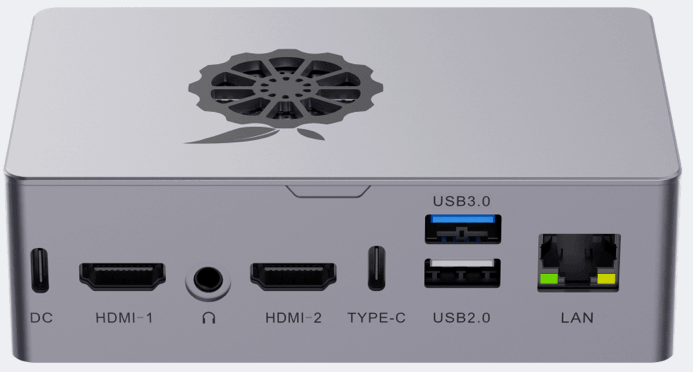

# 鲲鹏开发板指南
{: .no_toc }
`更新-260622` \| `发布-260420`

本文档描述 **鲲鹏开发板** 的相关信息，用于快速熟悉和入门教具。

<!--  -->
<details markdown="block">
  <summary>✳️ 目录</summary>
- TOC
{:toc}
</details>

<details markdown="block">
  <summary>ℹ️ 更新历史</summary>

**260622**
- 新增：[外观](#外观)

**260618**
- 新增：[连接串口](#连接串口)

**260601**
- 新增：[喇叭和麦克风](#普通用户访问喇叭和麦克风)

**260509**
- 新增：[连WiFi](#连wifi)
- 新增：[更改默认静态IP](#更改默认静态ip)
- 新增：[普通用户访问摄像头](#普通用户访问摄像头)
- 默认IP地址改为 192.168.137.100

**260506**
- 新增：[连接外网](#连接外网)

</details>

---

<span id="photo"></span>

## 外观
`[aka] photo`

[](./dkoo.assets/dkoo2.jpg)
[](./dkoo.assets/dkoo1.png)

[🔝](#top)

---

## 默认信息
<br>
操作系统烧录后，有以下默认信息：

### 默认账号密码
<br>
鲲鹏开发板的默认账号密码如下：

- 账号 / 密码： HwHiAiUser / Mind@123
- 账号 / 密码： root / Mind@123

### 默认IP
<br>
鲲鹏开发板的默认 IP 如下：

- IP地址：`192.168.137.100`
- 子网掩码：`255.255.255.0`

[🔝](#top)

---

<span id="nets"></span>

## 连接外网
`[aka] nets`

<br>
可以有几种方法：

- 找一个可以连接外网的PC（个人电脑），将可以连接外网的那个网络，共享给开发板
- 开发板连接可以访问外网的WiFi

### PC共享网络
<br>
可参考开发板官网的 [通过PC共享网络联网（Windows）↗](https://www.hiascend.com/document/detail/zh/Atlas200IDKA2DeveloperKit/23.0.RC2/Hardware%20Interfaces/hiug/hiug_0010.html)

上述指导，以“可以访问互联网的 WiFi，共享给开发板”为例。也可以将“本地电脑可以访问互联网的以太网（插网线的），共享给开发板”，操作步骤是一样的。

本地电脑连2个网线（以太网），1个连开发板：**以太网（连开发板）**，1个连外网（可以访问互联网）：**以太网（连外网）**。

以太网（连外网）：
- 点击 **更多适配器选项** 右边的 **编辑** 按钮
- 在 **以太网（连外网）属性** 界面中，有2个 tab 页：网络和共享，选择 **共享** tab页
- 中间的**请选一个专用网络连接**，选择 **以太网（连开发板）**
- 2个 **允许其他网络用户……**，都勾选上
- 按 **确定** 按钮


提示框显示：“Internet 连接共享被启用时……”，点击 **是(Y)**


✴️ 加密的无线网络（比如 JNU-Secure），不能被共享给开发板上网。JNU-WLAN 可以被共享给开发板上网。

<!--  -->
<span id="wifi"></span>

### 连WiFi
`[aka] wifi`

✳️ 先 root 用户登录开发板。或者已登录开发板，执行 `su - root` 切换为 root 用户。

✴️ 如何连接 JNU-WLAN 此类要在网页端输入账号密码的 WiFi，待补充。本章节方法不适用连接 JNU-WLAN。

- **查看有哪些WiFi**

    ```bash
nmcli dev wifi
    ```

    可以看到如下类似信息：

    ```bash
IN-USE  BSSID              SSID                MODE   CHAN  RATE        SIGNAL  BARS  SECURITY    
        44:DF:65:E7:BC:65  b102                Infra  6     130 Mbit/s  100     ▂▄▆█  WPA2        
        44:DF:65:E7:BC:64  b102                Infra  48    270 Mbit/s  84      ▂▄▆█  WPA2        
        14:D8:64:D1:D4:F3  b216                Infra  1     270 Mbit/s  80      ▂▄▆_  WPA1 WPA2   
    ```

- **密码方式连接WiFi（以连接 b102 WiFi 为例）**

    ```bash
nmcli dev wifi connect "b102" password "b102b102"
    ```

    可以看到如下提示信息：

    ```bash
Device 'wlan0' successfully activated with '3d96022d-1711-4206-8ff9-cfb991408b80'.
    ```

    连接 WiFi 成功后，可以执行 `curl -fsSL www.baidu.com` 访问百度是否成功。访问成功表示开发板可以访问外网了。

- **断开和b102的连接**

    ```bash
nmcli con down "b102"
    ```

- **连接（曾经连接过的）b102**

    ```bash
nmcli con up "b102"
    ```

- **查看连接过哪些 WiFi**

    ```bash
nmcli con show
    ```

- **忘记（曾经连接过的）b102**

    ```bash
nmcli con del "b102"
    ```

- **查看 WiFi 状态（开 或 关）**

    ```bash
nmcli radio wifi
    ```
- **关闭 WiFi**

    ```bash
nmcli radio wifi off
    ```

- **打开 WiFi**

    ```bash
nmcli radio wifi on
    ```

- **查看网络设备的状态**

    ```bash
nmcli device status
    ```

    可以看到如下类似信息：

    ```bash
DEVICE         TYPE      STATE                   CONNECTION 
eth0           ethernet  connected               eth0       
docker0        bridge    connected (externally)  docker0    
wlan0          wifi      disconnected            --         
p2p-dev-wlan0  wifi-p2p  disconnected            --         
bond0          bond      unmanaged               --         
lo             loopback  unmanaged               --   
    ```

[🔝](#top)

---

<span id="serial"></span>

## 连接串口
`[aka] serial`

连接开发板，还可以通过 **串口**（串行口）方式。相关步骤如下：

1. **连接PC（个人电脑）和开发板**

    找一根 USB 串口线，一端是USB口（USB Type-A），一端是 Micro USB。USB口连接PC（个人电脑），Micro USB 端连开发板上标识 Micro USB 的口。

    感兴趣者可阅读参考资料：一篇带你读懂USB接口：从Type-A到Type-C，你最常用哪个接口？[^1]

2. **设置串口访问相关参数**

    以 Windows 下的 MoberXterm 为例。

    - 点击主页面左上角的 **Session**
    - 在 Session Setting 页面，点击顶部的 **Serial**
    - **Serial Port**：选择 Windows 系统识别到的串口。比如：COM4(USB-Enhanced-SERIAL CH343)
    - **Speed(bps)**：选择 `115200`
    - 然后点击底部的 `OK` 按钮 

    [](./dkoo.assets/serial.png)

3. **访问开发板**

    用上一步骤设置好的 session 访问开发板。如下所示：

    [](./dkoo.assets/serial2.png)

[🔝](#top)

---

## 更改默认静态IP
<br>
将开发板默认IP地址修改为 `192.168.137.100`。

- **root 用户登录开发板**

- **进入网络配置目录**

    ```bash
cd /etc/netplan
    ```

- **修改网络配置文件**

    ```bash
vim /etc/netplan/01-netcfg.yaml
    ```

    内容如下：

    ```yaml
  network:
    version: 2
    renderer: NetworkManager
    ethernets:
      eth0:
        dhcp4: no
        addresses:
          - 192.168.137.100/24
        routes:
          - to: default
            via: 192.168.137.1
            metric: 700
        nameservers:
          addresses: [8.8.8.8, 114.114.114.114]
    ```

- **先应用新的 IP 地址**

    ```bash
netplan try
    ```

- **防止 NetworkManager 再次自动创建新的 eth0 连接**

    修改配置文件： 

    ```bash
vim /etc/NetworkManager/NetworkManager.conf
    ```

    在 [main] 段下添加：

    ```ini
no-auto-default=*
    ```

    然后重启 NetworkManager：

    ```bash
systemctl restart NetworkManager
    ```

- **再删除通过 UI 界面配置的 IP 地址**

    先看看 eth0 对应的配置 NAME

    ```bash
nmcli conn show
    ```

    比如看到 NAME 是 `eth0`
    
    ```bash
NAME          UUID                                  TYPE      DEVICE  
b102          1363b997-7e0b-4953-a004-807b7d6de1fc  wifi      wlan0   
eth0          14db5d66-2a23-4b83-893e-f7e53ff1db06  ethernet  eth0    
docker0       6fdb6ff7-4ec5-46dc-9937-946a7988d084  bridge    docker0 
netplan-eth0  626dd384-8b3d-3690-9511-192b2c79b3fd  ethernet  --      
    ```

    然后删除 eth0 对应的 `eth0`：

    ```bash
nmcli conn del eth0
    ```

    看到如下提示信息：

    ```bash
Connection 'eth0' (0da92994-463e-415e-abfc-6c500878e9b9) successfully deleted.
    ```

[🔝](#top)

---

<span id="access-camera"></span>

## 普通用户访问摄像头 
`[aka] access-camera`

如果普通用户（非 root 用户）打不开摄像头，可把普通用户添加到 Linux 的 `video` 组，就可以打开摄像头了。以 `HwHiAiUser` 用户为例： 

<!-- - 以 root 用户登录开发板

- 或已登录，先切换到 root

    ```bash
su - root
    ``` -->

- **加入 video 组：**

    ```bash
sudo usermod -a -G video HwHiAiUser
    ```

    - 如果执行不成功，则先执行 `su - root` 切换到 root 用户，再执行上述命令。
    - ✳️ 用 `HwHiAiUser` 重新登录开发板，才能生效。重新登录开发板，并不一定要从本地电脑再 ssh 登录开发板，也可以执行 `su - HwHiAiUser` 就可以了。

- **从 video 组中去掉**

    如要将普通用户 HwHiAiUser 从 video 组去掉，可执行以下指令：

    ```bash
sudo gpasswd -d HwHiAiUser video
    ```

- **查看摄像头信息**

    ```bash
v4l2-ctl --list-devices
    ```

    > 普通用户 HwHiAiUser 加入 video 组以后，可通过上述指令（不加 sudo）得到摄像头信息。

<!-- - **测试拍照**

    ```bash
sudo apt update && sudo apt install fswebcam
    ```

    > 如果执行不成功，则先执行 `su - root` 切换到 root 用户，再执行上述命令。

apt install 软件名 -o Acquire::http::Proxy="http://mirrors.tuna.tsinghua.edu.cn/ubuntu/" -->

[🔝](#top)

---

<span id="mic-speaker"></span>

## 普通用户访问喇叭和麦克风
`[aka]mic-speaker`

如果普通用户（非 root 用户）不能使用喇叭和麦克风，可把普通用户添加到 Linux 的 `audio` 组，就可以使用了。以 `HwHiAiUser` 用户为例： 

1. **加入 audio 组**

    ```bash
sudo usermod -a -G audio HwHiAiUser
    ```

    - 如果执行不成功，则先执行 `su - root` 切换到 root 用户，再执行上述命令。
    - ✳️ 用 `HwHiAiUser` 重新登录开发板，才能生效。重新登录开发板，并不一定要从本地电脑再 ssh 登录开发板，也可以执行 `su - HwHiAiUser` 就可以了。

2. **查看 audio 设备**

    查看喇叭：

    ```bash
aplay -l
    ```

    屏幕输出类似信息如下：

    ```bash
    **** List of PLAYBACK Hardware Devices ****
    card 0: ascend310b [ascend310b], device 0: ascend310b-playback ascend310b-hifi-0 []
    Subdevices: 1/1
    Subdevice #0: subdevice #0
    card 1: Camera [2K USB Camera], device 0: USB Audio [USB Audio]
    Subdevices: 1/1
    Subdevice #0: subdevice #0
    card 2: Q5 [Q5+], device 0: USB Audio [USB Audio]
    Subdevices: 1/1
    Subdevice #0: subdevice #0
    ```

    查看麦克风：

    ```bash
arecord -l
    ```

    屏幕输出类似信息如下：

    ```bash
    **** List of CAPTURE Hardware Devices ****
    card 0: ascend310b [ascend310b], device 1: ascend310b-capture ascend310b-hifi-1 []
    Subdevices: 1/1
    Subdevice #0: subdevice #0
    card 1: Camera [2K USB Camera], device 0: USB Audio [USB Audio]
    Subdevices: 1/1
    Subdevice #0: subdevice #0
    card 2: Q5 [Q5+], device 0: USB Audio [USB Audio]
    Subdevices: 1/1
    Subdevice #0: subdevice #0
    ```

3. **调节喇叭和麦克风音量**

    ```bash
alsamixer
    ```

    📊 喇叭（播放）音量条：
    
    - 绿色 → 白色 → 红色：输出电平从低到高。
    - 红色区域表示放大电路过载，喇叭可能会发出破音，甚至损坏扬声器。
    - 通常应将峰值控制在白色区域，避免进入红色。

    🎤 麦克风（录音）音量条：

    - 绿色 → 白色 → 红色：输入增益从低到高。
    - 红色表示输入信号过强，会导致录音“爆音”或削波，后期无法修复。**（录制的声音，可能听不清）**
    - 应调整麦克风增益（通常是 Mic 或 Capture 项），让说话最大声时刚好触及白色顶部但不进入红色。**（✳️ 能录制比较好的声音）**

4. **测试摄像头喇叭**

    ```bash
speaker-test -D hw:1 -c 1 -t wav
    ```

    - `-D hw:1`：指定 ALSA 设备为 hw:1，数字 1 对应 aplay -l 中显示的 card 1（即你的 USB 摄像头声卡）。
    - `-c 1`：设置声道数为 单声道 (mono)。因为之前尝试双声道 (-c 2) 时返回错误 Channels count (2) not available，说明该设备不支持立体声播放。
    - `-t wav`：使用内置的 WAV 测试音（会播放 "Front Left" 等语音提示）。

    ✳️ 如果没有声音，运行 `alsamixer -c 1`（-c 1 表示 aplay -l 中的 card 1 ），按 F3 切换到 Playback 视图，确保 PCM 条不是 MM（静音），且数值不为 0。

5. **测试Q5喇叭**

    ```bash
speaker-test -D hw:2 -c 2 -t wav
    ```

    - `-D hw:2`：指定 ALSA 设备为 hw:2，即你的 Q5+ USB 喇叭声卡。hw 表示直接访问硬件设备，数字 2 对应 aplay -l 中显示的 card 2。
    - `-c 2`：设置声道数为 立体声 (2 声道)。Q5+ 是喇叭，通常支持双声道输出。
    - `-t wav`：使用内置的 WAV 测试音，会依次播放 "Front Left" 和 "Front Right" 语音提示，用于检查左右声道是否正常。

    ✳️ 如果只有一边出声或完全无声，请检查：
    
    - 喇叭音量旋钮是否打开？
    - 运行 alsamixer -c 2，按 F3 进入播放视图，确认 PCM 或 Master 未静音（显示 MM 时按 m 键解除），且音量不为 0。
    - 喇叭是否已正确供电（部分 USB 喇叭需独立供电）。

6. **用摄像头的录制声音和播放**

    录制：

    ```bash
arecord -D hw:1 -c 1 -r 16000 -f S16_LE -d 5 capture.wav
    ```

    - `-D hw:1`：指定音频设备，hw:1 代表你的2K USB Camera声卡。
    - `-c 1`：设置声道数为单声道。
    - `-r 16000`：设置采样率为16kHz。
    - `-f S16_LE`：设置采样格式为16位小端 (Signed 16-bit Little Endian)。
    - `-d 5`：设置录音时长为5秒。
    - `capture.wav`:指定输出的录音文件名。

    播放：

    ```bash
aplay -D plughw:1 capture.wav
    ```

    或者，为了保证参数能完全匹配，也可以显式指定所有播放参数：

    ```bash
aplay -D plughw:1 -c 1 -r 16000 -f S16_LE capture.wav
    ```

7. **使用Q5录制声音和播放**

    录制：

    ```bash
arecord -D hw:2,0 -c 2 -r 44100 -f S16_LE -d 5 -t wav ~/test_q5_mic.wav
    ```

    - `-D hw:2,0`：直接访问 Q5 声卡硬件（无转换）
    - `-c 2`：立体声（Q5 麦克风要求）
    - `-r 44100`：采样率 44.1 kHz（硬件支持的）
    - `-f S16_LE`：16 位小端 PCM（硬件支持的格式）
    - `-d 5`：录制 5 秒
    - `~/test_q5_mic.wav`：保存路径

    播放：

    ```bash
aplay -D hw:2,0 ~/test_q5_mic.wav
    ```

    因为录制和播放的参数完全匹配（44100 Hz，立体声，16 位），直接使用 hw 设备即可。

[🔝](#top)

---

## 体验样例代码
<br>
除了可体验鲲鹏开发板自带的预置样例外，还可以通过如下方式体验升腾开发板的预置样例。

1. 点击下载：[昇腾开发板预置样例代码↗]

2. 建议放到开发板指定目录下。zip 包名为 `samples_aidk.zip`，600多MB，网速不同下载耗时不同。将下载的 zip 包上传 / 移动到用户 `HwHiAiUser` 的 HOME 目录下，完整路径是  `/home/HwHiAiUser`。

3. 解压缩。依次执行以下命令：

    先切换到 HOME 目录

    ```bash
    cd ~
    ```

    然后解压缩

    ```bash
    unzip samples_aidk.zip
    ```

    解压缩完成后，生成目录 samples_aidk，完整路径是  `/home/HwHiAiUser/samples_aidk`。

4. 启动样例代码服务端。依次执行以下命令：

    先切换样例所在目录

    ```bash
    cd ~/samples_aidk/notebook
    ```

    然后启动 Jupyter lab 服务端

    ```bash
    ./start_notebook.sh 192.168.137.200
    ```

    ✳️ 然后复制界面上出现的 `http://192.168.137.100:8888/lab?token=一串数字字母`。

5. 本地电脑 Web 浏览器体验。在本地电脑 Web 浏览器访问刚才复制的 `http://192.168.137.100:8888/lab?token=一串数字字母`

    ✳️ 后续体验步骤，可参考：[熟悉昇腾开发者套件↗]。

6. 部分截图


<!-- 


 -->

[🔝](#top)

---

<span id="onoff"></span>

## 关机、断电和开机
`[aka] onoff`

<br>
✴️ 完成实验后，请先关机，再断电（拔掉电源）。

✳️ 实验期间如需重启开发板，可先关机，再开机。

### 关机
<br>
**方法一：按关机按钮**

开发板盒子的绿灯边上有个**关机按钮**。按一下，就可以关机。

**方法二：poweroff关机**

或者执行以下命令也可关机：

```bash
su - root        # 切换到 root，密码是 Mind@123
poweroff
```

**方法三：shutdown关机**

或者执行以下命令也可关机：

```bash
su - root        # 如果不是 root 用户，先切换到 root，密码是 Mind@123
shutdown -h now  # shutdown 马上关机
```

✳️ 可以拿掉顶部的磁吸盖子，就可以看到散热风扇，**散热风扇停止转动**则表示已安全关机。


### 断电
<br>
待关机后 **（散热风扇停止转动）**，从电源接口处拔掉电源线切断外部电源，将开发板完全断电。

🚫 严禁开机状态直接拔电源（不能散热风扇还在转动，就拔电源）。在 Linux 系统运行的过程中，如果直接拔掉电源断电，可能会导致文件系统丢失某些数据。

### 开机
<br>
插上电源即可开机。

✳️ 可以在本地电脑执行 `~ % ping 192.168.137.200`，ping 通了就表示开机完成。

✳️ 也可以拿掉顶部的磁吸盖子，看到2个绿灯亮，就表示开机完成。

✴️ **关机按钮** 只能关机，不能开机。

<!--  -->
[昇腾开发板预置样例代码↗]: https://pan.jiangnan.edu.cn/link/AA3111BE7AEEE54D8486377047D3375185
[熟悉昇腾开发者套件↗]: https://tnt.gdvzz.com/ailab/aidk2604.html

<!--  -->
<span style="font-size:12px; color:#999">THE END</span>

<!--  -->
[^1]: [一篇带你读懂USB接口：从Type-A到Type-C，你最常用哪个接口？ ↗](https://zhuanlan.zhihu.com/p/703321838)；知乎；2024-06-14