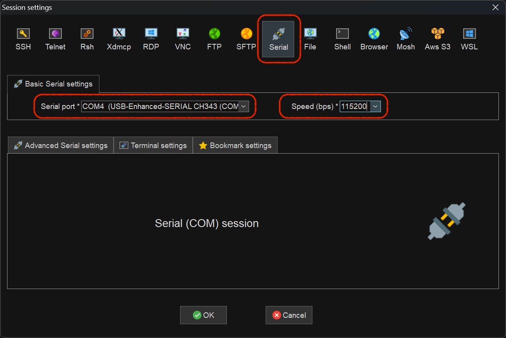
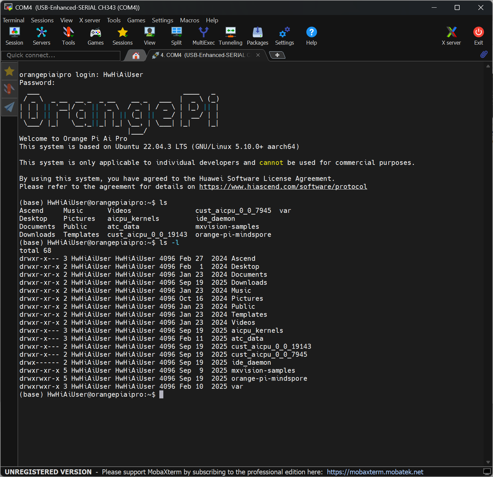

# 鲲鹏开发板指南
{: .no_toc }
`更新-260618` \| `发布-260420`

本文档描述 **鲲鹏开发板** 的相关信息，用于快速熟悉和入门教具。

<!--  -->
<details markdown="block">
  <summary>✳️ 目录</summary>
- TOC
{:toc}
</details>

<details markdown="block">
  <summary>ℹ️ 更新历史</summary>

**260618**
- 新增：[连接串口](#连接串口)

**260601**
- 新增：[喇叭和麦克风](#普通用户访问喇叭和麦克风)

**260509**
- 新增：[连WiFi](#连wifi)
- 新增：[更改默认静态IP](#更改默认静态ip)
- 新增：[普通用户访问摄像头](#普通用户访问摄像头)
- 默认IP地址改为 192.168.137.100

**260506**
- 新增：[连接外网](#连接外网)

</details>

---

## 默认信息
<br>
操作系统烧录后，有以下默认信息：

### 默认账号密码
<br>
鲲鹏开发板的默认账号密码如下：

- 账号：`HwHiAiUser` \| 密码：`Mind@123`
- 账号：`root` \| 密码：`Mind@123`

### 默认IP
<br>
鲲鹏开发板的默认 IP 如下：

- IP地址：`192.168.137.100`
- 子网掩码：`255.255.255.0`

---

<span id="nets"></span>

## 连接外网
`[aka] nets`

<br>
可以有几种方法：

- 找一个可以连接外网的PC（个人电脑），将可以连接外网的那个网络，共享给开发板
- 开发板连接可以访问外网的WiFi

### PC共享网络
<br>
可参考开发板官网的 [通过PC共享网络联网（Windows）↗](https://www.hiascend.com/document/detail/zh/Atlas200IDKA2DeveloperKit/23.0.RC2/Hardware%20Interfaces/hiug/hiug_0010.html)

上述指导，以“可以访问互联网的 WiFi，共享给开发板”为例。也可以将“本地电脑可以访问互联网的以太网（插网线的），共享给开发板”，操作步骤是一样的。

本地电脑连2个网线（以太网），1个连开发板：**以太网（连开发板）**，1个连外网（可以访问互联网）：**以太网（连外网）**。

以太网（连外网）：
- 点击 **更多适配器选项** 右边的 **编辑** 按钮
- 在 **以太网（连外网）属性** 界面中，有2个 tab 页：网络和共享，选择 **共享** tab页
- 中间的**请选一个专用网络连接**，选择 **以太网（连开发板）**
- 2个 **允许其他网络用户……**，都勾选上
- 按 **确定** 按钮


提示框显示：“Internet 连接共享被启用时……”，点击 **是(Y)**


✴️ 加密的无线网络（比如 JNU-Secure），不能被共享给开发板上网。JNU-WLAN 可以被共享给开发板上网。

### 连WiFi
<br>
先 root 用户登录开发板。或者已登录开发板，切换为 root 用户。

- `nmcli dev wifi`：查看有哪些WiFi

    ```bash
    (base) root@orangepiaipro:~# nmcli dev wifi
    IN-USE  BSSID              SSID                MODE   CHAN  RATE        SIGNAL  BARS  SECURITY    
            44:DF:65:E7:BC:65  b102                Infra  6     130 Mbit/s  100     ▂▄▆█  WPA2        
            44:DF:65:E7:BC:64  b102                Infra  48    270 Mbit/s  84      ▂▄▆█  WPA2        
            14:D8:64:D1:D4:F3  b216                Infra  1     270 Mbit/s  80      ▂▄▆_  WPA1 WPA2   
    ```

- `nmcli dev wifi connect "b102" password "b102b102"`：密码方式连接WiFi（WiFi是b102）

    ```bash
    (base) root@orangepiaipro:~# nmcli dev wifi connect "b102" password "b102b102"
    Device 'wlan0' successfully activated with '3d96022d-1711-4206-8ff9-cfb991408b80'.
    ```

    连接 WiFi 成功后，可以执行 `curl -fsSL www.baidu.com` 访问百度是否成功。访问成功表示开发板可以访问外网了。

- `nmcli con down "b102"`：断开和b102的连接
- `nmcli con up "b102"`：连接（曾经连接过的）b102

    ```bash
    (base) root@orangepiaipro:/etc/netplan# nmcli con up "b102"
    Connection successfully activated (D-Bus active path: /org/freedesktop/NetworkManager/ActiveConnection/6)
    ```

- `nmcli con show`：看看连接过哪些 WiFi

    ```bash
    (base) root@orangepiaipro:/etc/netplan# nmcli con show
    NAME          UUID                                  TYPE      DEVICE  
    b102          3d96022d-1711-4206-8ff9-cfb991408b80  wifi      wlan0   
    eth0          112f0b6a-e274-4f66-8198-1c1ac5705217  ethernet  eth0    
    docker0       6fdb6ff7-4ec5-46dc-9937-946a7988d084  bridge    docker0 
    netplan-eth1  8bf25856-ca0b-388e-823c-b898666ab9d2  ethernet  --      
    ```

- `nmcli con del "b102"`：忘记（曾经连接过的）b102

    ```bash
    (base) root@orangepiaipro:/etc/netplan# nmcli con del "b102"
    Connection 'b102' (3d96022d-1711-4206-8ff9-cfb991408b80) successfully deleted.
    ```

- `nmcli radio wifi`：查看 WiFi 状态（开 或 关）

    ```bash
    (base) root@orangepiaipro:/etc/netplan# nmcli radio wifi
    enabled
    ```

- `nmcli radio wifi off`：关闭 WiFi
- `nmcli radio wifi on`：打开 WiFi

- `nmcli device status`：查看网络设备的状态

    ```bash
    (base) root@orangepiaipro:~# nmcli device status
    DEVICE         TYPE      STATE                   CONNECTION 
    eth0           ethernet  connected               eth0       
    docker0        bridge    connected (externally)  docker0    
    wlan0          wifi      disconnected            --         
    p2p-dev-wlan0  wifi-p2p  disconnected            --         
    bond0          bond      unmanaged               --         
    lo             loopback  unmanaged               --   
    ```

---

<span id="serial"></span>

## 连接串口
`[aka] serial`

连接开发板，还可以通过 **串口**（串行口）方式。相关步骤如下：

1. **连接PC（个人电脑）和开发板**

    找一根 USB 串口线，一端是USB口（USB Type-A），一端是 Micro USB。USB口连接PC（个人电脑），Micro USB 端连开发板上标识 Micro USB 的口。

    感兴趣者可阅读参考资料：一篇带你读懂USB接口：从Type-A到Type-C，你最常用哪个接口？[^1]

2. **设置串口访问相关参数**

    以 Windows 下的 MoberXterm 为例。

    - 点击主页面左上角的 **Session**
    - 在 Session Setting 页面，点击顶部的 **Serial**
    - **Serial Port**：选择 Windows 系统识别到的串口。比如：COM4(USB-Enhanced-SERIAL CH343)
    - **Speed(bps)**：选择 `115200`
    - 然后点击底部的 `OK` 按钮 

    [](./dkoo.assets/serial.png)

3. **访问开发板**

    用上一步骤设置好的 session 访问开发板。如下所示：

    [](./dkoo.assets/serial2.png)

[🔝](#top)

---

## 更改默认静态IP
<br>
将开发板默认IP地址修改为 `192.168.137.100`。

- **root 用户登录开发板**

- **进入网络配置目录**

    ```bash
cd /etc/netplan
    ```

- **修改网络配置文件**

    ```bash
vim /etc/netplan/01-netcfg.yaml
    ```

    内容如下：

    ```yaml
  network:
    version: 2
    renderer: NetworkManager
    ethernets:
      eth0:
        dhcp4: no
        addresses:
          - 192.168.137.100/24
        routes:
          - to: default
            via: 192.168.137.1
            metric: 700
        nameservers:
          addresses: [8.8.8.8, 114.114.114.114]
    ```

- **先应用新的 IP 地址**

    ```bash
netplan try
    ```

- **防止 NetworkManager 再次自动创建新的 eth0 连接**

    修改配置文件： 

    ```bash
vim /etc/NetworkManager/NetworkManager.conf
    ```

    在 [main] 段下添加：

    ```ini
no-auto-default=*
    ```

    然后重启 NetworkManager：

    ```bash
systemctl restart NetworkManager
    ```

- **再删除通过 UI 界面配置的 IP 地址**

    先看看 eth0 对应的配置 NAME

    ```bash
nmcli conn show
    ```

    比如看到 NAME 是 `eth0`
    
    ```bash
NAME          UUID                                  TYPE      DEVICE  
b102          1363b997-7e0b-4953-a004-807b7d6de1fc  wifi      wlan0   
eth0          14db5d66-2a23-4b83-893e-f7e53ff1db06  ethernet  eth0    
docker0       6fdb6ff7-4ec5-46dc-9937-946a7988d084  bridge    docker0 
netplan-eth0  626dd384-8b3d-3690-9511-192b2c79b3fd  ethernet  --      
    ```

    然后删除 eth0 对应的 `eth0`：

    ```bash
nmcli conn del eth0
    ```

    看到如下提示信息：

    ```bash
Connection 'eth0' (0da92994-463e-415e-abfc-6c500878e9b9) successfully deleted.
    ```

---

<span id="access-camera"></span>

## 普通用户访问摄像头 
`[aka]access-camera`

如果普通用户（非 root 用户）打不开摄像头，可把普通用户添加到 Linux 的 `video` 组，就可以打开摄像头了。以 `HwHiAiUser` 用户为例： 

<!-- - 以 root 用户登录开发板

- 或已登录，先切换到 root

    ```bash
su - root
    ``` -->

- **加入 video 组：**

    ```bash
sudo usermod -a -G video HwHiAiUser
    ```

    - 如果执行不成功，则先执行 `su - root` 切换到 root 用户，再执行上述命令。
    - ✳️ 用 `HwHiAiUser` 重新登录开发板，才能生效。重新登录开发板，并不一定要从本地电脑再 ssh 登录开发板，也可以执行 `su - HwHiAiUser` 就可以了。

- **从 video 组中去掉**

    如要将普通用户 HwHiAiUser 从 video 组去掉，可执行以下指令：

    ```bash
sudo gpasswd -d HwHiAiUser video
    ```

- **查看摄像头信息**

    ```bash
v4l2-ctl --list-devices
    ```

    > 普通用户 HwHiAiUser 加入 video 组以后，可通过上述指令（不加 sudo）得到摄像头信息。

<!-- - **测试拍照**

    ```bash
sudo apt update && sudo apt install fswebcam
    ```

    > 如果执行不成功，则先执行 `su - root` 切换到 root 用户，再执行上述命令。

apt install 软件名 -o Acquire::http::Proxy="http://mirrors.tuna.tsinghua.edu.cn/ubuntu/" -->
---

<span id="mic-speaker"></span>

## 普通用户访问喇叭和麦克风
`[aka]mic-speaker`

如果普通用户（非 root 用户）不能使用喇叭和麦克风，可把普通用户添加到 Linux 的 `audio` 组，就可以使用了。以 `HwHiAiUser` 用户为例： 

1. **加入 audio 组**

    ```bash
sudo usermod -a -G audio HwHiAiUser
    ```

    - 如果执行不成功，则先执行 `su - root` 切换到 root 用户，再执行上述命令。
    - ✳️ 用 `HwHiAiUser` 重新登录开发板，才能生效。重新登录开发板，并不一定要从本地电脑再 ssh 登录开发板，也可以执行 `su - HwHiAiUser` 就可以了。

2. **查看 audio 设备**

    查看喇叭：

    ```bash
aplay -l
    ```

    屏幕输出类似信息如下：

    ```bash
    **** List of PLAYBACK Hardware Devices ****
    card 0: ascend310b [ascend310b], device 0: ascend310b-playback ascend310b-hifi-0 []
    Subdevices: 1/1
    Subdevice #0: subdevice #0
    card 1: Camera [2K USB Camera], device 0: USB Audio [USB Audio]
    Subdevices: 1/1
    Subdevice #0: subdevice #0
    card 2: Q5 [Q5+], device 0: USB Audio [USB Audio]
    Subdevices: 1/1
    Subdevice #0: subdevice #0
    ```

    查看麦克风：

    ```bash
arecord -l
    ```

    屏幕输出类似信息如下：

    ```bash
    **** List of CAPTURE Hardware Devices ****
    card 0: ascend310b [ascend310b], device 1: ascend310b-capture ascend310b-hifi-1 []
    Subdevices: 1/1
    Subdevice #0: subdevice #0
    card 1: Camera [2K USB Camera], device 0: USB Audio [USB Audio]
    Subdevices: 1/1
    Subdevice #0: subdevice #0
    card 2: Q5 [Q5+], device 0: USB Audio [USB Audio]
    Subdevices: 1/1
    Subdevice #0: subdevice #0
    ```

3. **调节喇叭和麦克风音量**

    ```bash
alsamixer
    ```

    📊 喇叭（播放）音量条：
    
    - 绿色 → 白色 → 红色：输出电平从低到高。
    - 红色区域表示放大电路过载，喇叭可能会发出破音，甚至损坏扬声器。
    - 通常应将峰值控制在白色区域，避免进入红色。

    🎤 麦克风（录音）音量条：

    - 绿色 → 白色 → 红色：输入增益从低到高。
    - 红色表示输入信号过强，会导致录音“爆音”或削波，后期无法修复。**（录制的声音，可能听不清）**
    - 应调整麦克风增益（通常是 Mic 或 Capture 项），让说话最大声时刚好触及白色顶部但不进入红色。**（✳️ 能录制比较好的声音）**

4. **测试摄像头喇叭**

    ```bash
speaker-test -D hw:1 -c 1 -t wav
    ```

    - `-D hw:1`：指定 ALSA 设备为 hw:1，数字 1 对应 aplay -l 中显示的 card 1（即你的 USB 摄像头声卡）。
    - `-c 1`：设置声道数为 单声道 (mono)。因为之前尝试双声道 (-c 2) 时返回错误 Channels count (2) not available，说明该设备不支持立体声播放。
    - `-t wav`：使用内置的 WAV 测试音（会播放 "Front Left" 等语音提示）。

    ✳️ 如果没有声音，运行 `alsamixer -c 1`（-c 1 表示 aplay -l 中的 card 1 ），按 F3 切换到 Playback 视图，确保 PCM 条不是 MM（静音），且数值不为 0。

5. **测试Q5喇叭**

    ```bash
speaker-test -D hw:2 -c 2 -t wav
    ```

    - `-D hw:2`：指定 ALSA 设备为 hw:2，即你的 Q5+ USB 喇叭声卡。hw 表示直接访问硬件设备，数字 2 对应 aplay -l 中显示的 card 2。
    - `-c 2`：设置声道数为 立体声 (2 声道)。Q5+ 是喇叭，通常支持双声道输出。
    - `-t wav`：使用内置的 WAV 测试音，会依次播放 "Front Left" 和 "Front Right" 语音提示，用于检查左右声道是否正常。

    ✳️ 如果只有一边出声或完全无声，请检查：
    
    - 喇叭音量旋钮是否打开？
    - 运行 alsamixer -c 2，按 F3 进入播放视图，确认 PCM 或 Master 未静音（显示 MM 时按 m 键解除），且音量不为 0。
    - 喇叭是否已正确供电（部分 USB 喇叭需独立供电）。

6. **用摄像头的录制声音和播放**

    录制：

    ```bash
arecord -D hw:1 -c 1 -r 16000 -f S16_LE -d 5 capture.wav
    ```

    - `-D hw:1`：指定音频设备，hw:1 代表你的2K USB Camera声卡。
    - `-c 1`：设置声道数为单声道。
    - `-r 16000`：设置采样率为16kHz。
    - `-f S16_LE`：设置采样格式为16位小端 (Signed 16-bit Little Endian)。
    - `-d 5`：设置录音时长为5秒。
    - `capture.wav`:指定输出的录音文件名。

    播放：

    ```bash
aplay -D plughw:1 capture.wav
    ```

    或者，为了保证参数能完全匹配，也可以显式指定所有播放参数：

    ```bash
aplay -D plughw:1 -c 1 -r 16000 -f S16_LE capture.wav
    ```

7. **使用Q5录制声音和播放**

    录制：

    ```bash
arecord -D hw:2,0 -c 2 -r 44100 -f S16_LE -d 5 -t wav ~/test_q5_mic.wav
    ```

    - `-D hw:2,0`：直接访问 Q5 声卡硬件（无转换）
    - `-c 2`：立体声（Q5 麦克风要求）
    - `-r 44100`：采样率 44.1 kHz（硬件支持的）
    - `-f S16_LE`：16 位小端 PCM（硬件支持的格式）
    - `-d 5`：录制 5 秒
    - `~/test_q5_mic.wav`：保存路径

    播放：

    ```bash
aplay -D hw:2,0 ~/test_q5_mic.wav
    ```

    因为录制和播放的参数完全匹配（44100 Hz，立体声，16 位），直接使用 hw 设备即可。

---

## 体验样例代码
<br>
除了可体验鲲鹏开发板自带的预置样例外，还可以通过如下方式体验升腾开发板的预置样例。

1. 点击下载：[昇腾开发板预置样例代码↗]

2. 建议放到开发板指定目录下。zip 包名为 `samples_aidk.zip`，600多MB，网速不同下载耗时不同。将下载的 zip 包上传 / 移动到用户 `HwHiAiUser` 的 HOME 目录下，完整路径是  `/home/HwHiAiUser`。

3. 解压缩。依次执行以下命令：

    先切换到 HOME 目录

    ```bash
    cd ~
    ```

    然后解压缩

    ```bash
    unzip samples_aidk.zip
    ```

    解压缩完成后，生成目录 samples_aidk，完整路径是  `/home/HwHiAiUser/samples_aidk`。

4. 启动样例代码服务端。依次执行以下命令：

    先切换样例所在目录

    ```bash
    cd ~/samples_aidk/notebook
    ```

    然后启动 Jupyter lab 服务端

    ```bash
    ./start_notebook.sh 192.168.137.200
    ```

    ✳️ 然后复制界面上出现的 `http://192.168.137.100:8888/lab?token=一串数字字母`。

5. 本地电脑 Web 浏览器体验。在本地电脑 Web 浏览器访问刚才复制的 `http://192.168.137.100:8888/lab?token=一串数字字母`

    ✳️ 后续体验步骤，可参考：[熟悉昇腾开发者套件↗]。

6. 部分截图


<!-- 


 -->

---

## 优化xfce界面

我的开发板是：香橙派kunpeng pro。怎么设置xfce界面，最终和ubuntu-desktop很类似

1、操作系统，当前安装了是ubuntu 22.04
2、桌面整体，要类似ubuntu-desktop
3、桌面dock栏，放到底部（ubuntu-desktop的dock栏在左侧），要类似ubuntu-desktop
4、桌面右上角顶部栏，要类似ubuntu-desktop。不仅样式像，顶部栏中的应用也要类似。
5、登录界面，暂时维持原样

11、系统设置。尽可能采用 ubuntu-desktop 的 setting
12、查找应用。类似 ubuntu-desktop桌面左下角有个applications那样
13、使用gnome原生terminal，替代现有 xfce 的 terminal。
14、增加快捷键定义的说明，用于terminal的窗口排列。
15、拟采用yaru-dark样式。


21、xfce界面当前是英文的。操作提示涉及界面的，还要给出英文，以便找到对应的item或界面。
22、不需要汉化xfce界面。
23、操作方案，就一条一条写即可，不要用表格方式。
24、方案描述，既要明确，更要精炼

<!-- 13、setting → window manager → style，已有：Yaru、Yaru-hdpi、Yaru-xhdpi、Yaru-dark、Yaru-dark-hdpi、Yaru-dark-xhdpi
7、yaru-theme-gtk yaru-theme-icon yaru-theme-sound ubuntu-wallpapers fonts-ubuntu，都已经安装 -->


# 香橙派Kunpeng Pro XFCE改Ubuntu Desktop风格配置手册（Ubuntu22.04）
`更新-260516` \| `发布-260516`

## 前置说明
1、设备：香橙派 Kunpeng Pro；系统：Ubuntu 22.04 XFCE；全程**保留英文界面、不汉化**。
2、最终效果：仿Ubuntu Desktop(GNOME)、底部Dock栏、原版Ubuntu顶部状态栏、Yaru-Dark主题、GNOME Terminal、仿Ubuntu系统设置、左下角应用启动器。

先切换到 root 用户

## 一、基础依赖安装（终端执行）
<!-- 1、更新软件源：sudo apt update && sudo apt upgrade -y -->
1、更新软件源：apt update
    不需要 apt upgrade

## 三、主题美化（固定Yaru-Dark）

8、设置GTK主题：打开 **Settings → Appearance → Style**，选择**Yaru-Dark**。

    如果找不到，执行以下命令安装Yaru暗黑主题（Ubuntu原生主题）：
    
    ```bash
    apt install yaru-theme-gtk yaru-theme-icon yaru-theme-sound
    ```
    
9、设置图标主题：同一界面 **Icons**，选择 **Yaru-Dark**。
10、设置窗口装饰主题：打开 **Settings → Window Manager → Style**，选择 **Yaru-Dark**。


## 二、卸载冗余组件（净化界面，贴合Ubuntu）
6、卸载XFCE多余面板插件：sudo apt remove xfce4-genmon-plugin xfce4-mailwatch-plugin -y

    卸载前，可以看看是否存在：

    ```bash
    apt list | grep xfce4-genmon-plugin
    apt list | grep xfce4-mailwatch-plugin
    ```

7、禁用XFCE原生桌面图标（纯净桌面）：打开 **Settings → Desktop → Icons**，取消勾选所有桌面图标选项。

    就是 Default Icons 下打勾的，都取消勾选。然后桌面上就没有了。


## 四、顶部状态栏改造（仿Ubuntu右上角状态栏）
11、提前安装缺失指示器插件（终端执行）：
```bash
apt install xfce4-indicator-plugin ayatana-indicator-application
```

12、清空多余顶部面板：右键顶部Panel → **Panel Preferences → Items**，删除所有无关插件（Weather、Directory Menu等）。
13、添加必备插件：点击Add按钮，搜索添加，最终仅保留 **Indicator Plugin、Clock、Sound、Power、Network、Bluetooth**。
14、调整状态栏样式：**Panel Preferences → Appearance**，设置Panel Alpha透明度为90%，Height高度32px，贴合Ubuntu原生顶部栏尺寸。
15、时间格式修改：右键Clock → **Clock Properties**，格式改为 **%H:%M %A %d %B**，显示星期+日期，复刻Ubuntu时间样式。


2、安装Yaru暗黑主题（Ubuntu原生主题）：sudo apt install yaru-theme-gtk yaru-theme-icon yaru-theme-sound -y
3、安装GNOME原生设置（替换XFCE原生设置）：sudo apt install gnome-control-center gnome-settings-daemon -y
4、安装GNOME Terminal（替换XFCE终端）：sudo apt install gnome-terminal -y
5、安装底部Dock工具（仿Ubuntu Dock）：sudo apt install plank -y


## 五、底部Dock栏配置（替代原生左侧Dock）
15、关闭XFCE原生底部面板：右键原生底部Panel → **Panel Preferences → General**，勾选 **Automatically hide the panel**，永久隐藏原生面板。
16、启动Plank Dock：终端输入plank，首次启动生成默认Dock栏。
17、Plank适配Yaru暗黑：右键Dock空白处 → **Preferences → Appearance → Theme**，选择 **Yaru**。
18、Dock参数优化：Icon Size设为42px，透明度85%，勾选 **Lock Icons**，仿Ubuntu固定Dock图标。
19、设置开机自启：打开 **Settings → Session and Startup → Application Autostart**，点击Add，Name填Plank，Command填/usr/bin/plank，保存开机自启。

## 六、左下角应用查找器（仿Ubuntu Applications）
20、添加应用启动器至顶部栏：打开顶部Panel **Items**，添加 **Whisker Menu**。
21、修改启动器图标：右键Whisker Menu → **Properties → Button**，图标更换为Ubuntu默认应用网格图标。
22、菜单样式调整：取消菜单圆角、模糊，配色跟随Yaru-Dark，实现和Ubuntu左下角应用菜单一致交互逻辑。

## 七、终端替换（GNOME Terminal替代XFCE Terminal）
23、设置默认终端：终端输入sudo update-alternatives --config x-terminal-emulator，选择编号对应 **gnome-terminal**。
24、卸载XFCE原生终端：sudo apt remove xfce4-terminal -y。
25、终端主题适配：打开GNOME Terminal → **Preferences → Appearance**，启用Yaru暗黑配色，关闭多余装饰边框。

## 八、系统设置替换（纯Ubuntu原生Setting）
26、屏蔽XFCE设置快捷键：打开 **Settings → Keyboard → Application Shortcuts**，删除XFCE Settings默认快捷键。
27、绑定GNOME设置：新建快捷键，Command填入gnome-control-center，自定义快捷键Super+I（复刻Ubuntu系统设置快捷键）。
28、禁用XFCE原生设置弹窗：终端输入mv ~/.config/xfce4/xfconf/xfce-perchannel-xml/xfce4-settings.xml ~/.config/xfce4/xfconf/xfce-perchannel-xml/xfce4-settings.xml.bak

## 九、窗口快捷键（Terminal窗口排列专用）
29、打开快捷键配置：**Settings → Keyboard → Window Manager**，手动添加以下快捷键（全部英文标注）。
30、Terminal窗口排列快捷键：Super+Left（Tile Left，左半屏）、Super+Right（Tile Right，右半屏）、Super+Up（Maximize，最大化）、Super+Down（Minimize，最小化）、Super+Shift+Up（Restore，还原窗口）。
31、终端快速新建：Ctrl+Shift+T（New Tab）、Ctrl+Shift+N（New Terminal Window），复刻GNOME终端原生快捷键。

## 十、收尾优化（保持Ubuntu纯净逻辑）
32、关闭XFCE窗口动画：**Settings → Window Manager Tweaks → Compositor**，取消窗口动画，贴合Ubuntu无动画流畅逻辑。
33、修改鼠标光标：**Settings → Appearance → Cursor**，选择Yaru光标样式。
34、保留登录界面：不修改lightdm、greeter配置，维持原厂登录界面不变。
35、重启生效：终端输入reboot，重启后所有配置生效。

> （注：文档部分内容可能由 AI 生成）


下面是你要的完整、可直接复制到 VSCode 的纯 Markdown 源码，从修复 Yaru-dark 主题开始，严格按照你的要求逐条写：

# 香橙派 Kunpeng Pro | Ubuntu22.04 XFCE 仿Ubuntu-Desktop 最终方案

## 环境说明

- 设备：香橙派 Kunpeng Pro
- 系统：Ubuntu 22.04 (arm64)
- 桌面：XFCE（全程保留英文界面，不汉化）
- 主题：Yaru-dark
- 目标：顶部状态栏+底部Dock+左下角应用菜单+原生Gnome设置

## 二、安装必备纯净依赖 (无多余垃圾包)

终端执行安装刚需组件

```bash
sudo apt update
sudo apt install indicator-application plank xfce4-whiskermenu-plugin gnome-control-center
```

1. indicator-application
    - 作用：让 XFCE 顶部栏显示 Ubuntu 风格的系统指示器
    - 包括：音量、网络、蓝牙、电源、系统菜单、后台应用托盘图标
    - 不装：右上角顶部栏就只有光秃秃的时钟，完全没有 Ubuntu 那种完整的状态栏效果，达不到你 “顶部栏要像 Ubuntu-desktop” 的要求
    - 结论：必须装，是仿 Ubuntu 顶部栏的核心依赖

2. plank
    - 作用：Ubuntu 风格的轻量级 Dock 栏程序
    - 就是你要放在屏幕底部、模仿 Ubuntu 左侧 Dock 的那个 “应用快捷启动栏”
    - 不装：XFCE 原生面板很难做出 Ubuntu 那种 Dock 效果，而且只能放在顶部 / 底部边缘，无法做到居中、半透明、自动隐藏等效果
    - 结论：必须装，是实现底部仿 Ubuntu Dock 的唯一方案

3. xfce4-whiskermenu-plugin
    - 作用：仿 Ubuntu 的 “Applications” 应用启动菜单
    - 它是一个可自定义的应用菜单插件，可以做成和 Ubuntu 左下角一样的应用列表、分类查找、收藏应用的样式
    - 不装：你只能用 XFCE 默认的菜单，风格和布局都跟 Ubuntu 不一样，没法实现你要的 “左下角 Applications 那样的应用查找”
    - 结论：必须装，是仿 Ubuntu 应用菜单的关键组件

4. gnome-control-center
    - 作用：Ubuntu-desktop 原生的系统设置控制面板
    - 也就是你说的 “ubuntu-desktop 的 setting”，它包含网络、显示、电源、用户等所有系统设置项
    - 不装：你只能用 XFCE 自带的xfce4-settings-manager，界面和功能都和 Ubuntu 不一样，没法实现你要的 “尽可能采用 ubuntu-desktop 的 setting”
    - 结论：必须装，是使用 Ubuntu 原生设置界面的前提


## 三、全局主题配置 Yaru-dark

1. 打开外观设置，英文路径：Settings -> Appearance
2. 切换 Style 选项卡，选择 Yaru-dark
3. 切换 Icons 选项卡，选择 Yaru-dark
4. 切换 Fonts 选项卡，全部字体改为 Ubuntu
5. 打开窗口管理器样式，英文路径：Settings -> Window Manager -> Style
6. 窗口装饰主题选择 Yaru-dark

## 四、删除原生底部面板 (为了放 Plank Dock)
1. 右键底部默认 Panel，选择：Panel -> Panel Preferences
2. 在面板列表中，删除唯一底部面板，只保留顶部面板

## 五、顶部状态栏配置 (仿 Ubuntu 右上角状态栏)
1. 右键顶部面板，选择：Panel -> Add New Items
2. 依次添加插件：Indicator Plugin、Notification Area、Clock
3. 右键顶部面板，打开：Panel -> Panel Preferences -> Display
4. 设置面板高度：32 px
5. 右键 Indicator Plugin -> Properties
6. 勾选全部指示器 (网络、音量、蓝牙、电源、系统菜单)

## 六、配置底部 Plank Dock

1. 终端输入命令启动 Dock

    ```bash
plank
    ```

2. 按住 Ctrl 右键 Plank 空白处，打开：Preferences
3. Position 选择 Bottom（放在屏幕底部）
4. Theme 选择 Yaru-dark
5. 设置开机自启动，英文路径：Settings -> Session and Startup -> Application Autostart -> Add
    - Name: Plank
    - Command: plank

## 七、配置左下角应用菜单 (仿 Ubuntu Applications)

1. 右键顶部面板，选择：Panel -> Add New Items
2. 添加插件：Whisker Menu
3. 右键 Whisker Menu -> Properties
4. 在 Appearance 选项卡中调整为 Ubuntu 风格布局
5. 设置菜单图标为 Yaru-dark 风格，显示所有应用分类

## 八、使用 Ubuntu 原生系统设置

1. 终端输入命令打开原生设置

    ```bash
gnome-control-center
    ```
2. 将 gnome-control-center 固定到 Plank Dock，方便随时打开

## 九、桌面壁纸与收尾设置

1. 右键桌面空白处，打开：Desktop Settings
2. 选择 Ubuntu 官方壁纸（已随ubuntu-wallpapers安装）
3. 调整桌面图标布局，保持简洁风格
4. 注销并重新登录，所有配置永久生效

//---


右键点击顶部面板 → Panel → Panel Preferences


切到 Items（项目）
删除原来的「Application Menu」（旧菜单）
点 + Add → 选 Whisker Menu → 添加
用上移按钮把 Whisker Menu 移到最顶部（最左边）

gnome-control-center

**一、桌面主题与控件（深色外观）**

打开设置管理器
点击左上角菜单 → Settings Manager。

设置整体外观为深色
在 Settings Manager 中点击 Appearance（外观）。
切换到 Style（样式）选项卡，从列表中选择 Yaru-dark。
英文对照：Appearance → Style → Yaru-dark

图标主题
仍在这个窗口，切换到 Icons（图标）选项卡，选择 Yaru。
英文对照：Icons → Yaru

字体
切换到 Fonts（字体）选项卡：

点击 Default Font（默认字体），选择 Ubuntu，大小推荐 10。

点击 Monospace Font（等宽字体），选择 Ubuntu Mono。
英文对照：Fonts → Default Font, Monospace Font

窗口边框也改为深色
回到 Settings Manager，打开 Window Manager（窗口管理器）。
切换到 Style（样式）选项卡，在列表中选择 Yaru-dark（注意不要选带 hdpi/xhdpi 的，除非您是高分屏）。
英文对照：Window Manager → Style → Yaru-dark

鼠标光标主题
在 Settings Manager 中打开 Mouse and Touchpad（鼠标和触摸板）。
切换到 Theme（主题）选项卡，Cursor Theme（光标主题）选择 Yaru。
英文对照：Mouse and Touchpad → Theme → Cursor Theme → Yaru

桌面壁纸
在桌面上右键，选择 Desktop Settings…（桌面设置）。
在 Background（背景）选项卡中，如果它默认只显示 xfce 文件夹，请点击左侧的 File System（文件系统），然后进入 /usr/share/backgrounds。
既然采用深色方案，选一张色调暗一些的壁纸会更协调（比如偏灰的 warty-final-ubuntu.png 或者任何您喜欢的图片）。点击 Open。
英文对照：Right-click desktop → Desktop Settings → Background

桌面 右键 desktop setting background
folder：选上级目录 backgrounds
style：zoomed

**二、右上角顶部面板（模仿 Ubuntu 顶部栏）**
删除不需要的默认面板
在现有的底部面板上右键 → Panel → Panel Preferences…。
在列表里选中默认面板（如 Panel 1），点击下方的 –（Remove）按钮删除。
英文对照：Right-click panel → Panel → Panel Preferences → –

新建顶部水平面板
在 Panel Preferences 窗口中，点击 +（Add）添加一个新面板。

切换到 Display（显示）选项卡：

Mode（模式）选 Horizontal（水平）。

勾选 Lock panel（锁定面板）。

Row Size（行大小）设为 30 像素左右。

切换到 Appearance（外观）选项卡：

Background（背景）→ Style（样式）选 Solid color（纯色）。

点击 Color（颜色）按钮，输入深灰色 #1E1E1E（和 Yaru-dark 标题栏接近），点击 OK。
英文对照：Display: Mode → Horizontal, Lock panel, Row Size. Appearance: Background → Solid color, Color → #1E1E1E

把面板拖到屏幕顶部
在面板上找到两端由点组成的小把手，拖住它贴到屏幕顶部，松手即固定。
英文对照：Drag the panel handle to the top edge.

向顶部面板添加插件
在顶部面板的空白处右键 → Add New Items…（添加新项目）。依次添加并排列下面的插件：

Applications Menu（应用程序菜单）
右键这个菜单图标 → Properties（属性），勾选 Show button title，在 Title 里输入 Activities，就变得和 Ubuntu 一样了。

Separator（分隔符）
右键它 → Properties，勾选 Expand（展开），这会把后面的项目推向右边。

Workspace Switcher（工作区切换器） （可选，Ubuntu 顶部没有它，如果不需要可以跳过）

Window Buttons（窗口按钮）

Separator（分隔符）
再添加一个分隔符，同样右键 → Properties → 勾选 Expand。

Notification Area（通知区域）
系统托盘会出现在这里。

Clock（时钟）
右键时钟 → Properties，在 Format 里可输入 %a %b %d, %H:%M 来显示如 “Sat May 15, 14:30”。

Action Buttons（操作按钮）
右上角的用户菜单（关机/重启等）。

英文对照：右键面板空白 → Add New Items → 依次添加以上项目。


sudo update-alternatives --config x-terminal-emulator

---

<span id="onoff"></span>

## 关机、断电和开机
`[aka]onoff`

<br>
✴️ 完成实验后，请先关机，再断电（拔掉电源）。

✳️ 实验期间如需重启开发板，可先关机，再开机。

### 关机
<br>
**方法一：按关机按钮**

开发板盒子的绿灯边上有个**关机按钮**。按一下，就可以关机。

**方法二：poweroff关机**

或者执行以下命令也可关机：

```bash
su - root        # 切换到 root，密码是 Mind@123
poweroff
```

**方法三：shutdown关机**

或者执行以下命令也可关机：

```bash
su - root        # 如果不是 root 用户，先切换到 root，密码是 Mind@123
shutdown -h now  # shutdown 马上关机
```

✳️ 可以拿掉顶部的磁吸盖子，就可以看到散热风扇，**散热风扇停止转动**则表示已安全关机。


### 断电
<br>
待关机后 **（散热风扇停止转动）**，从电源接口处拔掉电源线切断外部电源，将开发板完全断电。

🚫 严禁开机状态直接拔电源（不能散热风扇还在转动，就拔电源）。在 Linux 系统运行的过程中，如果直接拔掉电源断电，可能会导致文件系统丢失某些数据。

### 开机
<br>
插上电源即可开机。

✳️ 可以在本地电脑执行 `~ % ping 192.168.137.200`，ping 通了就表示开机完成。

✳️ 也可以拿掉顶部的磁吸盖子，看到2个绿灯亮，就表示开机完成。

✴️ **关机按钮** 只能关机，不能开机。

<!--  -->
[昇腾开发板预置样例代码↗]: https://pan.jiangnan.edu.cn/link/AA3111BE7AEEE54D8486377047D3375185
[熟悉昇腾开发者套件↗]: https://tnt.gdvzz.com/ailab/aidk2604.html

<!--  -->
<span style="font-size:12px; color:#999">THE END</span>

<!--  -->
[^1]: [一篇带你读懂USB接口：从Type-A到Type-C，你最常用哪个接口？ ↗](https://zhuanlan.zhihu.com/p/703321838)；知乎；2024-06-14