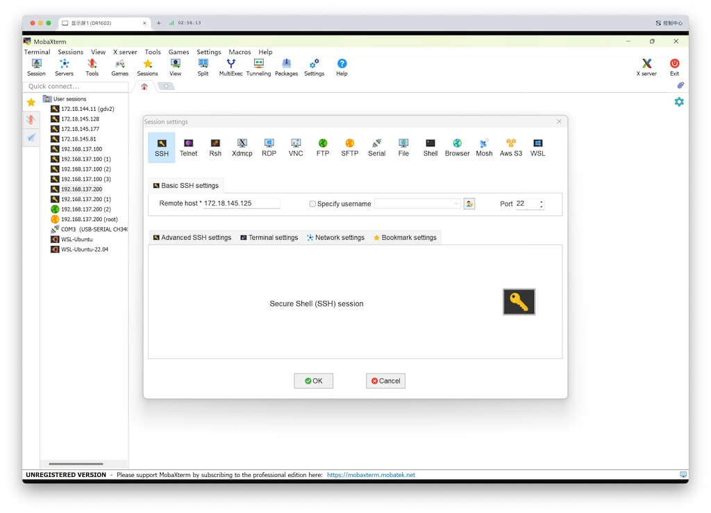
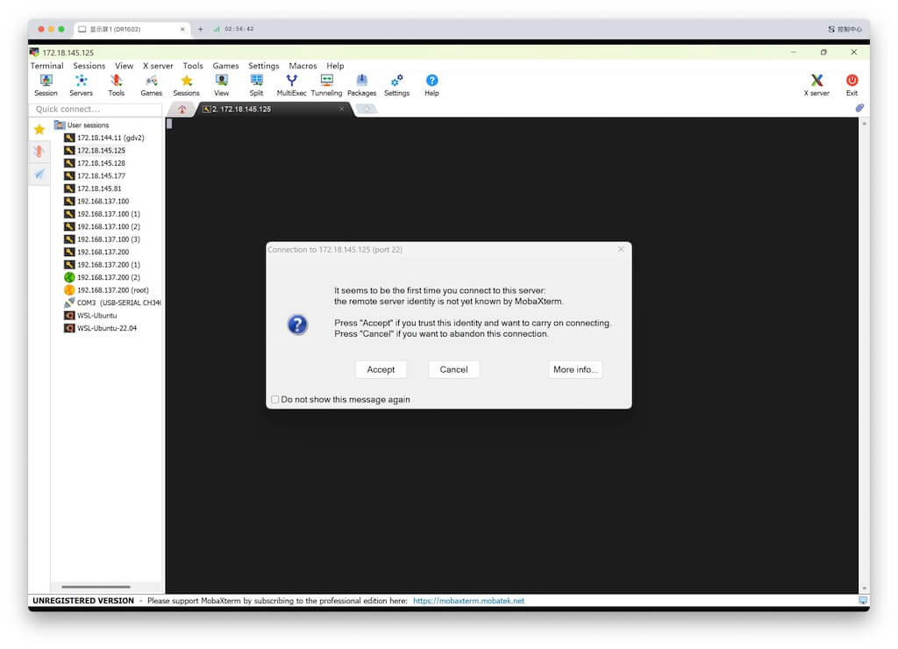
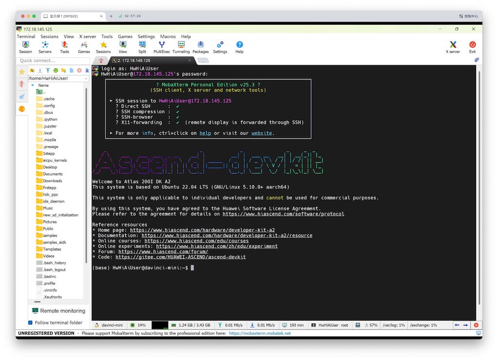
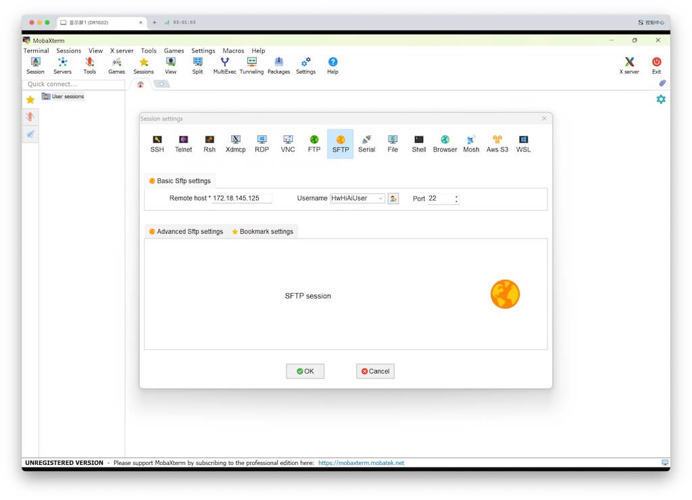
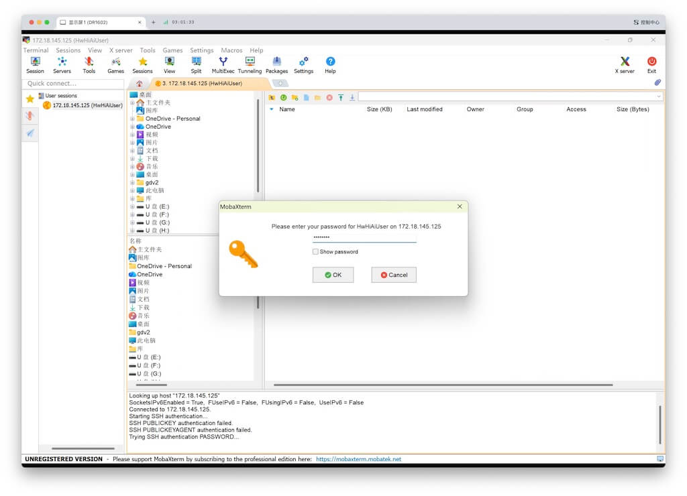
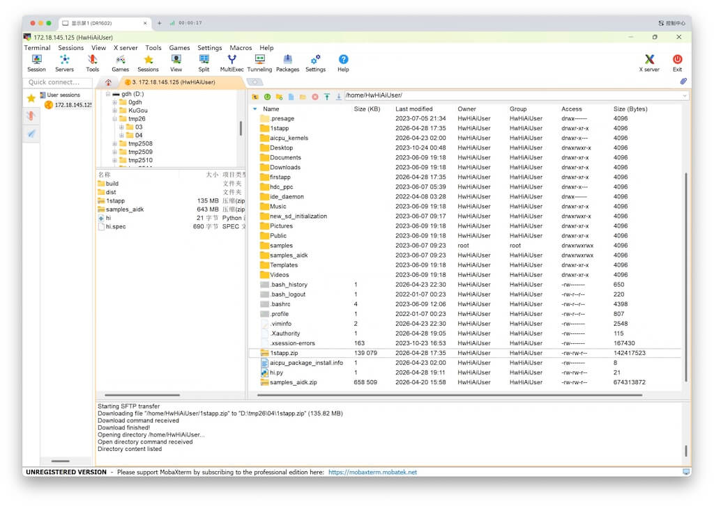

# MobaXterm简要说明
{: .no_toc }
`更新-260428` \| `发布-260428`

本文档描述 MobXterm 相关操作的说明，供同学参考。

<!--  -->

  

    目录
  

  <!-- {: .text-delta } -->
- TOC
{:toc}

---

## 安装

MobaXterm下载：[链接↗](https://pan.jiangnan.edu.cn/link/AA1B6BD0FB597643F18945DA1E1FBAA3E2)

解压后即可使用，免安装。

---

## SSH登录

1. **新建session**

    - 点击左上角 **Session**
    - 在 Session settings 界面中，点击左上角 **SSH**
    - **Remote host**：填写远程机器（开发板）的IP地址，比如 `172.18.145.125`
    - **Specify username**：可选。✳️ 建议不填。
    - 点击底部 **OK** 按钮

    

    ✳️ 如果是首次连接该远程，会出现以下提示框，点击 **Accept** 按钮即可。

    

1. **输入用户名和密码**

    输入用户名和正确的密码，即可登录。✅ Done！
    

    ✳️ 如果在 1. 新建session 指定了用户名，则登录时至要求输入正确密码即可。

---

## 传文件

1. **新建session**

    - 点击左上角 **Session**
    - 在 Session settings 界面中，点击顶部中间的 **SFTP**
    - **Remote host**：填写远程机器（开发板）的IP地址，比如 `172.18.145.125`
    - **Username**：填写访问该机器的用户名，比如 `HwHiAiUser`
    - 点击底部 **OK** 按钮

    

1. **输入密码**

    输入正确的密码。本样例就是输入 172.18.145.125 机器上的 HwHiAiUser 用户的密码。

    

2. **互传文件和目录**

    登录成功后，可通过鼠标拖拽，在本地和远程之间互传文件以及目录。✅ Done！

    

<!--  -->
THE END