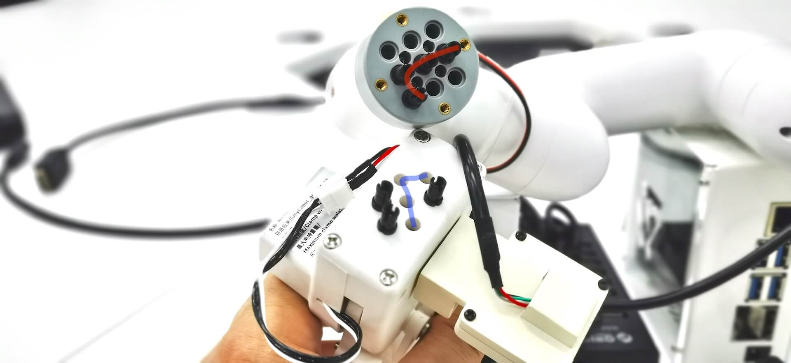
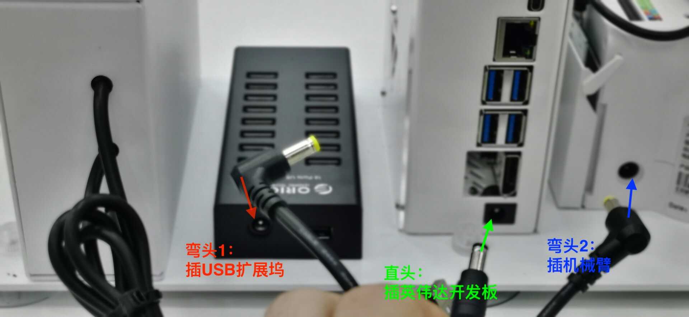
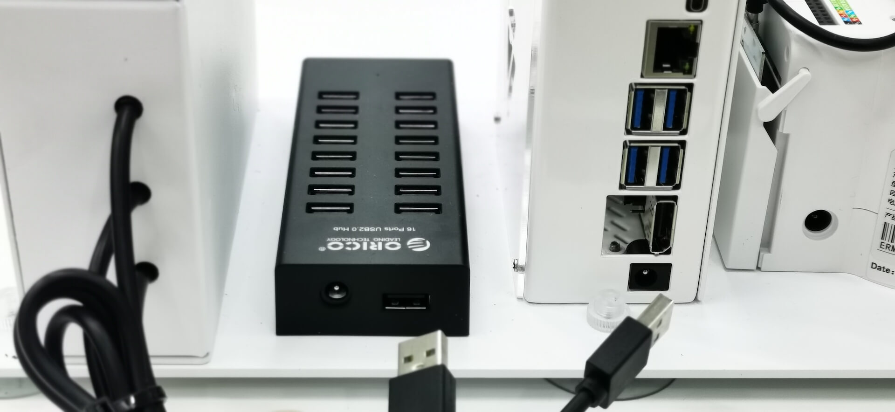
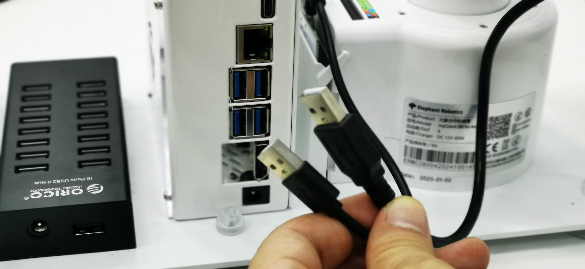
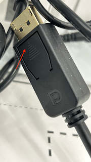

# 视觉实验箱
{: .no_toc }
`更新-260723` \| `发布-260515`

本文档描述 **视觉实验箱** 的相关信息，用于快速熟悉和入门教具。

<!--  -->
<details markdown="block">
  <summary>✳️ 目录</summary>
- TOC
{:toc}
</details>

<!--  -->
<details markdown="block">
  <summary>ℹ️ 更新</summary>

**260723**
- 新增：[安装Google拼音](#安装Google拼音)

**260713**
- 新增：[组装和装箱](#组装和装箱)

<span style="font-size:12px; color:#999">--- end ---</span>
</details>


---

## 账号信息
<br>
默认账号信息如下：

- 账号 / 密码： root / yahboom
- 账号 / 密码： jetson / yahboom
- WiFi 热点 / 密码：b102 / b102b102

---

<span id="install-pinyin"></span>

## 安装Google拼音
`[aka] install-pinyin`

在开发板上启一个 `终端(Terminal)`，然后按 `Ctrl` + `空格` 键，看看是否已安装中文输入法。如已有，则可使用。如没有，请参考如下步骤安装。

- 依次执行以下命令，安装中文输入法：

    ```bash
sudo apt update
    ```

    ```bash
sudo apt install fcitx fcitx-tools fcitx-config* fcitx-frontend* fcitx-module* fcitx-ui-* presage
    ```

    ```bash
sudo apt install fcitx-googlepinyin
    ```

    > 第2个命令只执行 `sudo apt install fcitx`，也能安装成功中文输入法，但中文输入时候选词框很小。按上述第2个命令安装后，中文输入时候选词框能看清楚。

- 按以下步骤修改配置：

    1. 点击 `Settings`，点击 `Region & Language`
    2. 点击 Region & Language 界面的底部的 `Manage Installed Languages`
    3. Language Support 界面有 2 个页签，选择 `Language` 页签（默认选中的）
    4. 更改 Language 页签的底部的 `Keyboard input method system:` 为 `fcitx`
    5. 再点击 Language 页签的中部的 `Appy System-Wide` 按钮，然后点击右下角 `Close` 关闭窗口

    > 如果想把界面改成中文显示，可将 Language 页签的顶部的 `Language for menus and windows:` 中的 `Chinese(China)`，用鼠标点住后拖动到最上面，然后也是要点击中部的 `Appy System-Wide` 按钮，然后点击右下角 `Close` 关闭窗口。

-  在 `终端(Terminal)` 输入 `reboot` （或者 `sudo reboot`）后按回车，重启系统。

- 配置并启用输入法
    - 重启后，桌面右上角任务栏会出现一个键盘或企鹅图标，点击它。
    - 选择 “配置” (Configure) 或 “配置当前输入法” (Configure Current Input Method)。
    - 在弹出的配置窗口中，点击左下角的 “+” 号添加输入法。
    - 取消勾选“只显示当前语言”，在列表中找到并选择 “Google Pinyin”，点击“OK”添加。
    - 完成后，你就可以使用 Ctrl + 空格 或 Shift 键切换中英文输入了。

[🔝](#top)

---

## 组装和装箱
<br>
带离实验室，需要装箱。到达目的地后，需要组装后才能使用。

### 装箱
<br>
需要先做以下事宜，才能装箱：

1. **拔下夹爪**

    - 双手分别抓住机械臂（其余部分）和夹爪。
    - 往外柔和拔夹爪，并上下左右轻微晃动。
    - 不要拔下夹爪和机械臂（其余部分）之间的连线。

    拔下后的夹爪（样例图）：
    
    [](./viki.assets/claw.jpg)

    在样例图中：

    - 夹爪有 7 字形的四个空洞
    - 另一端有 7 字形的四个接头
    - 对其后插入，夹爪即组装好了。

2. **拔下电源盒的3个插头**

    拔下电源盒的 3 个插头，3 个插头分别插：USB 扩展坞、英伟达开发板、机械臂。如下图所示：

    [](./viki.assets/power-plug.jpg)

3. **拔下电源盒的2个USB口**

    拔下电源盒的 2 个USB口，2 个USB分别插：USB 扩展坞、英伟达开发板。如下图所示：

    [](./viki.assets/power-usb.jpg)

4. **拔下机械臂的2个USB口**

    拔下机械臂的 2 个USB口，2 个USB都插在英伟达开发板。如下图所示：

    [](./viki.assets/irobot-usb.jpg)

5. **拔下DP显示线**

    拔下连在英伟达开发板的 DP 显示线。如下图所示：

    [](./viki.assets/dp.png)

    ✅ DP线有个卡扣（如图红色箭头），要按下后才能拔出。❌ 不能直接硬拔，会损坏视频接口。

<br>
完成上述事项后，就可以装箱。装箱注意事项：

- 所有器材，都放在箱子的合适位置。❌不能有任何高出箱子的部分。
- 器材周边如有空隙，要安放泡沫（或蓬松纸团）塞紧。以防运输过程晃动而损坏器材。

### 组装
<br>
请按以下步骤组装视觉实验箱：

1. **安装夹爪**

    对齐接头，将夹爪柔和的插回机械臂。

2. **电源盒的3个插头，插入对应插孔**

    - 弯头1：插入USB扩展坞
    - 直头：插入英伟达开发板
    - 弯头2：插入机械臂

3. **电源盒的2个USB，插入对应插孔**

    分别插入：USB扩展坞，英伟达开发板

4. **机械臂的2个USB，插入开发板**

    - 机械臂的2个USB，都插到英伟达开发板。
    - 调整连夹爪顶端摄像头的USB线，不要太紧绷。以免机械臂转动时拉脱USB接口。

5. **连其他线**

    - 鼠标：插 USB 扩展坞
    - 键盘：插 USB 扩展坞
    - 屏幕电源线：一端插 USB 扩展坞，一端插屏幕的Type-C（2个Type-C，随便哪个都可以）
    - 视频线：一端（大）插英伟达开发板，一端（小）插显示屏

6. **插电源线到电源盒**

    插电源线到电源盒，即可启动。

---

## 机械臂体验

机械臂体验，详见：[机械臂体验↗]

<!--  -->
<span style="font-size:12px; color:#999">THE END</span>

<!--  -->
[机械臂体验↗]: https://tnt.gdvzz.com/aikit/irobots.html
