# VSCode简要说明
{: .no_toc }
`更新-260428` \| `发布-260320`

本文档描述 VSCode 相关操作的说明，供同学参考。

<!--  -->
<details markdown="block">
  <summary>
    目录
  </summary>
  <!-- {: .text-delta } -->
- TOC
{:toc}
</details>

---

## 安装 VSCode

### Windows

（从略）

### macOS

（从略）

### Jetson开发板
<br>
点击界面左下角的 `九宫格(Show Applications)`，然后搜索 `VSCode`。如能找到则打开直接使用。如没有找到，参考如下步骤安装 VSCode 到开发板。

- 打开发板上的浏览器，访问 VSCode 官网 Download 页面：[https://code.visualstudio.com/Download↗](https://code.visualstudio.com/Download)

- 选择下载 `.deb` `Arm64`。通常下载到用户的 HOME 目录的 `Downloads` 子目录中，比如 `/home/jetson/Downloads`。

- 依次执行以下命令，安装 VSCode：

    ```bash
    cd ~/Downloads # 假定 .deb 安装包下载到 /home/jetson/Downloads 目录中
    sudo dpkg -i 下载的.deb安装包文件
    ```

- 点击界面左下角的 `九宫格(Show Applications)`，然后搜索 `VSCode`，就可以找到该应用。打开应用后，在界面左侧导航栏中找到该应用，鼠标右键选 `Add to Favorites`，以方便下次使用。

---

<span id="remote-ssh"></span>
## 远程连接
<br>
可在本地电脑使用 VSCode，远程 打开 Linux 服务器（包括开发板）上的文件，直接在本地电脑的 VSCode 编辑。

1. 安装 **Remote - SSH** 插件

    点击左侧导航栏的 **Extensions**，搜索 Remote - SSH，找到后点击安装。安装完成后，在左侧导航栏会新增 **Remote Explorer**。

    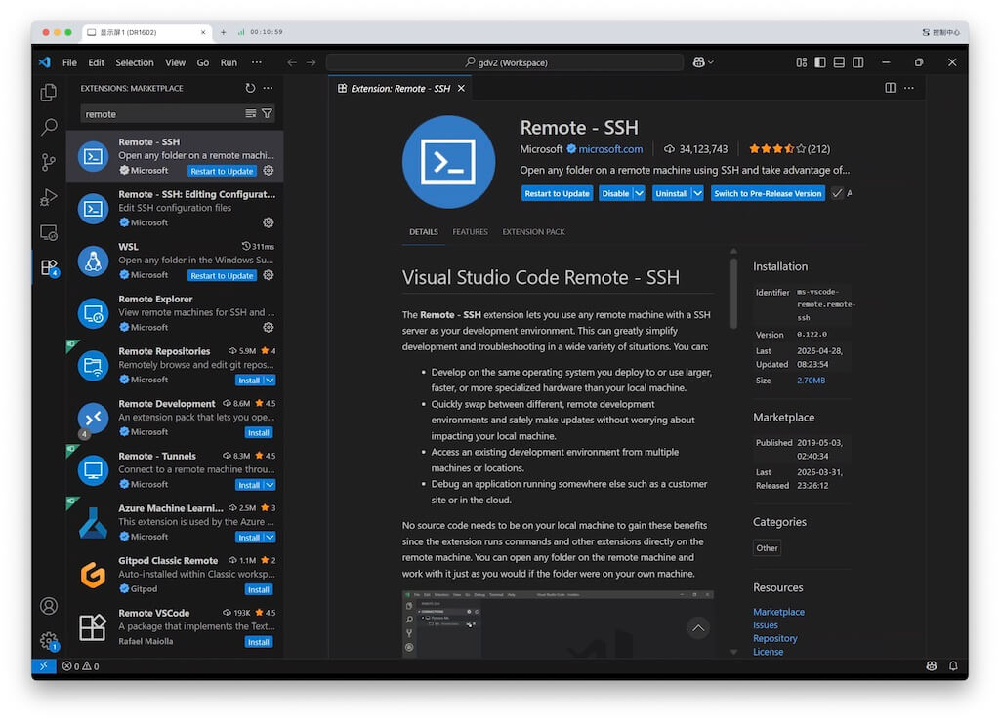

2. 新增远程

    点击左侧导航栏的 **Remote Explorer**，鼠标移到左上 **SSH**， 行末出现有 **+ New Remote**，点击后新增远程。

    在右侧顶部按提示信息 `E.g. ssh hello@microsoft.com -A`，输入 `ssh 用户名@IP地址（或域名） `。比如，`ssh root@172.18.145.125`。

    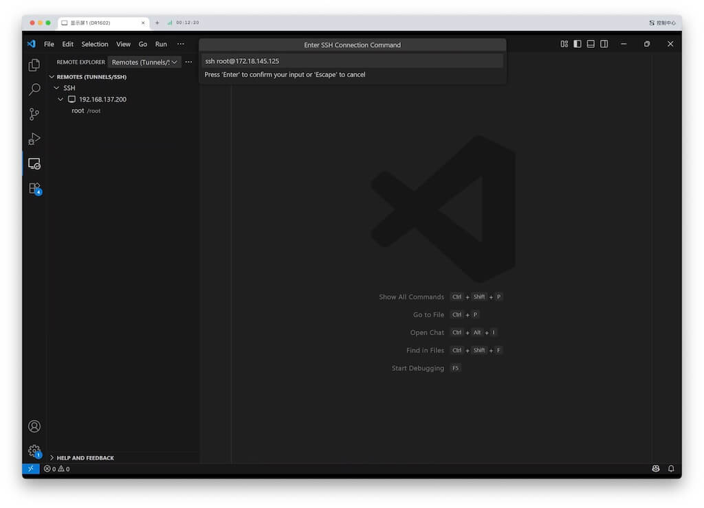

3. 保存远程的信息

    选一个文件，保存远程的信息。

    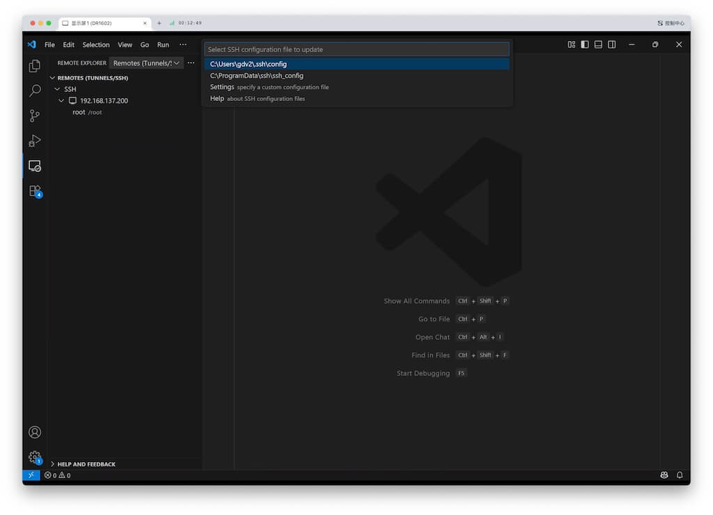

4. 连接远程

    刚配置的远程，可以点击右下角的 **Connect** 按钮连接远程。

    或者下次再连接时，鼠标移到左侧要连接的远程的名字，行末出现 **→ Connect in Current Window...** 和 **Connect in New Window...**，点击其中之一连接远程。
    
    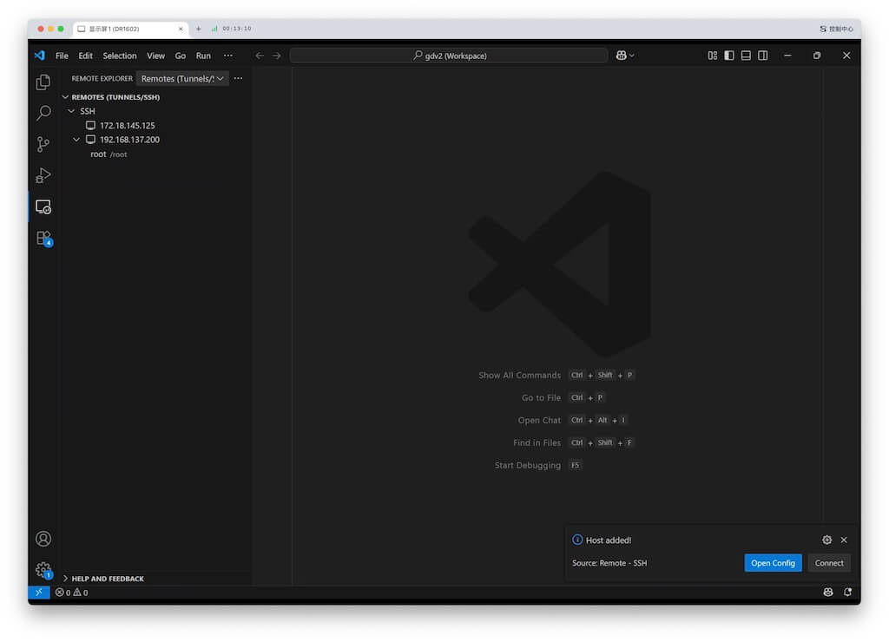

5. 按提示选择 OS 平台

    按提示信息选择远程的操作系统：Linux，Windows，macOS。

    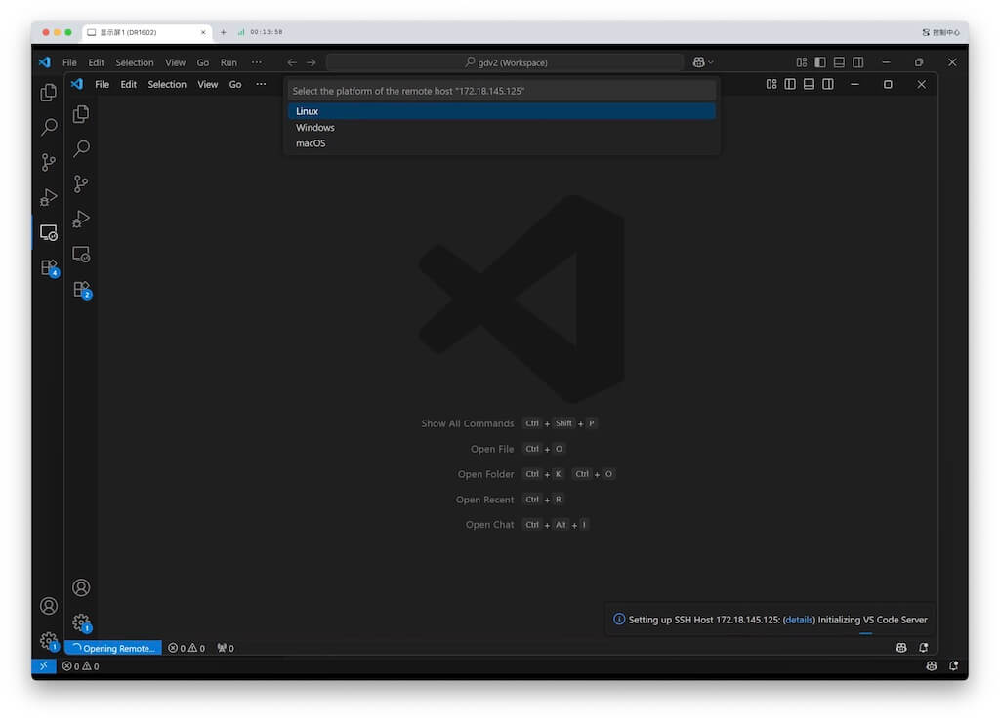

6. 在顶部输入密码

    在顶部输入密码（本例就是输入 172.18.145.125 机器上的 root 用户的密码）。

    ✴️ 可能会关注右下角 **Setting up SSH Host ...** 的信息，从而忽略顶部要求输入密码。如果没有输入密码，则右下角提示信息不会变化（一直在等待输入密码），从而觉得无法连接远程。

    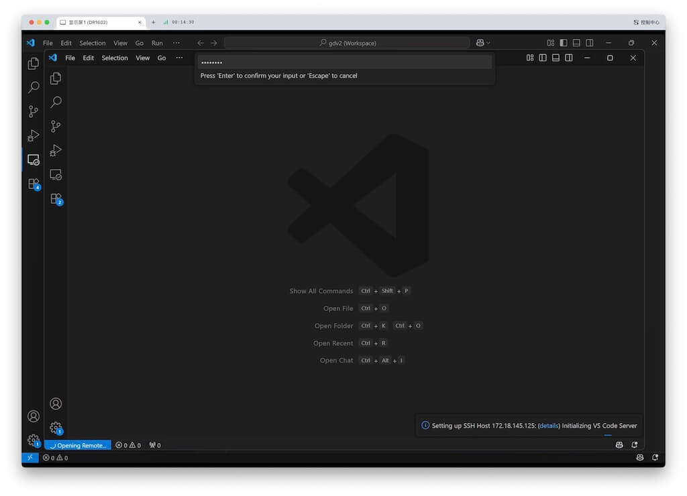

7. 等待下载

    输入密码后，右下角显示 **Downloading VS Code Server ...** 的信息。应该很快完成。
    
    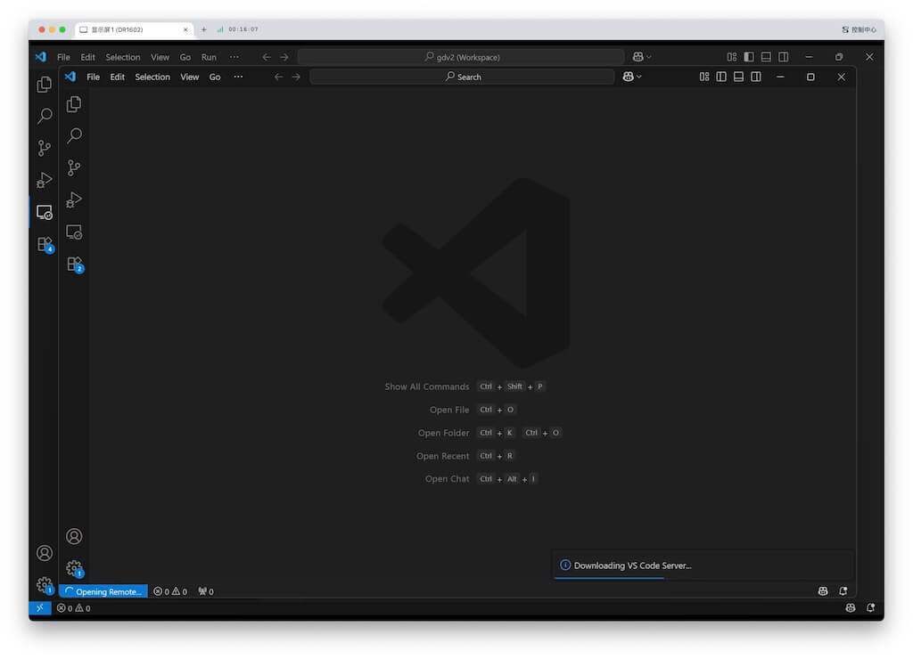

8. 打开文件夹

    在远程机器上，选择要打开的文件夹。
    
    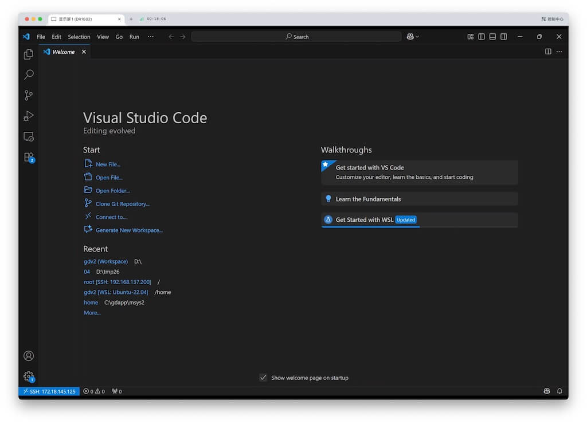
    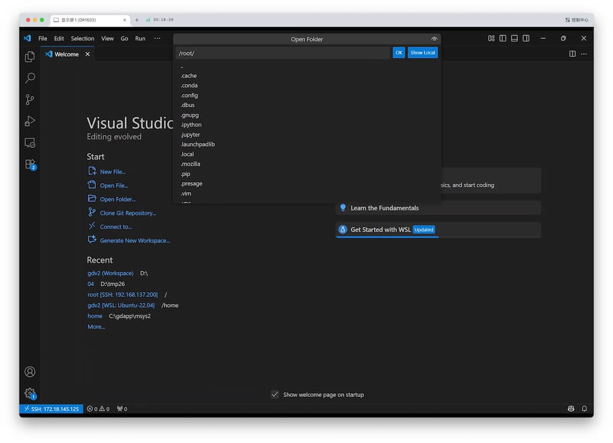

9. 再次输入密码

    再次在顶部输入密码（本例就是输入 172.18.145.125 机器上的 root 用户的密码）。

    ✴️ 可能会关注右下角 **Setting up SSH Host ...** 的信息，从而忽略顶部要求输入密码。如果没有输入密码，则右下角提示信息不会变化（一直在等待输入密码），从而觉得无法连接远程。

    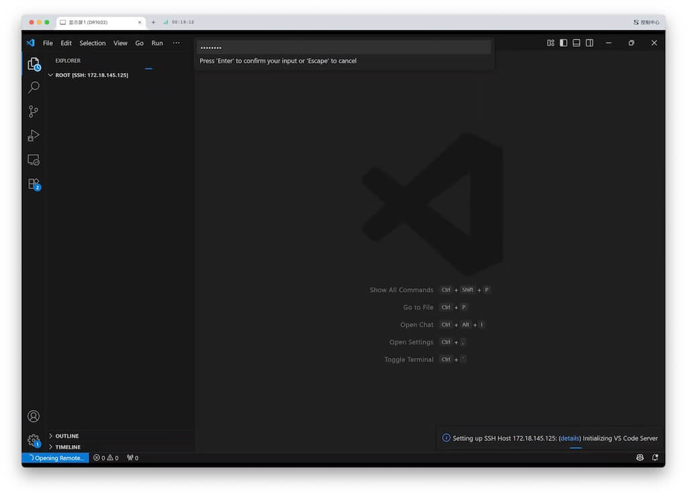

10. 点击信任

    点击 **Yes, I trust the authors**。 ✅ Done！
    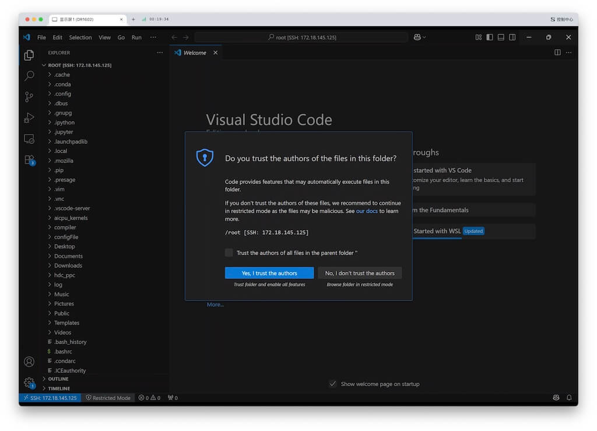

上述方法适用于临时连接远程。如果要经常连接某个远程服务器，避免经常输入密码，可通过配置 ssh 信息实现，详见：[vscode通过ssh连接服务器实现免密登录+删除（吐血总结）↗](https://blog.csdn.net/Oxford1151/article/details/137228119)

<!--  -->
<span style="font-size:12px; color:#999">THE END</span>