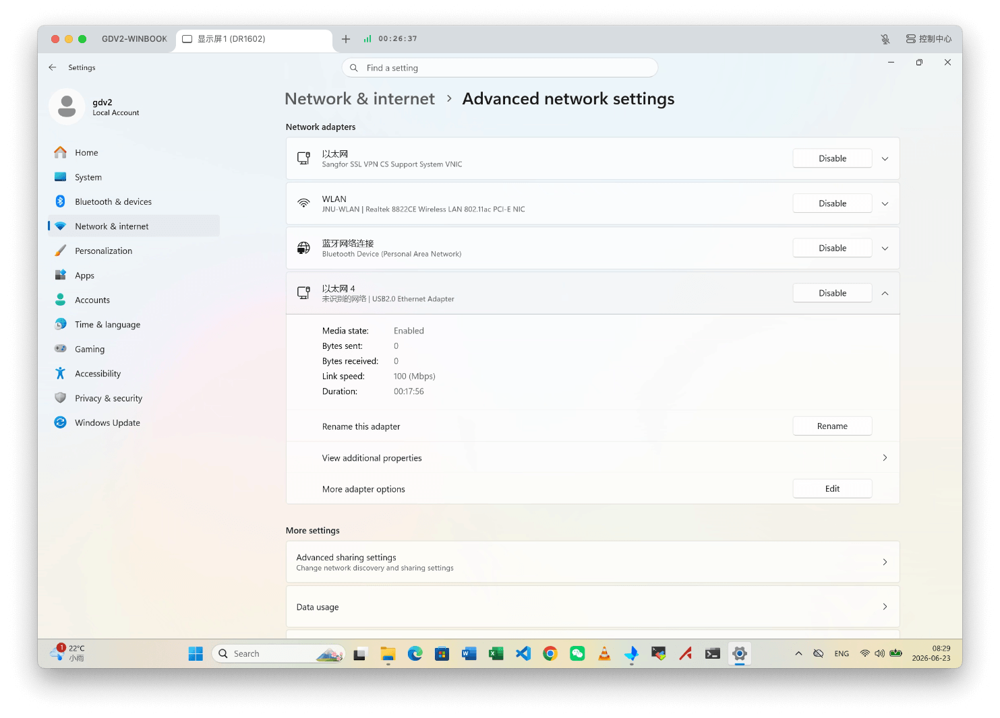
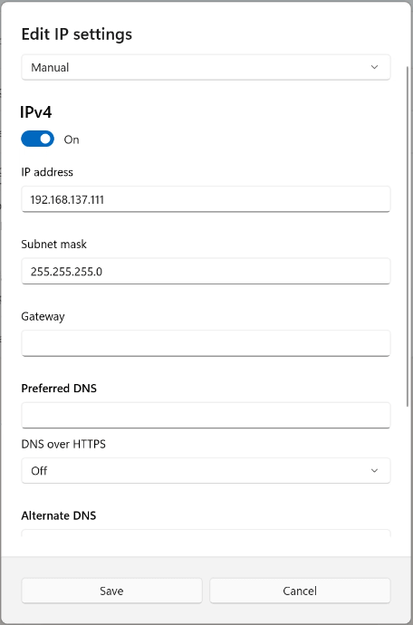
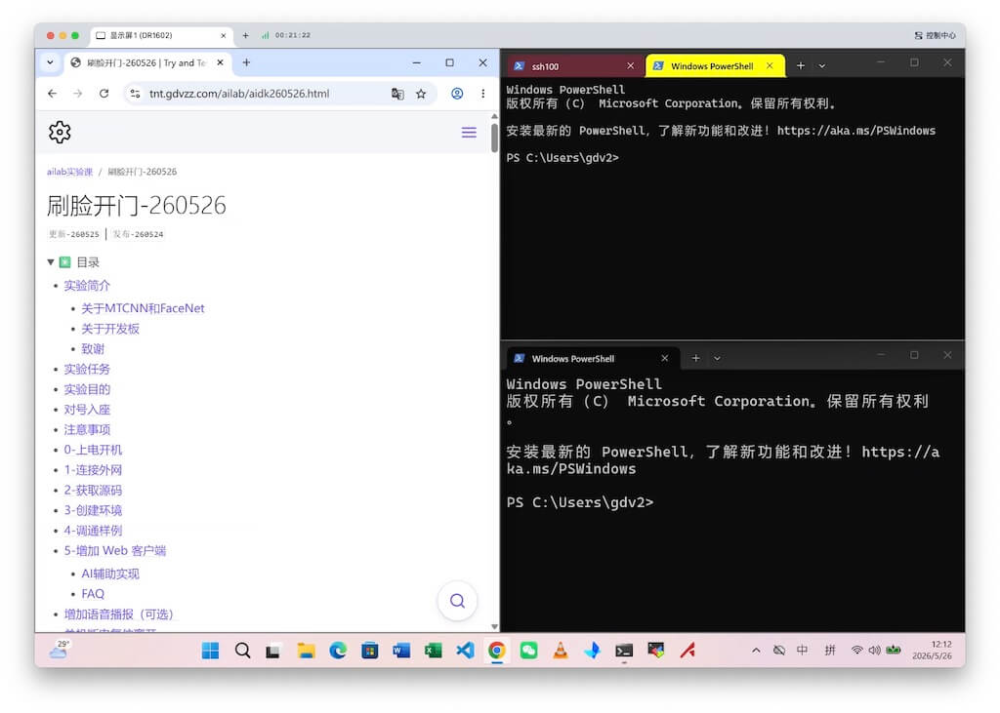

# Windows指南
{: .no_toc }
`更新-260623` \| `发布-260526`

本文档描述 **Windows操作** 的相关信息，用于快速熟悉和教具相关的操作。

<!--  -->
<details markdown="block">
  <summary>✳️ 目录</summary>
- TOC
{:toc}
</details>

<details markdown="block">
  <summary>ℹ️ 更新历史</summary>

**260623**
- 新增：[设置PC（个人电脑）IP](#setip)

**260607**
- 新增：[运行python项目](#运行-python-项目)
</details>

---

<span id="setip"></span>

## 设置PC（个人电脑）IP
`[aka] setip`

将 PC（个人电脑）的 IP 地址设置为和开发板同一个网段，以便通过网线访问开发板。以下以 Windows 11 Pro 25H2 为例。

**一、打开<ins>网络和Internet</ins>设置**

1. 按 `win` + `i` 键，调出 **设置（Settings）** 界面
2. 点击左侧导航栏的 **网络和Internet（Network & internet）**
3. 点击右侧 <ins>网络和Internet（Network & internet）</ins> 界面中底部的 **高级网络设置（Advanced network settings）**
4. 查看界面上列出的 <ins>网络适配器（Network adapters）</ins>，确定哪个是连接开发板的，通常是那个 **以太网xx**。然后点击那个 **以太网xx** 那行的任意处，以展开信息
5. 再点击 **查看更多属性（View additional properties）** 那行的任意处，可进入 IP 地址设置界面

样例界面如下：

[](./windowsug.assets/setip.png)

**✴️ 注意事项：**

- **确定PC（个人电脑）是否有网口**。可在上述样例界面查看，是否有 <ins>以太网xx</ins> 等网络适配器。如有，则大概率有网口（有的PC的网口是折叠的，很小，误以为不是网口）。如无，可联系实验室老师借用 <ins>USB转网口转接器</ins> 获得一个网口（样例图中的 <ins>以太网4</ins> 就是使用转接器获得的网口）。
- **设置连开发板的那个以太网**。样例图中，应设置连接开发板的 <ins>以太网4</ins> 的 IP 地址。样例图中的 <ins>以太网</ins> 是安装学校 VPN 软件后生成的虚拟网口，不是连接开发板的网口。

<!--  -->
**二、设置PC（个人电脑）的IP地址**

样例界面如下：

[](./windowsug.assets/editip.png)

参数设置如下：

- **编辑IP设置（Edit IP setting）**：选择 `手动（Manual）`
- **IPv4**：选择 `ON`
- **IP地址（IP address）**：输入 `192.168.137.111`

    - 取值是 192.168.137.xxx
    - xxx 可以是除 0（网络号）、255（广播地址）、100（开发板IP）、1（预留给网关）以外的数值
    - xxx可以取 111、222 等
    - **✴️ 注意事项**：IP地址不能设置为 `192.168.137.100`，因为该 IP 地址是开发板的 IP 地址。

- **子网掩码（Subnet mask）**：输入 `255.255.255.0`

    - 有的版本可能要求输入**子网掩码长度**，则输入 `24`

- 点击 **保存（Save）** 按钮

**✳️ 提示信息：**

- 如要求设置 **网管（Gateway）**，则输入`192.168.137.1`。网管信息不会用到。再尝试点击 **保存（Save）** 按钮
- 如要求设置 **DNS（Preferred DNS）**，则输入`114.114.114.114`。DNS不会用到。再尝试点击 **保存（Save）** 按钮
- 因Windows版本不同，上述设置步骤可能有细微差别。

[🔝](#top)

---

## 说明
<br>
相关操作适用于：**Windows 11 专业版 25H2**

软件下载请参考：[微软正版软件↗]

---

## 多窗口操作
<br>
通过在屏幕上合理安排多窗口进行操作，可提高操作效率。

1. **启用多窗口**

    - 按 `win` + `i` 键，调出 **设置**
    - 左侧导航栏 → 选择 **系统** → 右侧界面中选择 **多任务处理**
    - 打开 **贴靠窗口**

2. **窗口组合**

    - 按 `win` + `→←↓↑`，可排列窗口
    - 按 `win` + `→`，再按 `win` + `↑`，可将窗口放在右上角

3. **PowerShell**

    - 点击顶部 **+** 号，可以新建标签页。这样一个窗口里面，就有多个“窗口”了。
    - 字体大小调整：`ctrl` + `+`，`ctrl` + `-`，`ctrl` + `0`

窗口布局样例：


    
---

<span id="run-python-project"></span>

## 运行 Python 项目
`[aka] run-python-project`

建议先创建 Python 虚拟环境，然后在虚拟环境中运行项目，可以做到和PC（个人电脑）上的其他项目互不影响。

### 安装 Conda
<br>
安装 Conda 用于创建 Python 虚拟环境。实际是安装 miniforge，不是安装 miniconda，更不是安装 anaconda。更多信息可参考：[Conda指南-为什么需要Conda↗]。

安装指导可参考：[Conda指南-Conda 安装（Windows）↗]。

### 运行项目
<br>
用于开发板的实验手册，基本适用于 Windows。以下以 [人脸手势识别-260526↗] 为例，命令都是在 **PowerShell 7** 中运行测试通过的。

1. **创建环境**

    以下创建环境的3个命令，可以在 PowerShell7中运行：

    ```bash
conda create -n fgh0526 python=3.9
    ```
    ```bash
conda activate fgh0526
    ```
    ```bash
pip3 install mediapipe==0.10.9 opencv-python==4.12.0.88 numpy==2.0.2
    ```

2. **下载解压样例代码**

    以下3个命令，可以在 PowerShell7中运行：

    ```bash
mkdir ~/fgh0526
    ```
    ```bash
mv ~/Downloads/face_mesh.zip ~/fgh0526 && mv ~/Downloads/haar_detection.zip ~/fgh0526 && mv ~/Downloads/gesture_recognizer.zip ~/fgh0526
    ```
    ```bash
cd ~/fgh0526
    ```

    ✳️ unzip 要替换为 tar -xf。即将 unzip 命令：
    ```bash
unzip face_mesh.zip && unzip haar_detection.zip && unzip gesture_recognizer.zip
    ```

    改成如下的 tar -xf
    ```bash
tar -xf face_mesh.zip && tar -xf haar_detection.zip && tar -xf gesture_recognizer.zip
    ```

3. **体验视觉功能**

    以下进入目录 cd 也起作用：
    ```bash
cd ~/fgh0526/face_mesh
    ``` 

    ✳️ 可能要用 python（而不是 python3） 执行程序。即先尝试 python3：
    ```bash
python3 main.py
    ```

    不行的话就使用如下 python 执行程序：
    ```bash
python main.py
    ```

    > 可以执行 `where.exe python` 了解使用了哪个 python。可能输出信息中有多个 python，则第一个 python 就是使用的 python。<br>
    > 还可以执行 `python --help | more`，帮助信息的第一行会有 python 的路径。

[🔝](#top)

<!--  -->
<span style="font-size:12px; color:#999">THE END</span>

<!--  -->
[人脸手势识别-260526↗]: https://tnt.gdvzz.com/ailab/viki260526.html
[微软正版软件↗]: https://nic.jiangnan.edu.cn/info/1057/2446.htm
[Conda指南-为什么需要Conda↗]: https://tnt.gdvzz.com/aikit/condaug.html#why-conda
[Conda指南-Conda 安装（Windows）↗]: https://tnt.gdvzz.com/aikit/condaug.html#conda-win
