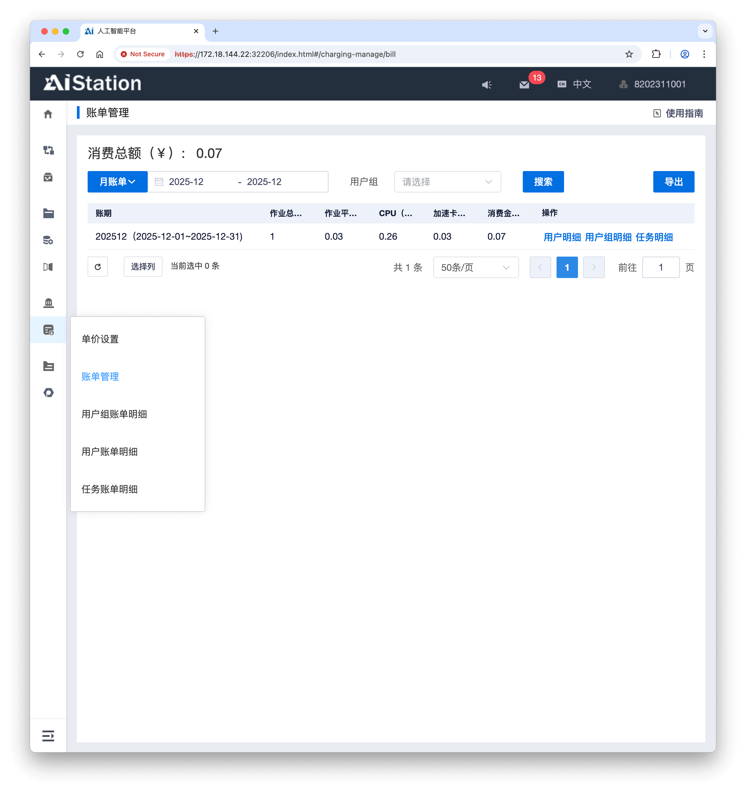

# 人工智能算力平台
{: .no_toc }

  

    目录
  

  <!-- {: .text-delta } -->
- TOC
{:toc}

关于学院算力平台的使用说明、费用查看，以及转账充值。

## 使用简要说明

下载链接：[算力平台使用简要说明-v1.30-221107](./aicp.assets/算力平台使用简要说明-v1.30-251107.pdf)

## 费用查看

L40 和 A100 费用，可在相应功能中查看。

### L40费用查看

L40 的费用，可在 `资源&任务 | 配额使用统计` 中查看。

### A100费用查看

A100 的费用，可在 `计费管理 | 账单管理` 中查看。

## 转账充值全攻略

转账充值全攻略，请参考：[【江南大仪共享】大仪开放共享系统转账充值全攻略](https://mp.weixin.qq.com/s/O6HFNKmMqv9C-ygCutl_KA)

<!--  -->
<!-- 

1、Nvidia L40，32张

参考资料：https://images.nvidia.cn/content/Solutions/data-center/vgpu-L40-datasheet.pdf

Nvidia L40, 90.5 TFLOPS(FP32) / 48GB

L40 算力，共：2896 TFLOPS(FP32)

2、NVIDIA A100 80GB PCIe，3张

参考资料：https://www.nvidia.com/content/dam/en-zz/Solutions/Data-Center/a100/pdf/nvidia-a100-datasheet-nvidia-us-2188504-web.pdf

Nvidia A100，19.5 TFLOPS(FP32) / 80GB

A100 算力，共：58.5 TFLOPS(FP32)

3、Nvidia H100 80GB，1张

参考资料：https://resources.nvidia.com/en-us-hopper-architecture/nvidia-tensor-core-gpu-datasheet?ncid=no-ncid

Nvidia H100，67 TFLOPS(FP32) / 80GB

H100 算力，共：67 TFLOPS(FP32)
 -->