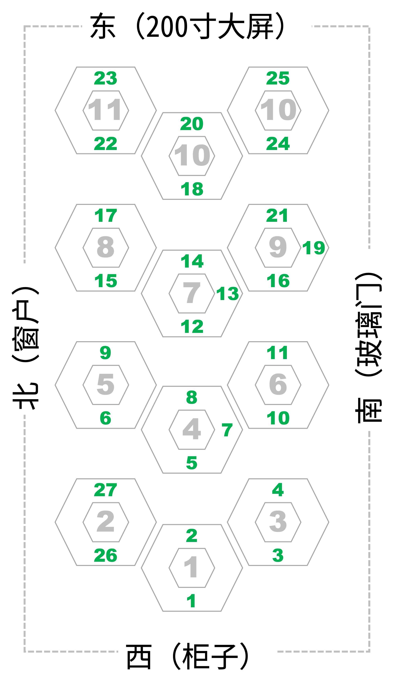
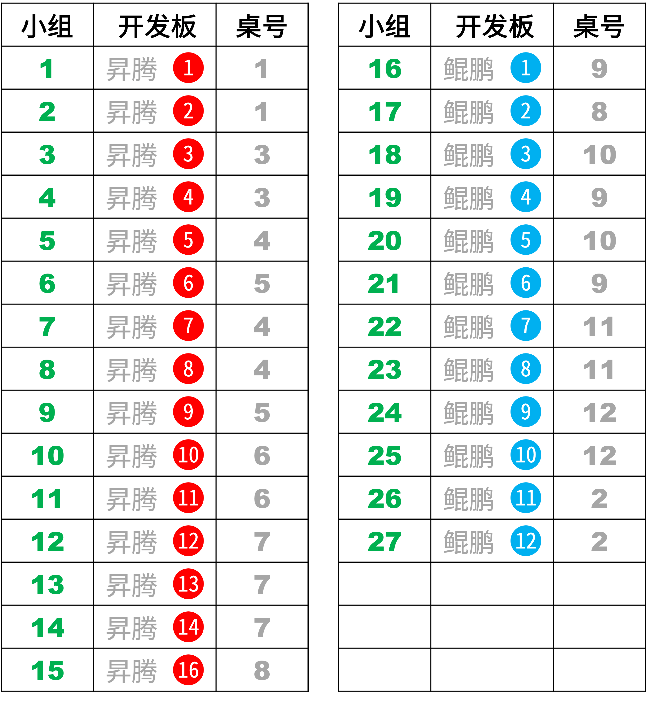

# BP网络-260512
{: .no_toc }
`更新-260512` \| `发布-260512`

<!--  -->
<!-- <details open markdown="block">
  <summary>
    目录
  </summary>
- TOC
{:toc}
</details> -->

<!-- <details>
    <summary>ℹ️ 更新历史</summary>
<br>

**260501：新增3个岗位**

- [产品运营-音乐方向](#产品运营-音乐方向)
- [前端开发工程师](#前端开发工程师)
- [移动端开发工程师-Android](#移动端开发工程师-android)

</details> -->

<details markdown="block">
  <summary>✳️ 目录</summary>
- TOC
{:toc}
</details>

---

## 实验简介
<br>
本次实验将采用 BP 网络拟合曲线、预测销量等。

本次实验将使用  **昇腾开发板** 和  **鲲鹏开发板** 完成。

---

## 实验目的
<br>
通过本次实验，期望达成以下目的：

1. 了解 BP 网络
2. 进一步掌握开发板的使用
3. 进一步熟悉 Linux 相关操作
4. 增加解决问题的经验

---

## 实验任务
<br>
本次实验主要完成以下任务：

### 任务1-拟合正弦
<br>
构建BP网络拟合正弦样本数据：

- 样本数据，请编写程序自动生成。

- 请编写程序实现。

❇️ **需完成任务：**

1. 输出拟合曲线，以及损失函数和epoch的曲线。如下示意：
    

2. 不同隐含层对结果影响（采用均方根误差分析）

3. 神经元个数对结果影响（采用均方根误差分析）

### 任务2-预测药品销量
<br>
构建BP网络预测药品销量：

- 已有1月到12月的药品销量。

- 根据1、2、3月的销量，预测4月的销量；根据2、3、4月的实际销量，预测5月的销量；……。直至满足预测精度为止。

- 1月到12月的药品销量数据如下：2056, 2395, 2600, 2298, 1634, 1600, 1873, 1478, 1900, 1500, 2046, 1556

❇️ **需完成任务：**

1. 编写程序实现预测药品销量。

2. 截图保存结果。

3. 不同隐含层对结果影响（采用均方根误差分析）

4. 神经元个数对结果影响（采用均方根误差分析）

### 任务3-预测客货运量
<br>
构建BP网络预测公路客运量和货运量：

- 已有1990年到2009年的客运量和货运量数据。

- 根据历史数据，预测2010年和2011年的客户量/货运量数据。

- 1990年到2009年公路客运量数据（万人）如下（共 20 个数据）：5126, 6217, 7730, 9145, 10460, 11387, 12353, 15750, 18304, 19836, 21024, 19490, 20433, 22598, 25107, 33442, 36836, 40548, 42927, 43462

- 1990年到2009年公路货运量数据（万吨）如下（共 20 个数据）：1237, 1379, 1385, 1399, 1663, 1714, 1834, 4322, 8132, 8936, 11099, 11203, 10524, 11115, 13320, 16762, 18673, 20724, 20803, 21804

❇️ **需完成任务：**

1. 编写程序实现预测公路客运量和货运量。

2. 截图保存结果。

3. 不同隐含层对结果影响（采用均方根误差分析）

4. 神经元个数对结果影响（采用均方根误差分析）

---

## 对号入座
<br>
因小组人数变动，座位安排有调整：
<details markdown="block">
  <summary>✳️ 座位安排，请对号入座</summary>

</details>

开发板安排，和上次实验一致：
<details markdown="block">
  <summary>✳️ 器材安排，请对号使用</summary>

</details>

---

## 注意事项
<br>
敬请关注以下事项：

- 🚫 **禁止：水杯、水瓶等，不要放在桌上**。临时放桌上，则要拧紧盖子。液体泼洒会损坏开发板。

- ✅ **建议：书包等物品放实验室四周空闲处**。以提高效率，并防止器材跌落（已发生跌落）。

- ✅ **建议：电源线等，都从中间穿到桌面上**。以提高效率，并防止器材跌落（已发生跌落）。

---

## 0-上电开机
<br>
插上电源即可开机：

-  昇腾：开发板上电后，3个指示灯会依次绿色常亮，表示启动正常。

-  鲲鹏：前面板有2个 Type-C，电源插入➡️边上那个。
-  鲲鹏：拿掉顶部的磁吸盖子，看到2个绿灯亮，就表示开机完成。

---

## 1-连接外网
<br>
开发板上电开机后，先让开发板连接外网，即能访问互联网。建议连外网后，创建本次实验所需的 Python 虚拟环境。相关请参考如下：

-  昇腾：[连接外网↗](https://tnt.gdvzz.com/aikit/aidk.html#nets)
-  鲲鹏：[连接外网↗](https://tnt.gdvzz.com/aikit/dkoo.html#nets)

---

## 2-代码调测
<br>
建议按如下步骤开展：

1. **AI辅助生成代码，并做相应调整**

1. **HwHiAiUser 用户登录开发板**

    用 MobeXterm 软件登录，或在本地电脑执行：

    ```bash
ssh HwHiAiUser@192.168.137.100
    ```
    
    > 在权限满足实验要求的前提下，尽量不用超级用户 root 做实验。


2. **用 conda 创建 Python 虚拟环境：**

    ```bash
conda create -n bp0512 python=3.10
    ```

    > (1) 在虚拟环境中开展实验，可做到和开发板的其他项目互不影响。<br>
    > (2) bp0512 是虚拟环境的名字的样例。<br>
    > (3) Python 3.10 只是举例。应能满足要求大部分要求。如需要可尝试其他版本。


3. **激活刚创建的虚拟环境：**

    ```bash
conda activate bp0512
    ```

1. **在开发板上创建实验目录：**

    比如创建目录 bp0512

    ```bash
mkdir ~/bp0512
    ```

3. **上传源码到开发板的实验目录中**

    **方式一：** 用 MobaXterm 软件传文件。请参考：[MobaXterm简要说明↗](https://tnt.gdvzz.com/aikit/mobaxtermug.html) \| 传文件

    **方式二：** 或者在本地电脑敲命令传文件。请参考：[Linux常用操作↗](https://tnt.gdvzz.com/aikit/linuxug.html) \| scp 远程复制文件/目录。比如：`scp bpsin.py HwHiAiUser@192.168.137.100:/home/HwHiAiUser/bp0512`

    **方式三：** 或者粘贴到开发板上，

    先进入开发板上的实验目录

    ```bash
cd ~/bp0512    
    ```

    在实验目录下编辑文件（新建一个空文件）

    ```bash
vim bpsin.py
    ```

    在 vim 界面上：按 `esc` 键  → 按 `i` 键 → 粘贴 → 按 `esc` 键  → 输入 `:wq`  → 按 `回车` 键

    如果不保存：按 `esc` 键  → 输入 `:q!`  → 按 `回车` 键

4. **在虚拟环境中安装相关包：**

    尝试运行代码，比如：

    ```bash
python3 bpsin.py
    ```

    如果报错缺什么包，就安装什么包。比如缺 numpy 包，就安装 numpy：

    ```bash
pip3 install numpy
    ```

    亦可用 conda 安装，效果是一样的。命令是：

    ```bash
conda install numpy
    ``` 

    如此重复，直至程序可运行起来。

<br>

✅ 可以执行以下命令，删除虚拟环境。然后重复上述步骤，重新创建虚拟环境。

- 如果当前在虚拟环境 bp0512 中，则先去激活：

    ```bash
conda deactivate
    ```

- 然后删除虚拟环境：

    ```bash
conda remove -n bp0512 --all
    ```

---

## 关机断电复位离开
<br>
实验结束后，请完成以下事项，再离开实验课。

1. **关机断电**

    开发板要先关机、再断电。🚫 **严谨开机状态直接断电（拔电源）！**

    -  **昇腾**：[关机断电↗](https://tnt.gdvzz.com/aikit/aidk.html#onoff) 
    -  **鲲鹏**：[关机断电↗](https://tnt.gdvzz.com/aikit/dkoo.html#onoff) 

    ✴️ 上次实验课后，发现有1个开发板无法启动。重新烧录镜像后解决。镜像损坏（大概率是文件系统损坏引起的），可能和 SD 卡质量相关，也可能是开机状态直接断电引起的。

2. **归还实验器材，给实验室老师**

    - 开发板（每组1个）
    - 开发板电源（每组1个）
    - 网线（每组1个）
    - USB摄像头（每桌共用1个）
    - 借用的其他器材

3. **椅子复位**

    - 每个桌子，配套 6 个椅子。请将椅子推到桌子下面。
    - 西侧玻璃门，前中后靠墙，各 6 个。共 18 个。请按此数量靠墙摆放。

4. **带齐随身物品**

✅ 上述事项完成后，可离开实验室。

<!--  -->
<span style="font-size:12px; color:#999">THE END</span>
