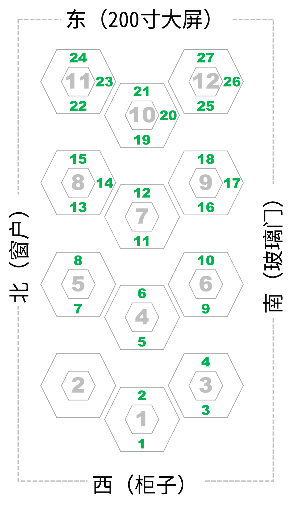
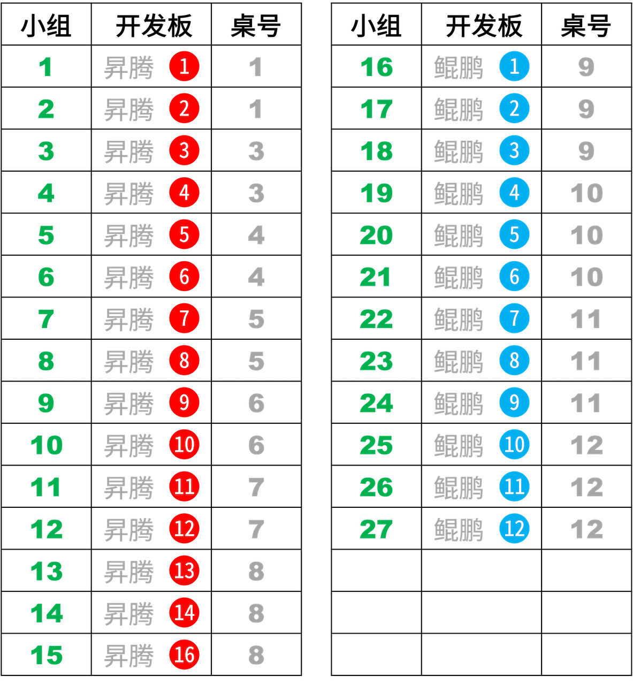

# BP网络-260528
{: .no_toc }
`更新-260528` \| `发布-260528`

<!--  -->
<details markdown="block">
  <summary>✳️ 目录</summary>
- TOC
{:toc}
</details>

---

## 实验简介
<br>
本次实验将采用 BP 网络完成相关任务。硬件采用  **昇腾开发板** 和  **鲲鹏开发板** 。

---

## 实验目的
<br>
通过本次实验，期望达成以下目的：

1. 了解 BP 网络
2. 进一步掌握开发板的使用
3. 进一步熟悉 Linux 相关操作
4. 增加解决问题的经验

---

## 实验任务
<br>
详见群内文档。

---

## 对号入座
<br>
请同学们对号入座、对号使用器材。
<details markdown="block">
  <summary>✳️ 座位安排，请对号入座</summary>

</details>
<details markdown="block">
  <summary>✳️ 器材安排，请对号使用</summary>

</details>

---

## 注意事项
<br>
敬请关注以下事项：

- 🚫 **禁止：水杯、水瓶等，不要放在桌上**。临时放桌上，则要拧紧盖子。液体泼洒会损坏开发板。

- ✅ **建议：书包等物品放实验室四周空闲处**。以提高效率，并防止器材跌落（已发生跌落）。

- ✅ **建议：电源线等，都从中间穿到桌面上**。以提高效率，并防止器材跌落（已发生跌落）。

---

## 0-上电开机
<br>
插上电源即可开机：

-  昇腾：开发板上电后，3个指示灯会依次绿色常亮，表示启动正常。

-  鲲鹏：前面板有2个 Type-C，电源插入➡️边上那个。
-  鲲鹏：拿掉顶部的磁吸盖子，看到2个绿灯亮，就表示开机完成。

---

## 1-ssh登录开发板
<br>
参考上次实验 [初识开发板-260521↗]，登录开发板。

可用 MobeXterm 软件登录，或在本地电脑执行：

```bash
ssh HwHiAiUser@192.168.137.100
```
    
> 在权限满足实验要求的前提下，尽量不用超级用户 root 做实验。

<br>

相关建议：

- ✴️  昇腾：有上下排列的2个网口，网线连接上面⬆️那个网口。
- ✳️ 建议 Windows 多窗口操作，可提高效率。详见：[Windows指南↗]。

---

## 2-连接外网
<br>
开发板上电开机后，先让开发板连接外网，即能访问互联网。建议连外网后，创建本次实验所需的 Python 虚拟环境。

相关请参考如下：

-  昇腾：[连接外网↗](https://tnt.gdvzz.com/aikit/aidk.html#nets)
-  鲲鹏：[连接外网↗](https://tnt.gdvzz.com/aikit/dkoo.html#nets)

连接外网后，在开发板上执行以下命令，验证是否确实能访问外网：

```bash
curl -fsSL www.baidu.com
```

---

## 3-代码调测
<br>
建议按如下步骤开展：

1. **用 conda 创建 Python 虚拟环境：**

    ```bash
conda create -n bpe0528 python=3.10
    ```

    > (1) 在虚拟环境中开展实验，可做到和开发板的其他项目互不影响。<br>
    > (2) bpe0528 是虚拟环境的名字的样例。可以是其他名字。<br>
    > (3) Python 3.10 只是举例。应能满足要求大部分要求。如需要可尝试其他版本。

    ✅ Conda 应该是正常的。如果不能成功创建虚拟环境，请实验室老师协助。

    ❌ 不要参考AI的建议，对Conda的相关设置做修改。


2. **激活刚创建的虚拟环境：**

    ```bash
conda activate bpe0528
    ```

3. **在开发板上创建实验目录：**

    比如创建目录 bp0528

    ```bash
mkdir ~/bp0528
    ```

4. **上传源码到开发板的实验目录中**

    **方式一：** 用 MobaXterm 软件传文件。请参考：[MobaXterm简要说明↗](https://tnt.gdvzz.com/aikit/mobaxtermug.html) \| 传文件

    **方式二：** 或者在本地电脑敲命令传文件。请参考：[Linux常用操作↗](https://tnt.gdvzz.com/aikit/linuxug.html) \| scp 远程复制文件/目录。比如：`scp bpsin.py HwHiAiUser@192.168.137.100:/home/HwHiAiUser/bp0512`

    **方式三：** 或者粘贴到开发板上，

    先进入开发板上的实验目录

    ```bash
cd ~/bp0528    
    ```

    在实验目录下编辑文件（新建一个空文件）

    ```bash
vim bpsin.py
    ```

    在 vim 界面上：按 `esc` 键  → 按 `i` 键 → 粘贴 → 按 `esc` 键  → 输入 `:wq`  → 按 `回车` 键

    如果不保存：按 `esc` 键  → 输入 `:q!`  → 按 `回车` 键

    更多信息请参考：[Linux指南-vim文本编辑↗]

5. **在虚拟环境中安装相关包：**

    尝试运行代码，比如：

    ```bash
python3 bpsin.py
    ```

    如果报错缺什么包，就安装什么包。比如缺 numpy 包，就安装 numpy：

    ```bash
pip3 install numpy
    ```

    亦可用 conda 安装，效果是一样的。命令是：

    ```bash
conda install numpy
    ``` 

    如此重复，直至程序可运行起来。

<br>

✅ 可以执行以下命令，删除虚拟环境。然后重复上述步骤，重新创建虚拟环境。

- 如果当前在虚拟环境 bpe0528 中，则先去激活：

    ```bash
conda deactivate
    ```

- 然后删除虚拟环境：

    ```bash
conda remove -n bpe0528 --all
    ```

更多信息请参考：[Conda指南↗]

---

## 关机断电复位离开
<br>
实验结束后，请完成以下事项，再离开实验课。

1. **关机断电**

    开发板要先关机、再断电。🚫 **严谨开机状态直接断电（拔电源）！**

    -  **昇腾**：[关机断电↗](https://tnt.gdvzz.com/aikit/aidk.html#onoff) 
    -  **鲲鹏**：[关机断电↗](https://tnt.gdvzz.com/aikit/dkoo.html#onoff) 

2. **归还实验器材，给实验室老师**

    - 开发板（每组1个）
    - 开发板电源（每组1个）
    - 网线（每组1个）
    - 借用的其他器材

3. **椅子复位**

    - 每个桌子，配套 6 个椅子。请将椅子推到桌子下面。
    - 西侧玻璃门，前中后靠墙，各 6 个。共 18 个。请按此数量靠墙摆放。

4. **带齐随身物品**

✅ 上述事项完成后，可离开实验室。

<!--  -->
<span style="font-size:12px; color:#999">THE END</span>

<!--  -->
[初识开发板-260521↗]: https://tnt.gdvzz.com/ailab/aidk260521.html
[Conda指南↗]: https://tnt.gdvzz.com/aikit/condaug.html
[Linux指南-vim文本编辑↗]: https://tnt.gdvzz.com/aikit/linuxug.html#vim
[Windows指南↗]: https://tnt.gdvzz.com/aikit/windowsug.html