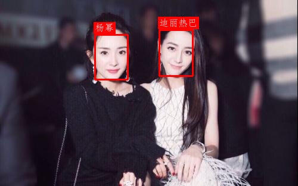

# 签到刷脸-260602
{: .no_toc }
`更新-260602` \| `发布-260602`

<!--  -->
<!-- <details open markdown="block">
  <summary>
    目录
  </summary>
- TOC
{:toc}
</details> -->

<!-- <details>
    <summary>ℹ️ 更新历史</summary>
<br>

**260501：新增3个岗位**

- [产品运营-音乐方向](#产品运营-音乐方向)
- [前端开发工程师](#前端开发工程师)
- [移动端开发工程师-Android](#移动端开发工程师-android)

</details> -->

<details markdown="block">
  <summary>✳️ 目录</summary>
- TOC
{:toc}
</details>

---

## 实验简介

### 关于教室考勤系统
<br>
在门禁系统的基础上，拓展为教室考勤系统，对教室里所有人进行识别，统计人数和出勤人，打破现有的只能统计人数，但不知道谁没来。

建议方案：用YoloV5-face检测多个人脸，也实验了人数统计，然后用FaceNet实验人脸识别。

### 关于开发板
<br>
本次实验将使用  **昇腾开发板** 和  **鲲鹏开发板**，完成推理验证。

---

## 实验任务
<br>
基于开发板 + 摄像头，实现 **教室考勤** 系统。主要建议和要求如下：

- **AI模型**： yolo5face + facenet。或其他类似模型。
- **B/S架构**： Web 后端程序运行在开发板上，相关功能通过 Web 界面交互的方式来实现
- **摄像头**： 接在开发板上
<!--  -->
- **学生注册**。摄像头拍摄（或上传照片）进行注册；要填写学号和姓名。学号不能重复，姓名可重复。
- **注册展示**。Web 界面展示已注册的学生，包括：照片，学号，姓名。
- **考勤识别**。摄像头拍摄（或上传照片）进行识别；照片中可以有多个学生。
- **考勤统计**。上午下午各一堂课，列出2堂课各自的出席、缺席的学生，以及出勤率。


---

## 实验目的
<br>
通过本次实验，期望达成以下目的：

1. 进一步了解 FaceNet 等AI模型
2. 做一个 **教室考勤** 系统
3. 进一步掌握开发板的使用
4. 进一步熟悉 Linux 相关操作
5. 增加解决问题的经验

---

## 对号入座
<br>
请同学们对号入座、对号使用器材。

<details markdown="block">
  <summary>✳️ 座位安排，请对号入座</summary>

</details>
<details markdown="block">
  <summary>✳️ 器材安排，请对号使用</summary>

</details>

---

## 注意事项
<br>
敬请关注以下事项：

- 🚫 **禁止：水杯、水瓶等，不要放在桌上**。临时放桌上，则要拧紧盖子。液体泼洒会损坏开发板。

- ✅ **建议：书包等物品放实验室四周空闲处**。以提高效率，并防止器材跌落（已发生跌落）。

- ✅ **建议：电源线等，都从中间穿到桌面上**。以提高效率，并防止器材跌落（已发生跌落）。

---

## 0-上电开机
<br>
插上电源即可开机：

-  昇腾：开发板上电后，3个指示灯会依次绿色常亮，表示启动正常。

-  鲲鹏：前面板有2个 Type-C，电源插入➡️边上那个。
-  鲲鹏：拿掉顶部的磁吸盖子，看到2个绿灯亮，就表示开机完成。

---

## 1-连接外网
<br>
开发板上电开机后，先让开发板连接外网，即能访问互联网。后续创建本次实验所需的 Python 虚拟环境，需要开发板能访问外网。开发板如何连接外网，请参考：

-  昇腾：[连接外网↗](https://tnt.gdvzz.com/aikit/aidk.html#nets)
-  鲲鹏：[连接外网↗](https://tnt.gdvzz.com/aikit/dkoo.html#nets)


---

## 3-创建环境
<br>
在虚拟环境中开展实验，可做到和开发板的其他项目互不影响。

1. **登录开发板**

    用 MobeXterm 软件登录，或在 **本地个人电脑** 执行：

    ```bash
ssh HwHiAiUser@192.168.137.100
    ```

2. **创建 conda 虚拟环境**

    ```bash
conda create -n chke0602 python=3.10
    ```

3. **激活虚拟环境**

    ```bash
conda activate chke0602
    ```

4. **安装 PyTorch (CPU 版)**

    ```bash
pip3 install torch==2.2.2 torchvision==0.17.2 torchaudio==2.2.2 --index-url https://download.pytorch.org/whl/cpu
    ```

5. **安装其他依赖库**
    
    ```bash
pip3 install yolo5face facenet-pytorch opencv-python-headless numpy==1.26.4 Pillow==10.2.0 pyyaml flask flask-cors
    ```

<br>

**提示：**

- ✴️ Python 版本 和 相关依赖库，仅供参考。可能因同学们源码不同而不同。
- ✳️ Conda 相关信息请参考：[Conda指南↗]


---

提示词参考

```markdown
1、在门禁系统的基础上，拓展为教室考勤系统，对教室里所有人进行识别，统计人数和出勤人，打破现有的只能统计人数，但不知道谁没来
2、方案: 用YoloV5-face检测多个人脸，也实验了人数统计，然后用FaceNet实验人脸识别

3、学生注册，先用照片方式注册。
- 图片文件名的命名方式：学号_姓名。比如，12345_zhangsan.jpg，1102312345_李四.png
- 一张照片中，只有一个学生
- 照片在 roster 目录中

4、识别，先用照片方式识别。
- 一张照片中，可能有多个学生，也可能只有一个学生

5、在香橙派Kunpeng Pro开发板上运行，ssh 登录上去的。

请给出源码样例。
```

主要优化说明
优化点	实现方式
批量注册	新增 batch_register_from_roster()，自动解析 roster/ 目录下所有符合 学号_姓名.扩展名 的照片，检测人脸后注册到特征库。
SSH 无界面适配	检测 DISPLAY 环境变量，若无则跳过所有 cv2.imshow 和 cv2.waitKey，所有结果通过 print 输出，避免卡死。
性能提升	将 TARGET_SIZE 从 512 降低到 320，显著减少 CPU 检测耗时，适合香橙派。
缺勤名单输出	在 process_image 中直接计算并打印应到/实到/出勤/缺勤名单，满足核心需求。
交互简化	主菜单保留常用功能，并将批量注册作为注册模式的子选项。


<!-- ()
```markdown
1、在门禁系统的基础上，拓展为教室考勤系统，对教室里所有人进行识别，统计人数和出勤人，打破现有的只能统计人数，但不知道谁没来
2、方案: 用YoloV5-face检测多个人脸，也实验了人数统计，然后用FaceNet实验人脸识别

3、要有摄像头识别功能。
4、也要有照片识别功能，方便调测。
5、用conda创建虚拟环境来调测。给出虚拟环境的python建议版本
6、学生注册，保留摄像头注册。还要增加可用照片注册，方便调测。

6、先在macBook上尝试。macBook相关系统信息如下：
MacBook Pro：13-inch, 2017, Four Thunderbolt 3 Ports；3.1 GHz Dual-Core Intel Core i5

``` -->

登录

```bash
ssh HwHiAiUser@192.168.137.100
```

创建 conda 虚拟环境：
```bash
conda create -n chke0602 python=3.10
```

激活虚拟环境：
```bash
conda activate chke0602
```

删除虚拟环境
```bash
conda remove -n chke0602 --all
```

<!-- 安装 PyTorch (CPU 版)：
```bash
pip3 install torch torchvision torchaudio --index-url https://download.pytorch.org/whl/cpu
``` -->
安装 PyTorch (CPU 版)：
```bash
pip3 install torch==2.2.2 torchvision==0.17.2 torchaudio==2.2.2 --index-url https://download.pytorch.org/whl/cpu
```

<!-- 安装其他依赖库：
```bash
pip3 install yolo5face facenet-pytorch opencv-python numpy
``` -->
安装其他依赖库：
```bash
pip3 install yolo5face facenet-pytorch opencv-python-headless numpy==1.26.4 Pillow==10.2.0 pyyaml  flask flask-cors
```

创建目录：

```bash
mkdir ~/chkin0602
```

切换目录

```bash
cd ~/chkin0602
```

从个人电脑上传代码到开发板
```bash
scp main.py HwHiAiUser@192.168.137.100:/home/HwHiAiUser/chkin0602
```

```bash
scp -r roster HwHiAiUser@192.168.137.100:/home/HwHiAiUser/chkin0602
```
```bash
scp -r photo HwHiAiUser@192.168.137.100:/home/HwHiAiUser/chkin0602
```

---

提示词参考

```markdown

1、在门禁系统的基础上，拓展为教室考勤系统，对教室里所有人进行识别，统计人数和出勤人，打破现有的只能统计人数，但不知道谁没来

2、方案: 用YoloV5-face检测多个人脸，也实验了人数统计，然后用FaceNet实验人脸识别

3、学生注册，可以上传照片文件，或者用摄像头拍摄。

- 在 Web 界面上输入姓名和学号
- 除了将照片保存到人脸库以外，再保存一份处理过的照片，到临时目录中
- 如果要注册的照片，已经在人脸库中，提示已在人脸库。可以再次加入人脸库。
- 学号不能重复，姓名可以重复。
- 如果照片中有多人，以面积最大的那个人脸为准。
- 注册结果（成功与否），要显示在web 界面上。
- web界面上，要显示已注册学生：照片，学号，姓名。

4、考勤识别，可以上传照片文件，或者用摄像头拍摄。

- 一张照片中，可能有多个学生，也可能只有一个学生
- 识别结果，也要标识在照片上：学号+姓名+相似度

5、在香橙派Kunpeng Pro开发板上运行，ssh 登录上去的。

6、给出 Web 后端程序 webapp.py

- web界面的颜色：monochromatic muted  pastel
- web界面的layout：card based design with layered elements
- web界面的风格：Neo-minumalism
- web界面的设计哲学：approachable sophistication


7、参考上传的main.py


```

---

## 2-获取源码
<br>
下载样例压缩包（源码+数据），并上传开发板，然后解压缩。


1. **下载样例压缩包**：[gitee_夜雨飘零/Pytorch-MobileFaceNet↗]

    - 打开 gitee 页面后，点击 **</br>代码** <sub>（左上角）</sub> → **克隆/下载**
    - 在“克隆/下载” 页面，点击 **↓下载ZIP** <sub>（右上角）</sub>

    压缩包文件名是：Pytorch-MobileFaceNet-master.zip

2. **HwHiAiUser 用户登录开发板**

    用 MobeXterm 软件登录，或在本地电脑执行：

    ```bash
ssh HwHiAiUser@192.168.137.100
    ```

    或者已用 root 登录开发板，则切换到 HwHiAiUser：

    ```bash
su - HwHiAiUser
    ```

    > 在权限满足实验要求的前提下，尽量不用超级用户 root 做实验。

3. **在开发板上新建目录：**

    ```bash
mkdir ~/oss0526
    ```

    > （1）该目录的完整路径是：/home/HwHiAiUser/oss0526<br>
    > （2）oss 是 “open sesame 芝麻开门”的意思。

4. **上传压缩包到开发板的实验目录中**

    用 MobaXterm 软件传文件。请参考：[MobaXterm简要说明↗](https://tnt.gdvzz.com/aikit/mobaxtermug.html) \| 传文件

    或者在本地电脑敲命令传文件。请参考：[Linux常用操作↗](https://tnt.gdvzz.com/aikit/linuxug.html) \| scp 远程复制文件/目录。比如进入压缩包保存的目录后，执行：

    ```bash
scp Pytorch-MobileFaceNet-master.zip HwHiAiUser@192.168.137.100:/home/HwHiAiUser/oss0526
    ```

5. **在开发板上解压缩**

    先切换目录：

    ```bash
cd  ~/oss0526
    ```

    再解压缩：

    ```bash
unzip Pytorch-MobileFaceNet-master.zip
    ```

    解压缩后生成子目录 Pytorch-MobileFaceNet-master，完整路径应该是：/home/HwHiAiUser/oss0526/Pytorch-MobileFaceNet-master。

---

## 3-创建环境
<br>
在虚拟环境中开展实验，可做到和开发板的其他项目互不影响。

1. **HwHiAiUser 用户登录开发板**

    用 MobeXterm 软件登录，或在本地电脑执行：

    ```bash
ssh HwHiAiUser@192.168.137.100
    ```

    或者已用 root 登录开发板，则切换到 HwHiAiUser：

    ```bash
su - HwHiAiUser
    ```

    > 在权限满足实验要求的前提下，尽量不用超级用户 root 做实验。

2. **用 conda 创建 Python 3.11 的虚拟环境：**

    ```bash
conda create -n oss0526 python=3.11
    ```

    > （1）在虚拟环境中开展实验，可做到和开发板的其他项目互不影响。<br>
    > （2）oss0526 是虚拟环境的名字的样例。<br>


3. **激活刚创建的虚拟环境：**

    ```bash
conda activate oss0526
    ```

4. **在虚拟环境中安装相关包：**

    先安装 CPU 版本的 PyTorch 和 torchvision：
    
    ```bash
pip3 install torch torchvision --index-url https://download.pytorch.org/whl/cpu
    ```

    > 增加 `--index-url ...` 是避免安装不必要的 nvidia 相关的包。

    先切换目录：

    ```bash
cd ~/oss0526/Pytorch-MobileFaceNet-master
    ```
    
    再安装其他需要的包：

    ```bash
pip3 install -r requirements.txt
    ```

    > 如果安装速度较慢（主要是下载速度较慢），可以尝试：`pip3 install -r requirements.txt -i https://pypi.tuna.tsinghua.edu.cn/simple`。

<!-- pip3 install -r requirements.txt -i https://pypi.tuna.tsinghua.edu.cn/simple -->

<!-- 如果你希望使用国内镜像加速下载，可以将国内镜像作为主索引，同时将 PyTorch 官方 CPU 源作为额外索引，这样既能保证速度，又能保证正确获取 CPU 版本。
pip3 install torch torchvision -i https://pypi.tuna.tsinghua.edu.cn/simple/ --extra-index-url https://download.pytorch.org/whl/cpu --trusted-host pypi.tuna.tsinghua.edu.cn -->

<br>

✅ 可以执行以下命令，删除虚拟环境。然后重复上述2、3、4步骤，重新创建虚拟环境。

- 如果当前在虚拟环境 oss0526 中，则先去激活：

    ```bash
conda deactivate
    ```

- 删除虚拟环境：

    ```bash
conda remove -n oss0526 --all
    ```

更多信息请参考：[Conda指南↗]

---

## 4-调通样例
<br>
先在开发板上调通样例。样例使用 GPU，开发板上没有 GPU（有类似的 NPU），先改成使用 CPU。主要涉及改动以下 3 个文件，部分目录结构如下：

```bash
Pytorch-MobileFaceNet-master
├── dataset
│   ├── lfw_test.txt
│   └── test.jpg
├── detection
│   ├── face_detect.py   # 待修改
│   └── utils.py
├── face_db
│   ├── 杨幂.jpg
│   └── 迪丽热巴.jpg
├── infer.py              # 待修改
├── models
│   ├── aamloss.py
│   ├── fc.py
│   └── mobilefacenet.py
├── requirements.txt
├── save_model
│   ├── mobilefacenet.pth
│   └── mtcnn
│       ├── ONet.pth
│       ├── PNet.pth
│       └── RNet.pth
├── train.py
├── utils
│   ├── predictor.py      # 待修改
│   ├── reader.py
│   ├── scheduler.py
│   ├── simfang.ttf
│   └── utils.py
└── webapp.py             # “5-增加Web客户端”步骤新增
```

1. **尝试人脸识别**

    先进入目录：

    ```bash
cd ~/oss0526/Pytorch-MobileFaceNet-master/
    ```

    然后执行以下命令，尝试人脸识别：

    ```bash
python3 infer.py --image_path=dataset/test.jpg --face_db_path=face_db --threshold=0.5
    ```

    > --image_path：待识别的人脸图片的路径<br>
    > --face_db_path：人脸库图片的路径

2. **AI辅助尝试解决 CUDA 相关报错**

    会有 CUDA（GPU相关） 相关报错，屏幕提示信息如下：

    ```
...
NotImplementedError: Could not run 'aten::empty_strided' with arguments from the 'CUDA' backend. 
This could be because the operator doesn't exist for this backend, or was omitted during the 
selective/custom build process (if using custom build). 
...
    ```

    和 AI 交流，修改相关文件，即可解决。主要修改点：使用 GPU，改成使用 CPU。 

    修改后，重复上述第 1 步操作。

3.  **AI辅助尝试解决 QT 相关报错**   

    人脸识别后输出结果，会有 QT（显示窗口相关） 相关报错，屏幕提示信息如下：

    ```
    ...
    qt.qpa.xcb: could not connect to display 
    qt.qpa.plugin: Could not load the Qt platform plugin "xcb" in "/home/HwHiAiUser/.conda/envs/oss0526/lib/python3.11/site-packages/cv2/qt/plugins" even though it was found.
    This application failed to start because no Qt platform plugin could be initialized. 
    Reinstalling the application may fix this problem.

    Available platform plugins are: xcb.
    ....
    ```

    和 AI 交流，修改相关文件，即可解决。主要是 ssh 登录使用开发板，没有显示窗口。主要修改点：有窗口时，在窗口中显示识别结果；是否有窗口可供显示，识别结果都要保存为图片。

    修改后，重复上述第 1 步操作。

4. **测试人脸识别**

    ```bash
python3 infer.py --image_path=dataset/test.jpg --face_db_path=face_db --threshold=0.5
    ```

    测试结果保存在 result.jpg 中，如下：

    

<details markdown="block">
  <summary>修改后的样例代码</summary>

能调通的样例代码如下：

- [face_detect.py](./aidk260526.assets/face_detect.py)
- [infer.py](./aidk260526.assets/infer.py)
- [predictor.py](./aidk260526.assets/predictor.py)

请复制到相应目录中：

```bash
Pytorch-MobileFaceNet-master
├── detection
│   ├── face_detect.py
├── infer.py
├── utils
│   ├── predictor.py   
```
</details>

---

## 5-增加 Web 客户端
<br>
增加 Web 客户端，实现 **刷脸开门** 功能。

### AI辅助实现
<br>
可以AI辅助实现功能。**一般需要和 AI 交互多轮，才能得到预期的功能**。以下是多轮交互后的样例提示词，仅供参考：

```
新增 Python 程序，实现“刷脸开门”的界面：

1、用连接在开发板上的USB 摄像头进行拍照
2、在浏览器的界面上，要显示摄像头的实时画面
3、在实时画面上，加个尽可能大的正方形黄框，只拍黄框内的画面。黄框和短边一样大。
4、拍摄到的图片（在黄框内），要显示在Web 界面上
5、识别结果，要显示在Web 界面上，就叠加在摄像头的实时画面里。拍到的照片中：
    - 如果没有人脸，显示“没有人脸”；
    - 如果有人脸，但比对后不知道是谁，显示“不认识”；
    - 如果命中人脸库，则显示：对应的姓名，请进
```

样例实现效果：


<details markdown="block">
  <summary>webapp.py样例代码</summary>

能调通的样例代码如下：

- [webapp.py](./aidk260526.assets/webapp.py)

请复制到目录 Pytorch-MobileFaceNet-master 中。
</details>

### FAQ
<br>
可能遇到的问题：

1. 开发板可能有多个摄像头。程序打开的摄像头，不是外接的 USB 摄像头。
2. 拍摄光线、角度，会影响识别别准确度。

---

## 增加语音播报（可选）
<br>
AI辅助增加语音播报。比如：张三，请进。

多轮交互下得到的样例提示词如下，供参考：

```
再新增 Python 程序，实现“刷脸开门”的界面。这是一个新的任务。

1、用连接在开发板上的USB 摄像头进行拍照
2、在浏览器的界面上，要显示摄像头的实时画面
3、在实时画面上，加个尽可能大的正方形黄框，只拍黄框内的画面。黄框和短边一样大。
4、拍摄到的图片（在黄框内），要显示在Web 界面上
5、识别结果，要显示在Web 界面上，就叠加在摄像头的实时画面里。拍到的照片中：
    - 如果没有人脸，显示“没有人脸”；
    - 如果有人脸，但比对后不知道是谁，显示“不认识”；
    - 如果命中人脸库，则显示：对应的姓名，请进
6、增加语音播报
    - 如果没有人脸，显示“未识别到人脸”，并语音说出来；
    - 如果有人脸，但比对后不知道是谁，显示“不认识您”，并语音说出来；
    - 如果命中人脸库，则显示：对应的姓名，请进，并语音说：xx，请进
    - 声音要和自然语音接近，用 edge-tts
```

<!-- ```bash
sudo apt update && sudo apt install portaudio19-dev python3-pyaudio espeak mpg123
```

```bash
pip3 install SpeechRecognition pyaudio pocketsphinx edge-tts
``` -->

需要安装软件如下：

```bash
sudo apt update && sudo apt install mpg123
```

在 Python 虚拟环境 oss0526 中安装相关包：

```bash
pip3 install edge-tts
```

样例效果如下：


<details markdown="block">
  <summary>样例代码</summary>

能调通的样例代码如下：

- [webv3.py](./aidk260526.assets/webv3.py)：带语音播报
- [test_tts.py](./aidk260526.assets/test_tts.py)：测试声音。可用于修改 webv3.py 中的播报声音。

请复制到目录 Pytorch-MobileFaceNet-master 中。
</details>

---

## 相关指南
<br>
可参考相关指南，已提高操作效率：

- [VSCode指南↗]
- [Linux指南↗]
- [Linux指南 - vim文本编辑↗]
- [Windows指南↗]

---

## 关机断电复位离开
<br>
实验结束后，请完成以下事项，再离开实验课。

1. **关机断电**

    开发板要先关机、再断电。🚫 **严谨开机状态直接断电（拔电源）！**

    -  **昇腾**：[关机断电↗](https://tnt.gdvzz.com/aikit/aidk.html#onoff) 
    -  **鲲鹏**：[关机断电↗](https://tnt.gdvzz.com/aikit/dkoo.html#onoff) 

2. **归还实验器材，给实验室老师**

    - 开发板（每组1个）
    - 开发板电源（每组1个）
    - 网线（每组1个）
    - USB摄像头（每桌共用1个）
    - 借用的其他器材

3. **椅子复位**

    - 每个桌子，配套 6 个椅子。请将椅子推到桌子下面。
    - 西侧玻璃门，前中后靠墙，各 6 个。共 18 个。请按此数量靠墙摆放。

4. **带齐随身物品**

✅ 上述事项完成后，可离开实验室。

<!-- 参考资料 -->
[^1]: [零基础AI入门指南↗](https://liaoxuefeng.com/blogs/all/2023-05-08-mnist/index.html)

<!--  -->

[AscendCL 应用开发指南（Python）- 快速入门↗]: https://www.hiascend.com/document/detail/zh/Atlas200IDKA2DeveloperKit/23.0.RC2/Application%20Development%20Guide/aadgp/aclpythondevg_0001.html

[VSCode指南↗]: https://tnt.gdvzz.com/aikit/vscodeug.html
[Linux指南 - vim文本编辑↗]: https://tnt.gdvzz.com/aikit/linuxug.html#vim
[Conda指南↗]: https://tnt.gdvzz.com/aikit/condaug.html
[Linux指南↗]: https://tnt.gdvzz.com/aikit/linuxug.html
[Windows指南↗]: https://tnt.gdvzz.com/aikit/windowsug.html


[gitee_夜雨飘零/Pytorch-MobileFaceNet↗]: https://gitee.com/yeyupiaoling/Pytorch-MobileFaceNet

<!--  -->
<span style="font-size:12px; color:#999">THE END</span>
