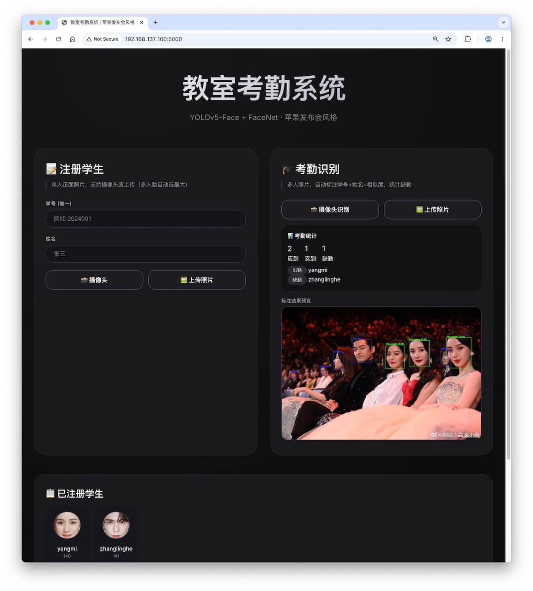
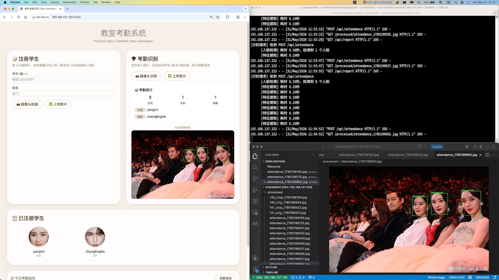

<!-- 
260601：新版navorder修改了，大数字靠前
-->

# 签到刷脸-260602
{: .no_toc }
`更新-260601` \| `发布-260531`

<!--  -->
<!-- <details open markdown="block">
  <summary>
    目录
  </summary>
- TOC
{:toc}
</details> -->

<!-- <details>
    <summary>ℹ️ 更新历史</summary>
<br>

**260501：新增3个岗位**

- [产品运营-音乐方向](#产品运营-音乐方向)
- [前端开发工程师](#前端开发工程师)
- [移动端开发工程师-Android](#移动端开发工程师-android)

</details> -->

<details markdown="block">
  <summary>✳️ 目录</summary>
- TOC
{:toc}
</details>

---

## 实验简介

### 关于教室考勤系统
<br>
在门禁系统的基础上，拓展为教室考勤系统，对教室里所有人进行识别，统计人数和出勤人，打破现有的只能统计人数，但不知道谁没来。

建议方案：用YoloV5-face检测多个人脸，也实验了人数统计，然后用FaceNet实验人脸识别。

### 关于开发板
<br>
本次实验将使用  **昇腾开发板** 和  **鲲鹏开发板**，完成实验。

---

## 实验任务
<br>
基于开发板 + 摄像头，实现 **教室考勤** 系统。主要建议和要求如下：

- **AI模型**： yolo5face + facenet。或其他类似模型。
- **B/S架构**： Web 后端程序运行在开发板上，相关功能通过 Web 界面交互的方式来实现
- **摄像头**： 接在开发板上
- **学生注册**。摄像头拍摄（或上传照片）进行注册；要填写学号和姓名。学号不能重复，姓名可重复。
- **注册展示**。Web 界面展示已注册的学生，包括：照片，学号，姓名。
- **考勤识别**。摄像头拍摄（或上传照片）进行识别；照片中可以有多个学生。
- **考勤统计**。上午下午各一堂课，列出2堂课各自的出席、缺席的学生，以及出勤率。


---

## 实验目的
<br>
通过本次实验，期望达成以下目的：

1. 进一步了解 FaceNet 等AI模型
2. 做一个 **教室考勤** 系统
3. 进一步掌握开发板的使用
4. 进一步熟悉 Linux 相关操作
5. 增加解决问题的经验

---

## 对号入座
<br>
请同学们对号入座、对号使用器材。

<details markdown="block">
  <summary>✳️ 座位安排，请对号入座</summary>

</details>
<details markdown="block">
  <summary>✳️ 器材安排，请对号使用</summary>

</details>

---

## 注意事项
<br>
敬请关注以下事项：

- 🚫 **禁止：水杯、水瓶等，不要放在桌上**。临时放桌上，则要拧紧盖子。液体泼洒会损坏开发板。
- ✅ **建议：书包等物品放实验室四周空闲处**。以提高效率，并防止器材跌落。
- ✅ **建议：电源线等，都从中间穿到桌面上**。以提高效率，并防止器材跌落。

---

## 0-上电开机
<br>
插上电源即可开机：

-  昇腾：开发板上电后，3个指示灯会依次绿色常亮，表示启动正常。

-  鲲鹏：前面板有2个 Type-C，电源插入➡️边上那个。
-  鲲鹏：拿掉顶部的磁吸盖子，看到2个绿灯亮，就表示开机完成。

---


## 1-ssh登录开发板
<br>
可用 MobeXterm 软件登录，或在本地电脑执行：

```bash
ssh HwHiAiUser@192.168.137.100
```

**提示：**

- ✴️  昇腾：有上下排列的2个网口，网线连接上面⬆️那个网口。
- ✳️ 建议 Windows 多窗口操作，可提高效率。详见：[Windows指南↗]。
- ✳️ **检查个人电脑是否有网口**。在 PC（个人电脑）按 `win` + `i` 调出 <ins>设置</ins>，点击左侧导航栏 <ins>网络和Internet</ins> → 点击右下的 <ins>高级网络设置</ins> → 在右侧顶部 <ins>网络适配器</ins> 能看到 <ins>以太网</ins> 或 <ins>Ethernet</ins>，则大概率有网口。如果没有网口，可借用“USB转网口”适配器获得网口。

---

## 2-连接外网
<br>
开发板上电开机后，先让开发板连接外网，即能访问互联网。后续创建本次实验所需的 Python 虚拟环境，需要开发板能访问外网。开发板如何连接外网，请参考：

-  昇腾：[连接外网↗](https://tnt.gdvzz.com/aikit/aidk.html#nets)
-  鲲鹏：[连接外网↗](https://tnt.gdvzz.com/aikit/dkoo.html#nets)

✴️ 加密的无线网络（比如 JNU-Secure），不能被共享给开发板上网。JNU-WLAN 可以被共享给开发板上网。

连接外网后，在开发板上执行以下命令，验证是否确实能访问外网：

```bash
curl -fsSL www.baidu.com
```

---

## 3-代码调测
<br>
建议按如下步骤开展：

1. **创建 conda 虚拟环境**

    ```bash
conda create -n chke0602 python=3.10
    ```

    - ✅ Conda 应该是正常的。如果不能成功创建虚拟环境，请实验室老师协助。
    - ❌ 不要参考AI的建议，对 Conda 的相关设置做修改。
    - 在虚拟环境中开展实验，可和开发板上的其他项目互不影响。

2. **激活虚拟环境**

    ```bash
conda activate chke0602
    ```

3. **创建实验用目录**


    ```bash
mkdir ~/chkin0602
    ```

4. **上传源码到开发板的实验目录中**

    **方式一：** 用 MobaXterm 软件传文件。请参考：[MobaXterm简要说明↗](https://tnt.gdvzz.com/aikit/mobaxtermug.html) \| 传文件

    **方式二：** 或者在本地电脑敲命令传文件。请参考：[Linux常用操作↗](https://tnt.gdvzz.com/aikit/linuxug.html) \| scp 远程复制文件/目录。比如：
    
    ```bash
scp main.py HwHiAiUser@192.168.137.100:/home/HwHiAiUser/chkin0602
    ```

    **方式三：** 或者粘贴到开发板上，

    先进入开发板上的实验目录

    ```bash
cd ~/chkin0602    
    ```

    在实验目录下编辑文件（新建一个空文件）

    ```bash
vim main.py
    ```

    在 vim 界面上：按 `Esc` → 按 `i` → 粘贴 → 按 `Esc` → 输入 `:wq` → 按 `Enter回车`

    如果不保存：按 `Esc` → 输入 `:q!` → 按 `Enter回车`

    更多信息请参考：[Linux指南-vim文本编辑↗]

4. **在虚拟环境中安装 PyTorch (CPU 版)**

    ```bash
pip3 install torch==2.2.2 torchvision==0.17.2 torchaudio==2.2.2 --index-url https://download.pytorch.org/whl/cpu
    ```

    ✳️ 要先激活虚拟环境，从而确保在虚拟环境中安装相关软件（而不是安装到其他环境中）。相关操作请参考：[Conda指南↗]。

5. **安装其他依赖库**
    
    ```bash
pip3 install yolo5face facenet-pytorch opencv-python-headless numpy==1.26.4 Pillow==10.2.0 pyyaml flask flask-cors
    ```

    ✳️ 要先激活虚拟环境，从而确保在虚拟环境中安装相关软件（而不是安装到其他环境中）。相关操作请参考：[Conda指南↗]。

<br>

**提示：**

- ✴️ Python 版本 和 相关依赖库，仅供参考。可能因同学们源码不同而不同。
- ✴️ Conda（Python）虚拟环境（本文名称样例是 chke0602），创建一次即可。不需要反复重复创建。
- ✳️ Conda 相关操作请参考：[Conda指南↗]

---

## 对代码的建议
<br>
以下是针对代码的一些建议，仅供参考。

### 先调通核心功能
<br>
可以先调通核心功能。比如用图片注册学生，对图片做签到识别。也可以一步到位，直接调测 B/S 架构的教室考勤系统。

经多轮完善，针对核心功能的提示词参考如下：

```markdown
1、在门禁系统的基础上，拓展为教室考勤系统，对教室里所有人进行识别，统计人数和出勤人，打破现有的只能统计人数，但不知道谁没来
2、方案: 用YoloV5-face检测多个人脸，也实验了人数统计，然后用FaceNet实验人脸识别

3、学生注册，先用照片方式注册。
- 图片文件名的命名方式：学号_姓名。比如，12345_zhangsan.jpg，1102312345_李四.png
- 一张照片中，只有一个学生
- 照片在 roster 目录中

4、识别，先用照片方式识别。
- 一张照片中，可能有多个学生，也可能只有一个学生

5、在香橙派Kunpeng Pro开发板（和昇腾开发板）上运行，ssh 登录上去的。

请给出源码样例。
```

✳️ 在调测过程中，有时可以要求输出更多详细信息，以方便更快解决问题。

<!--  -->
<details markdown="block">
  <summary>用做注册的图片</summary>


</details>
<!--  -->
<details markdown="block">
  <summary>用做识别的图片</summary>


</details>
<!--  -->
<!--  -->
<details markdown="block">
  <summary>参考代码</summary>
[main.py](./aidk260602.assets/main.py)

说明：可大致跑通，未精确调测。
</details>

### Web版
<br>
以下是针对目标系统的相关建议，仅供参考。

经多轮完善，可实现目标系统的提示词参考样例如下：

```markdown
1、在门禁系统的基础上，拓展为教室考勤系统，对教室里所有人进行识别，统计人数和出勤人，打破现有的只能统计人数，但不知道谁没来

2、方案: 用YoloV5-face检测多个人脸，也实验了人数统计，然后用FaceNet实验人脸识别

3、学生注册，可以上传照片文件，或者用摄像头拍摄。

- 在 Web 界面上输入姓名和学号
- 除了将照片保存到人脸库以外，再保存一份处理过的照片，到临时目录中
- 如果要注册的照片，已经在人脸库中，提示已在人脸库。可以再次加入人脸库。
- 学号不能重复，姓名可以重复。
- 如果照片中有多人，以面积最大的那个人脸为准。
- 注册结果（成功与否），要显示在web 界面上。
- web界面上，要显示已注册学生：照片，学号，姓名。

4、考勤识别，可以上传照片文件，或者用摄像头拍摄。

- 一张照片中，可能有多个学生，也可能只有一个学生
- 识别结果，也要标识在照片上：学号+姓名+相似度

5、在香橙派Kunpeng Pro开发板（和昇腾开发板）上运行，ssh 登录上去的。

6、给出 Web 后端程序 webapp.py

- web界面的颜色：monochromatic muted  pastel
- web界面的layout：card based design with layered elements
- web界面的风格：Neo-minumalism
- web界面的设计哲学：approachable sophistication

7、参考上传的main.py

```

- **参考界面1：**

    

- **参考界面2：**

    

- **调测窗口组合：**

    - 左侧：Web 界面
    - 右上：个人电脑 ssh 登录到开发板的窗口，运行 Web 后端程序
    - 右下：个人电脑 VSCode 连接到开发板，可直接修改代码，和查看识别结果的图片
    
    

<details markdown="block">
  <summary>参考代码</summary>
[参考界面1-webapp.py](./aidk260602.assets/webapp.py)<br>
[参考界面2-app2.py](./aidk260602.assets/app2.py)

说明：

- 可大致跑通图片注册和识别，未精确调测。
- 摄像头功能尚未调测。
</details>
---

## 增加语音点名（可选）
<br>
增加语音点名，对没有识别到的同学再点名。比如：张三，到了吗。

如果张三到了，用摄像头再次考勤签到。

声音要和自然语音接近，可采用 edge-tts。需要安装软件如下：

```bash
sudo apt update && sudo apt install mpg123
```

在 Python 虚拟环境 chke0602 中安装相关包：

```bash
pip3 install edge-tts
```

<details markdown="block">
  <summary>测试声音代码</summary>

- [test_tts.py](./aidk260526.assets/test_tts.py)：测试声音。

</details>

---

## 相关指南
<br>
可参考相关指南，以提高操作效率：

- [VSCode指南↗]
- [Linux指南↗]
- [Linux指南-vim文本编辑↗]
- [Windows指南↗]

---

## 关机断电复位离开
<br>
实验结束后，请完成以下事项，再离开实验课。

1. **关机断电**

    开发板要先关机、再断电。🚫 **严谨开机状态直接断电（拔电源）！**

    -  **昇腾**：[关机断电↗](https://tnt.gdvzz.com/aikit/aidk.html#onoff) 
    -  **鲲鹏**：[关机断电↗](https://tnt.gdvzz.com/aikit/dkoo.html#onoff) 

2. **归还实验器材，给实验室老师**

    - 开发板（每组1个）
    - 开发板电源（每组1个）
    - 网线（每组1个）
    - 借用的其他器材

3. **椅子复位**

    - 每个桌子，配套 6 个椅子。请将椅子推到桌子下面。
    - 西侧玻璃门，前中后靠墙，各 6 个。共 18 个。请按此数量靠墙摆放。

4. **带齐随身物品**

✅ 上述事项完成后，可离开实验室。

<!-- 参考资料 -->
[^1]: [零基础AI入门指南↗](https://liaoxuefeng.com/blogs/all/2023-05-08-mnist/index.html)

<!--  -->

[AscendCL 应用开发指南（Python）- 快速入门↗]: https://www.hiascend.com/document/detail/zh/Atlas200IDKA2DeveloperKit/23.0.RC2/Application%20Development%20Guide/aadgp/aclpythondevg_0001.html

[VSCode指南↗]: https://tnt.gdvzz.com/aikit/vscodeug.html
[Linux指南-vim文本编辑↗]: https://tnt.gdvzz.com/aikit/linuxug.html#vim
[Conda指南↗]: https://tnt.gdvzz.com/aikit/condaug.html
[Linux指南↗]: https://tnt.gdvzz.com/aikit/linuxug.html
[Windows指南↗]: https://tnt.gdvzz.com/aikit/windowsug.html


[gitee_夜雨飘零/Pytorch-MobileFaceNet↗]: https://gitee.com/yeyupiaoling/Pytorch-MobileFaceNet

<!--  -->
<span style="font-size:12px; color:#999">THE END</span>
