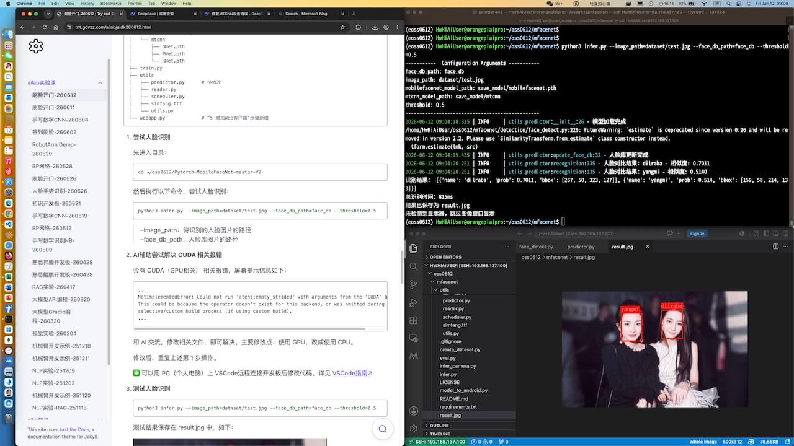
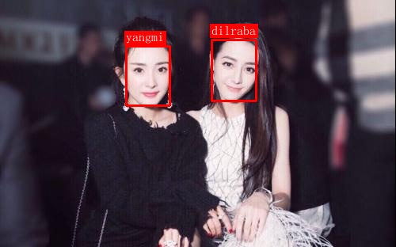
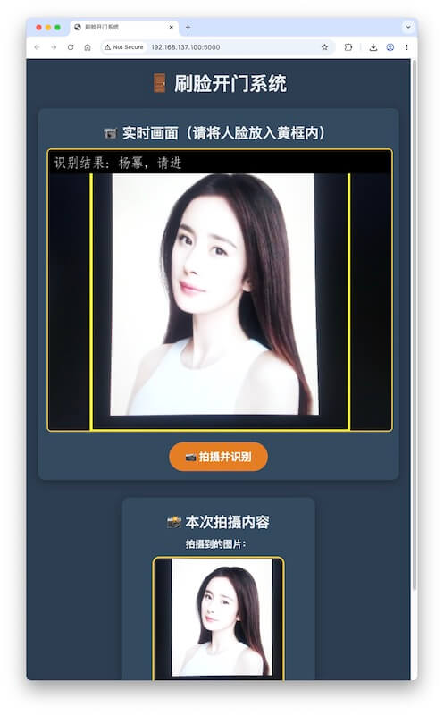

# 刷脸开门-260612
{: .no_toc }
`更新-260612` \| `发布-260612`

<!-- lab course for epita exchange students -->

<!--  -->
<details markdown="block">
  <summary>✳️ CONTENT</summary>
- TOC
{:toc}
</details>

---

## 实验简介

### 关于MTCNN和FaceNet
<br>
MTCNN（Multi-task Cascaded Convolutional Networks）是一种用于人脸检测的级联卷积网络。它通过三个子网络（P-Net、R-Net、O-Net）逐步筛选候选框，同时输出人脸边界框和五个关键点（双眼、鼻子、左右嘴角）。其优势在于兼顾检测精度和速度，且对遮挡、光照有一定鲁棒性。

FaceNet 是 Google 提出的人脸识别网络，核心思想是将人脸图像直接映射到 128 维或 512 维的欧几里得嵌入空间。它使用三元组损失（triplet loss）训练，使同一个人的人脸嵌入距离小、不同人的人脸嵌入距离大。FaceNet 可直接用于人脸验证（比较距离是否小于阈值）、识别（最近邻分类）和聚类，省去了传统的 softmax 分类层，特征泛化能力很强。

简单来说：MTCNN 负责“找出人脸在哪”，FaceNet 负责“判断是谁的人脸”，两者常串联构成完整的人脸识别流程。

### 关于开发板
<br>
本次实验将使用  **鲲鹏开发板**，完成推理验证。

---

## 实验任务
<br>
基于开发板，采用摄像头自动抓取人脸图像，小组成员的人脸能够识别，识别成功显示 “开门成功”，小组以外成员不能识别，显示 “开门失败”。

---

## 实验目的
<br>
通过本次实验，期望达成以下目的：

1. 了解 MTCNN 和 FaceNet
2. 做一个 **刷脸开门** 系统
3. 进一步掌握开发板的使用
4. 进一步熟悉 Linux 相关操作
5. 增加解决问题的经验

### 账号信息
<br>
相关账号信息如下：

- 开发板（账号/密码）： HwHiAiUser / Mind@123
- 开发板（账号/密码）： root / Mind@123
- WiFi（名称/密码）  ： b102 / b102b102

---

## 注意事项
<br>
敬请关注以下事项：

- 🚫 **禁止：水杯、水瓶等，不要放在桌上**。临时放桌上，则要拧紧盖子。液体泼洒会损坏开发板。
- ✅ **建议：书包等物品放实验室四周空闲处**。以提高效率，并防止器材跌落。
- ✅ **建议：电源线等，都从中间穿到桌面上**。以提高效率，并防止器材跌落。

---

## 0-上电开机
<br>
插上电源即可开机：

- 前面板有2个 Type-C，电源插入➡️边上那个。
- 拿掉顶部的磁吸盖子，看到2个绿灯亮，**✴️ 并且风扇在转**，就表示开机完成。

---

## 1-连网线
<br>
将PC（个人电脑）和开发板用网线连起来：

- 网线一端连接PC（个人电脑），另一端连接开发板的以太网口。
- 开发板以太网口指示灯绿色常亮，黄灯闪烁，表示连线正常。

---

## 2-设置PC（个人电脑）IP
<br>
将 PC（个人电脑）的 IP 地址设置为和开发板同一个网段，以便通过网线访问开发板。以 Windows 为例：打开 **设置 \| 网络和Internet**，找到连接开发板的网络适配器（通常叫 **以太网**；如有多个，请修改连接开发板的那个），修改 IP 地址的相关设置。

1. **DHCP**：手动（Manual）

2. **IPV4**：ON

3. **IP地址**：输入 `192.168.137.111`

    ✴️ **不能把PC（个人电脑）的 IP 地址，设置成 `192.168.137.100`。因为该地址是开发板的 IP 地址。** 

4. **子网掩码**（或**子网掩码长度**）

    - 掩码：`255.255.255.0`
    - or 子网掩码长度：24

5. （可选）**网关**：`192.168.137.1`（不会用到）

6. 点击 **保存** 按钮

---

## 3-ssh登录
<br>
可用 MobeXterm 软件登录，或在本地电脑执行：

```bash
ssh HwHiAiUser@192.168.137.100
```

如果遇到以下报错信息：

```bash
~ % ssh HwHiAiUser@192.168.137.100
@@@@@@@@@@@@@@@@@@@@@@@@@@@@@@@@@@@@@@@@@@@@@@@@@@@@@@@@@@@
@    WARNING: REMOTE HOST IDENTIFICATION HAS CHANGED!     @
@@@@@@@@@@@@@@@@@@@@@@@@@@@@@@@@@@@@@@@@@@@@@@@@@@@@@@@@@@@
...
```

可以先执行以下命令：

```bash
ssh-keygen -R 192.168.137.100
```

然后再尝试 `ssh HwHiAiUser@192.168.137.100`

---

## 4-连接外网
<br>
开发板上电开机后，先让开发板连接外网，即能访问互联网。后续创建本次实验所需的 Python 虚拟环境，需要开发板能访问外网。

执行以下命令连接 WiFi：

```bash
sudo nmcli dev wifi connect "b102" password "b102b102"
```

连接成功后可看到屏幕提示信息类似如下：

```bash
(base) HwHiAiUser@orangepiaipro:~$ sudo nmcli dev wifi connect "b102" password "b102b102"
Device 'wlan0' successfully activated with '50e4b905-bffb-46d3-afbe-f35c2627e16b'.
```

连接外网后，在开发板上执行以下命令，验证是否确实能访问外网：

```bash
curl -fsSL www.baidu.com
```

---

## 5-获取源码
<br>
下载样例压缩包（源码+数据）到本地 PC（个人电脑），并上传开发板，然后解压缩。


1. **下载样例压缩包**：[江大云盘↗](https://pan.jiangnan.edu.cn/link/AA70F3A24CA37D45FF92DC5E6E6AD9C848)

    压缩包文件名是：Pytorch-MobileFaceNet-master-V2.zip

2. **在开发板上新建目录：**

    ```bash
mkdir ~/oss0612
    ```

    > （1）该目录的完整路径是：/home/HwHiAiUser/oss0612<br>
    > （2）oss 是 “open sesame 芝麻开门”的意思。

4. **上传压缩包到开发板的实验目录中**

    用 MobaXterm 软件传文件。请参考：[MobaXterm简要说明↗](https://tnt.gdvzz.com/aikit/mobaxtermug.html) \| 传文件

    或者在本地电脑敲命令传文件。请参考：[Linux常用操作↗](https://tnt.gdvzz.com/aikit/linuxug.html) \| scp 远程复制文件/目录。比如进入压缩包保存的目录后，执行：

    ```bash
scp Pytorch-MobileFaceNet-master-V2.zip HwHiAiUser@192.168.137.100:/home/HwHiAiUser/oss0612
    ```

5. **在开发板上解压缩**

    先切换目录：

    ```bash
cd  ~/oss0612
    ```

    再解压缩：

    ```bash
unzip Pytorch-MobileFaceNet-master-V2.zip
    ```

    解压缩后生成子目录 Pytorch-MobileFaceNet-master-V2，完整路径应该是：/home/HwHiAiUser/oss0612/Pytorch-MobileFaceNet-master-V2。

---

## 3-创建环境
<br>
在虚拟环境中开展实验，可和开发板上的其他项目互不影响。

1. **创建 conda 虚拟环境**

    ```bash
conda create -n eoss0612 python=3.11
    ```

    - ✅ Conda 应该是正常的。如果不能成功创建虚拟环境，请实验室老师协助。
    - ❌ 不要参考AI的建议，对 Conda 的相关设置做修改。
    - 在虚拟环境中开展实验，可和开发板上的其他项目互不影响。


2. **激活虚拟环境：**

    ```bash
conda activate eoss0612
    ```

3. **在虚拟环境中安装 PyTorch (CPU 版)**

    先安装 CPU 版本的 PyTorch 和 torchvision：
    
    ```bash
pip3 install torch torchvision --index-url https://download.pytorch.org/whl/cpu
    ```

    > 增加 `--index-url ...` 是避免安装不必要的 nvidia 相关的包。

    ✳️ 要先激活虚拟环境，从而确保在虚拟环境中安装相关软件（而不是安装到其他环境中）。相关操作请参考：[Conda指南↗]。

4. **安装其他依赖库**

    先切换目录：

    ```bash
cd ~/oss0612/Pytorch-MobileFaceNet-master-V2
    ```
    
    再安装其他需要的包：

    ```bash
pip3 install -r requirements.txt
    ```

    > 如果安装速度较慢（主要是下载速度较慢），可以尝试：`pip3 install -r requirements.txt -i https://pypi.tuna.tsinghua.edu.cn/simple`。

---

<!-- pip3 install -r requirements.txt -i https://pypi.tuna.tsinghua.edu.cn/simple -->

<!-- 如果你希望使用国内镜像加速下载，可以将国内镜像作为主索引，同时将 PyTorch 官方 CPU 源作为额外索引，这样既能保证速度，又能保证正确获取 CPU 版本。
pip3 install torch torchvision -i https://pypi.tuna.tsinghua.edu.cn/simple/ --extra-index-url https://download.pytorch.org/whl/cpu --trusted-host pypi.tuna.tsinghua.edu.cn -->
<br>

**提示：**

- ✴️ Conda（Python）虚拟环境（本文名称样例是 eoss0612），创建一次即可。不需要反复重复创建。
- ✳️ Conda 相关操作请参考：[Conda指南↗]

---

## 4-调通样例
<br>
先在开发板上调通样例。样例使用 GPU，开发板上没有 GPU（有类似的 NPU），先改成使用 CPU。主要涉及改动以下 2 个文件：`face_detect.py`，`predictor.py`。部分目录结构如下：

```bash
Pytorch-MobileFaceNet-master
├── dataset
│   ├── lfw_test.txt
│   └── test.jpg
├── detection
│   ├── face_detect.py   # 待修改
│   └── utils.py
├── face_db
│   ├── 杨幂.jpg
│   └── 迪丽热巴.jpg
├── infer.py             
├── models
│   ├── aamloss.py
│   ├── fc.py
│   └── mobilefacenet.py
├── requirements.txt
├── save_model
│   ├── mobilefacenet.pth
│   └── mtcnn
│       ├── ONet.pth
│       ├── PNet.pth
│       └── RNet.pth
├── train.py
├── utils
│   ├── predictor.py      # 待修改
│   ├── reader.py
│   ├── scheduler.py
│   ├── simfang.ttf
│   └── utils.py
└── webapp.py             # “5-增加Web客户端”步骤新增
```

1. **尝试人脸识别**

    先进入目录：

    ```bash
cd ~/oss0612/Pytorch-MobileFaceNet-master-V2
    ```

    然后执行以下命令，尝试人脸识别：

    ```bash
python3 infer.py --image_path=dataset/test.jpg --face_db_path=face_db --threshold=0.5
    ```

    > --image_path：待识别的人脸图片的路径<br>
    > --face_db_path：人脸库图片的路径

2. **AI辅助尝试解决 CUDA 相关报错**

    会有 CUDA（GPU相关） 相关报错，屏幕提示信息如下：

    ```
...
NotImplementedError: Could not run 'aten::empty_strided' with arguments from the 'CUDA' backend. 
This could be because the operator doesn't exist for this backend, or was omitted during the 
selective/custom build process (if using custom build). 
...
    ```

    和 AI 交流，修改相关文件，即可解决。主要修改点：使用 GPU，改成使用 CPU。 

    修改后，重复上述第 1 步操作。

    ✳️ 可以用 PC（个人电脑）上 VSCode远程连接开发板后修改代码。详见 [VSCode指南↗]。如下截图：

    - 左侧：浏览器窗口，显示实验指导手册，以及AI辅助编程信息
    - 右上：ssh 登录到开发板的 terminal 窗口
    - 右下：PC（个人电脑）上 VSCode 远程连接到开发板，可修改开发板上的代码

    


3. **测试人脸识别**

    ```bash
python3 infer.py --image_path=dataset/test.jpg --face_db_path=face_db --threshold=0.5
    ```

    测试结果保存在 result.jpg 中，如下：

    

<!-- <details markdown="block">
  <summary>修改后的样例代码</summary>

能调通的样例代码如下：

- [face_detect.py](./aidk260526.assets/face_detect.py)
- [infer.py](./aidk260526.assets/infer.py)
- [predictor.py](./aidk260526.assets/predictor.py)

请复制到相应目录中：

```bash
Pytorch-MobileFaceNet-master
├── detection
│   ├── face_detect.py
├── infer.py
├── utils
│   ├── predictor.py   
```
</details> -->

---

## 5-增加 Web 客户端
<br>
增加 Web 客户端，实现 **刷脸开门** 功能。

### AI辅助实现
<br>
可以AI辅助实现功能。**一般需要和 AI 交互多轮，才能得到预期的功能**。以下是多轮交互后的样例提示词，仅供参考：

```
新增 Python 程序，实现“刷脸开门”的界面：

1、用连接在开发板上的USB 摄像头进行拍照
2、在浏览器的界面上，要显示摄像头的实时画面
3、在实时画面上，加个尽可能大的正方形黄框，只拍黄框内的画面。黄框和短边一样大。
4、拍摄到的图片（在黄框内），要显示在Web 界面上
5、web界面上有个按钮（拍摄并识别），点击后才拍摄。
5、识别结果，要显示在Web 界面上，就叠加在摄像头的实时画面里。拍到的照片中：
    - 如果没有人脸，显示“没有人脸”；
    - 如果有人脸，但比对后不知道是谁，显示“不认识”；
    - 如果命中人脸库，则显示：对应的姓名，请进
6、上传自己的人脸和同学的人脸到人脸图像库，在web端识别自己和同学的人脸。
7、web界面使用英文界面

8、web界面要高大上：
- web界面的颜色：monochromatic muted  pastel
- web界面的layout：card based design with layered elements
- web界面的风格：Neo-minumalism
- web界面的设计哲学：approachable sophistication

9、输出单一的程序文件，名字是 webapp.py。html模板等都在 webapp.py中。

```

样例实现效果：



<!-- <details markdown="block">
  <summary>webapp.py样例代码</summary>

能调通的样例代码如下：

- [webapp.py](./aidk260526.assets/webapp.py)

请复制到目录 Pytorch-MobileFaceNet-master 中。
</details> -->

### FAQ
<br>
可能遇到的问题：

1. 开发板可能有多个摄像头。程序打开的摄像头，不是外接的 USB 摄像头。
2. 拍摄光线、角度，会影响识别别准确度。

---

## 增加语音播报（可选）
<br>
AI辅助增加语音播报。比如：张三，请进。

多轮交互下得到的样例提示词如下，供参考：

```
再新增 Python 程序，实现“刷脸开门”的界面。这是一个新的任务。

1、用连接在开发板上的USB 摄像头进行拍照
2、在浏览器的界面上，要显示摄像头的实时画面
3、在实时画面上，加个尽可能大的正方形黄框，只拍黄框内的画面。黄框和短边一样大。
4、拍摄到的图片（在黄框内），要显示在Web 界面上
5、识别结果，要显示在Web 界面上，就叠加在摄像头的实时画面里。拍到的照片中：
    - 如果没有人脸，显示“没有人脸”；
    - 如果有人脸，但比对后不知道是谁，显示“不认识”；
    - 如果命中人脸库，则显示：对应的姓名，请进
6、增加语音播报
    - 如果没有人脸，显示“未识别到人脸”，并语音说出来；
    - 如果有人脸，但比对后不知道是谁，显示“不认识您”，并语音说出来；
    - 如果命中人脸库，则显示：对应的姓名，请进，并语音说：xx，请进
    - 声音要和自然语音接近，用 edge-tts
```

<!-- ```bash
sudo apt update && sudo apt install portaudio19-dev python3-pyaudio espeak mpg123
```

```bash
pip3 install SpeechRecognition pyaudio pocketsphinx edge-tts
``` -->

需要安装软件如下：

```bash
sudo apt update && sudo apt install mpg123
```

在 Python 虚拟环境 oss0526 中安装相关包：

```bash
pip3 install edge-tts
```

样例效果如下：


<!-- <details markdown="block">
  <summary>样例代码</summary>

能调通的样例代码如下：

- [webv3.py](./aidk260526.assets/webv3.py)：带语音播报
- [test_tts.py](./aidk260526.assets/test_tts.py)：测试声音。可用于修改 webv3.py 中的播报声音。

请复制到目录 Pytorch-MobileFaceNet-master 中。
</details> -->

---

## 相关指南
<br>
可参考相关指南，已提高操作效率：

- [VSCode指南↗]
- [Linux指南↗]
- [Linux指南-vim文本编辑↗]
- [Windows指南↗]

---

## 关机断电复位离开
<br>
实验结束后，请完成以下事项，再离开实验课。

1. **关机断电**

    开发板要先关机、再断电。🚫 **严谨开机状态直接断电（拔电源）！**

    -  **昇腾**：[关机断电↗](https://tnt.gdvzz.com/aikit/aidk.html#onoff) 
    -  **鲲鹏**：[关机断电↗](https://tnt.gdvzz.com/aikit/dkoo.html#onoff) 

2. **归还实验器材，给实验室老师**

    - 开发板（每组1个）
    - 开发板电源（每组1个）
    - 网线（每组1个）
    - USB摄像头
    - 借用的其他器材

3. **椅子复位**

    - 每个桌子，配套 6 个椅子。请将椅子推到桌子下面。
    - 西侧玻璃门，前中后靠墙，各 6 个。共 18 个。请按此数量靠墙摆放。

4. **带齐随身物品**

✅ 上述事项完成后，可离开实验室。

---
## 致谢
<br>
本文主要参考资料：[gitee_夜雨飘零/Pytorch-MobileFaceNet↗]。在此致谢文章作者。

<!-- 参考资料 -->
[^1]: [零基础AI入门指南↗](https://liaoxuefeng.com/blogs/all/2023-05-08-mnist/index.html)

<!--  -->

[AscendCL 应用开发指南（Python）- 快速入门↗]: https://www.hiascend.com/document/detail/zh/Atlas200IDKA2DeveloperKit/23.0.RC2/Application%20Development%20Guide/aadgp/aclpythondevg_0001.html

[Conda指南↗]: https://tnt.gdvzz.com/aikit/condaug.html
[Linux指南-vim文本编辑↗]: https://tnt.gdvzz.com/aikit/linuxug.html#vim
[Linux指南↗]: https://tnt.gdvzz.com/aikit/linuxug.html
[VSCode指南↗]: https://tnt.gdvzz.com/aikit/vscodeug.html
[Windows指南↗]: https://tnt.gdvzz.com/aikit/windowsug.html


[gitee_夜雨飘零/Pytorch-MobileFaceNet↗]: https://gitee.com/yeyupiaoling/Pytorch-MobileFaceNet

<!--  -->
<span style="font-size:12px; color:#999">THE END</span>
