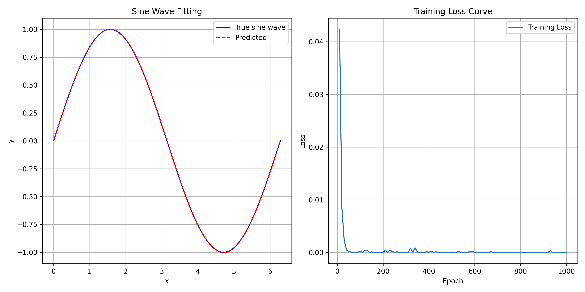

# BP网络-260512
{: .no_toc }
`更新-260512` \| `发布-260512`

<!--  -->
<!-- <details open markdown="block">
  <summary>
    目录
  </summary>
- TOC
{:toc}
</details> -->

<!-- <details>
    <summary>ℹ️ 更新历史</summary>
<br>

**260501：新增3个岗位**

- [产品运营-音乐方向](#产品运营-音乐方向)
- [前端开发工程师](#前端开发工程师)
- [移动端开发工程师-Android](#移动端开发工程师-android)

</details> -->

<details markdown="block">
  <summary>✳️ 目录</summary>
- TOC
{:toc}
</details>

---

## 实验简介


### 关于开发板
<br>
本次实验将使用  **昇腾开发板** 和  **鲲鹏开发板**，完成 MNIST 模型训练和推理验证。

本文部分步骤的思路借鉴了“零基础AI入门指南” [^1]。在此致谢文章作者。

---

## 实验目的
<br>
通过本次实验，期望达成以下目的：

1. 了解 BP 网络
2. 进一步掌握开发板的使用
3. 进一步熟悉 Linux 相关操作
4. 增加解决问题的经验

---

## 实验任务
<br>
本次实验主要完成以下任务：

### 任务1-拟合正弦
<br>
构建BP网络拟合正弦样本数据：

- 样本数据，请编写程序自动生成。
- 请编写程序实现。

需完成任务：

1. 输出拟合曲线，以及损失函数和epoch的曲线。如下示意：
    

2. 不同隐含层对结果影响（采用均方根误差进行分析）

3. 不同个数神经元对结果影响（采用均方根误差进行分析）

### 任务2-预测药品销量
<br>
构建BP网络预测药品销量：

- 已有1月到12月的药品销量。
- 根据1、2、3月的销量，预测4月的销量；根据2、3、4月的实际销量，预测5月的销量；……。直至满足预测精度为止。
- 1月到12月的药品销量数据如下：2056, 2395, 2600, 2298, 1634, 1600, 1873, 1478, 1900, 1500, 2046, 1556

需完成任务：

1. 编写程序实现预测药品销量

2. 截图保存结果。

3. 不同隐含层对结果影响（采用均方根误差进行分析）

4. 不同个数神经元对结果影响（采用均方根误差进行分析）

### 任务3-预测客货运量
<br>
构建BP网络预测公路客运量和货运量：

- 已有1990年到2009年的客运量和货运量数据。
- 根据历史数据，预测2010年和2011年的客户量/货运量数据。
- 1990年到2009年公路客运量数据（万人）如下（共 20 个数据）：5126, 6217, 7730, 9145, 10460, 11387, 12353, 15750, 18304, 19836, 21024, 19490, 20433, 22598, 25107, 33442, 36836, 40548, 42927, 43462
- 1990年到2009年公路货运量数据（万吨）如下（共 20 个数据）：1237, 1379, 1385, 1399, 1663, 1714, 1834, 4322, 8132, 8936, 11099, 11203, 10524, 11115, 13320, 16762, 18673, 20724, 20803, 21804

需完成任务：

1. 编写程序实现预测公路客运量和货运量。

2. 截图保存结果。

3. 不同隐含层对结果影响（采用均方根误差进行分析）

4. 不同个数神经元对结果影响（采用均方根误差进行分析）

---

## 对号入座
<br>
小组 + 桌号 + 开发板编号，安排如下。✅请对号入座。


|小组|桌号|开发板|人数|
|:---:|:---:|:---:|:---:|
|1|1|昇腾1|3|
|2|1|昇腾2|3|
|3|3|昇腾3|3|
|4|3|昇腾4|3|
|5|4|昇腾5|2|
|6|5|昇腾6|3|
|7|4|昇腾7|2|
|8|4|昇腾8|2|
|9|5|昇腾9|3|
|10|6|昇腾10|3|
|11|8|昇腾11|2|
|12|7|昇腾12|2|
|13|7|昇腾13|2|
|14|7|昇腾14|2|
|15|6|昇腾16|3|
|16|8|鲲鹏1|2|
|17|9|鲲鹏2|3|
|18|9|鲲鹏3|3|
|19|8|鲲鹏4|2|
|20|10|鲲鹏5|3|
|21|11|鲲鹏6|2|
|22|10|鲲鹏7|3|
|23|11|鲲鹏8|2|
|24|12|鲲鹏9|3|
|25|12|鲲鹏10|3|
|26|11|鲲鹏11|2|
|27|2|鲲鹏12|1|

---

## 注意事项
<br>
敬请关注以下事项：

- 🚫 **禁止：水杯、水瓶等，不要放在桌上**。临时放桌上，则要拧紧盖子。液体泼洒会损坏开发板。

- ✅ **建议：书包等物品放实验室四周空闲处**。以便提高效率，并防止器材跌落（已发生跌落）。

- ✅ **建议：电源线等，都从桌子中间穿出到桌面上**。以便提高效率，并防止器材跌落（已发生跌落）。

---

## 0-上电开机
<br>
插上电源即可开机：

-  昇腾：开发板上电后，3个指示灯会依次绿色常亮，表示启动正常。

-  鲲鹏：前面板有2个 Type-C，电源插入➡️边上那个。
-  鲲鹏：拿掉顶部的磁吸盖子，看到2个绿灯亮，就表示开机完成。

---

## 1-连接外网
<br>
开发板上电开机后，先让开发板连接外网，即能访问互联网。后续创建本次实验所需的 Python 虚拟环境，需要开发板能访问外网。相关请参考如下：

-  昇腾：[连接外网↗](https://tnt.gdvzz.com/aikit/aidk.html#nets)
-  鲲鹏：[连接外网↗](https://tnt.gdvzz.com/aikit/dkoo.html#nets)

---

## 2-创建环境
<br>
创建本次实验所需环境，主要包括：

- 创建 Python 虚拟环境。在虚拟环境中开展实验，可做到和开发板的其他项目互不影响。
- 在 Python 虚拟环境中安装相关包。

1. **HwHiAiUser 用户登录开发板**

    用 MobeXterm 软件登录，或在本地电脑执行：

    ```bash
ssh HwHiAiUser@192.168.137.100
    ```
    
    > 在权限满足实验要求的前提下，尽量不用超级用户 root 做实验。


2. **用 conda 创建 Python 虚拟环境：**

    ```bash
conda create -n bp0512 python=3.10
    ```

    > bp0512 是虚拟环境的名字。可以是其他名字。<br>
    > Python 3.10 只是举例。应该能满足要求大部分要求。如果不行，可以尝试用低版本或高版本。


3. **激活刚创建的虚拟环境：**

    ```bash
conda activate bp0512
    ```

4. **在虚拟环境中安装相关包：**

    ```bash
pip3 install numpy Pillow flask opencv-python
    ```

    ✳️ 亦可用 conda 安装，效果是一样的。命令是：

    ```bash
conda install numpy Pillow flask opencv-python
    ``` 

<br>

✅ 可以执行以下命令，删除虚拟环境。然后重复上述2、3、4步骤，重新创建虚拟环境。

- 如果当前在虚拟环境 nbm0509 中，则先去激活：

    ```bash
conda deactivate
    ```

- 删除虚拟环境：

    ```bash
conda remove -n nbm0509 --all
    ```

---

## 3-获取源码
<br>
下载样例压缩包（源码+数据），并上传开发板，然后解压缩。

1. **下载样例压缩包**：[江大云盘链接↗](https://pan.jiangnan.edu.cn/link/AA0E3A5508BA9C45DEAFAF4CDE19F0411F)

    压缩包文件名是：nbm260509.zip，包含以下样例文件和数据：

    ```bash
├── apphw.py    # Web界面鼠标手写数字识别
├── apptk.py    # 摄像头拍摄手写数字识别
├── data        # MNIST数据集
│   └── MNIST
│       └── raw
│           ├── t10k-images-idx3-ubyte.gz
│           ├── t10k-labels-idx1-ubyte.gz
│           ├── train-images-idx3-ubyte.gz
│           └── train-labels-idx1-ubyte.gz
├── infer.py    # 模型推理程序
├── input       # 测试图片
│   ├── test-0.png
│   ├── test-1.png
│   ├── test-2.png
│   ├── test-3.png
│   ├── test-4.png
│   ├── test-5.png
│   ├── test-6.png
│   ├── test-7.png
│   ├── test-8.png
│   └── test-9.png
├── templates    # Web页面
│   ├── handwrite.html
│   └── takephoto.html
└── train.py     # 模型训练程序
    ```

2. **在开发板上新建实验用目录：**

    ```bash
mkdir ~/nbm0509
    ```

    该实验目录的完整路径是：/home/HwHiAiUser/nbm0509

3. **上传压缩包到开发板的实验目录中**

    用 MobaXterm 软件传文件。请参考：[MobaXterm简要说明↗](https://tnt.gdvzz.com/aikit/mobaxtermug.html) \| 传文件

    或者在本地电脑敲命令传文件。请参考：[Linux常用操作↗](https://tnt.gdvzz.com/aikit/linuxug.html) \| scp 远程复制文件/目录

    ```bash
scp nbm260509.zip HwHiAiUser@192.168.137.100:/home/HwHiAiUser/nbm0509
    ```

4. **在开发板上解压缩**

    先进入实验目录：

    ```bash
cd ~/nbm0509
    ```

    再解压缩：

    ```bash
unzip nbm260509.zip
    ```

    解压缩后生成子目录 mnist-nb，完整路径应该是：/home/HwHiAiUser/nbm0509/mnist-nb。

---

## 4-体验样例

### 训练模型
<br>
使用压缩包中的数据集，对朴素贝叶斯模型做训练。

1. **先进入样例代码目录**

    ```bash
cd ~/nbm0509/mnist-nb
    ```

2. **并确保虚拟环境已激活**

    命令行提示符首部有 `(nbm0509)` 字样，即表示本次实验用虚拟环境已激活。如需激活，可执行以下命令：

    ```bash
conda activate nbm0509
    ```

3. **训练模型**

    ```bash
python3 train.py
    ```

    训练耗费数秒时间。训练完成后，可在屏幕上看到如下信息：

    ```bash
(nbm0509) HwHiAiUser@davinci-mini:~/nbm0509/mnist-nb$ python3 train.py
加载训练集...
加载测试集...
训练集大小: (60000, 784), 测试集大小: (10000, 784)
训练 Bernoulli Naive Bayes 模型...
测试集准确率: 0.8427 (84.27%)
模型已保存为 mnist_nb_model.npz
    ```

### 推理验证
<br>
样例中的目录 `input` 有 0 ~ 9 共 10 张图片。可执行以下命令体验推理验证：

```bash
python3 infer.py <图片路径>
```

比如验证识别数字 0：

```bash
python3 infer.py input/test-0.png
```

可在屏幕看到如下提示信息：

```bash
(nbm0509) HwHiAiUser@davinci-mini:~/nbm0509/mnist-nb$ python3 infer.py input/test-0.png
预测数字: 0
其他数字概率:
  0: 1.000000
  1: 0.000000
  2: 0.000000
  3: 0.000000
  4: 0.000000
  5: 0.000000
  6: 0.000000
  7: 0.000000
  8: 0.000000
  9: 0.000000
```

<!--  -->
### 产品化
<br>
增加 Web 界面。可在 Web 界面手写数字、要求识别，并得到识别结果。

1. **开发板上启动 Web 服务端**

    在开发板上执行以下命令：

    ```bash
python3 apphw.py
    ```

    启动完成后，可看到屏幕如下类似提示信息：

    ```bash
(nbm0509) HwHiAiUser@davinci-mini:~/nbm0509/mnist-nb$ python3 apphw.py
模型加载成功
* Serving Flask app 'apphw'
* Debug mode: on
WARNING: This is a development server. Do not use it in a production deployment. Use a production WSGI server instead.
* Running on all addresses (0.0.0.0)
* Running on http://127.0.0.1:5000
* Running on http://172.18.145.46:5000
Press CTRL+C to quit
* Restarting with stat
模型加载成功
* Debugger is active!
* Debugger PIN: 921-919-078
    ```

2. **本地电脑浏览器访问开发板**

    在本地电脑浏览器输入以下 **IP:端口** 访问：

    ```
192.168.137.100:5000
    ```

    在本地电脑的浏览器界面，用鼠标手逐个写 0 ~ 9 共 10 个数字，点击识别，并获得识别结果。

    

<!--  -->
### 拍摄并识别
<br>
增加 Web 界面。可在 Web 界面指引用连接开发板的 USB 摄像头，拍摄手写数字、要求识别，并得到识别结果。

1. **开发板上启动 Web 服务端**

    在开发板上执行以下命令：

    ```bash
python3 apptk.py
    ```

    启动完成后，可看到屏幕如下类似提示信息：

    ```bash
(nbm0509) HwHiAiUser@davinci-mini:~/nbm0509/mnist-nb$ python3 apptk.py
模型加载成功
找到可用摄像头: /dev/video0
* Serving Flask app 'apptk'
* Debug mode: on
WARNING: This is a development server. Do not use it in a production deployment. Use a production WSGI server instead.
* Running on all addresses (0.0.0.0)
* Running on http://127.0.0.1:5000
* Running on http://172.18.145.46:5000
Press CTRL+C to quit
* Restarting with stat
模型加载成功
找到可用摄像头: /dev/video0
* Debugger is active!
* Debugger PIN: 921-919-078
    ```

    ✴️ 如果无法访问摄像头，请参考：[普通用户访问摄像头↗](https://tnt.gdvzz.com/aikit/dkoo.html#access-camera)

2. **本地电脑浏览器访问开发板**

    在本地电脑浏览器输入以下 **IP:端口** 访问：

    ```
192.168.137.100:5000
    ```

    参考在本地电脑的浏览器界面上的指引，用和开发板相连的USB摄像头，逐个拍摄 0 ~ 9 共 10 个数字，点击识别，并获得识别结果。

    


---

## 关机断电复位离开
<br>
实验结束后，请完成以下事项，再离开实验课。

1. **关机断电**

    开发板要先关机、再断电。🚫 **严谨开机状态直接断电（拔电源）！**

    -  **昇腾**：[关机断电↗](https://tnt.gdvzz.com/aikit/aidk.html#onoff) 
    -  **鲲鹏**：[关机断电↗](https://tnt.gdvzz.com/aikit/dkoo.html#onoff) 

    ✴️ 上次实验课后，发现有1个开发板无法启动。重新烧录镜像后解决。镜像损坏（大概率是文件系统损坏引起的），可能和 SD 卡质量相关，也可能是开机状态直接断电引起的。

2. **归还实验器材，给实验室老师**

    - 开发板（每组1个）
    - 开发板电源（每组1个）
    - 网线（每组1个）
    - USB摄像头（每桌共用1个）
    - 借用的其他器材

3. **椅子复位**

    - 每个桌子，配套 6 个椅子。请将椅子推到桌子下面。
    - 西侧玻璃门，前中后靠墙，各 6 个。共 18 个。请按此数量靠墙摆放。

4. **带齐随身物品**

✅ 上述事项完成后，可离开实验室。

<!-- 参考资料 -->
[^1]: [零基础AI入门指南↗](https://liaoxuefeng.com/blogs/all/2023-05-08-mnist/index.html)

<!--  -->
<span style="font-size:12px; color:#999">THE END</span>
