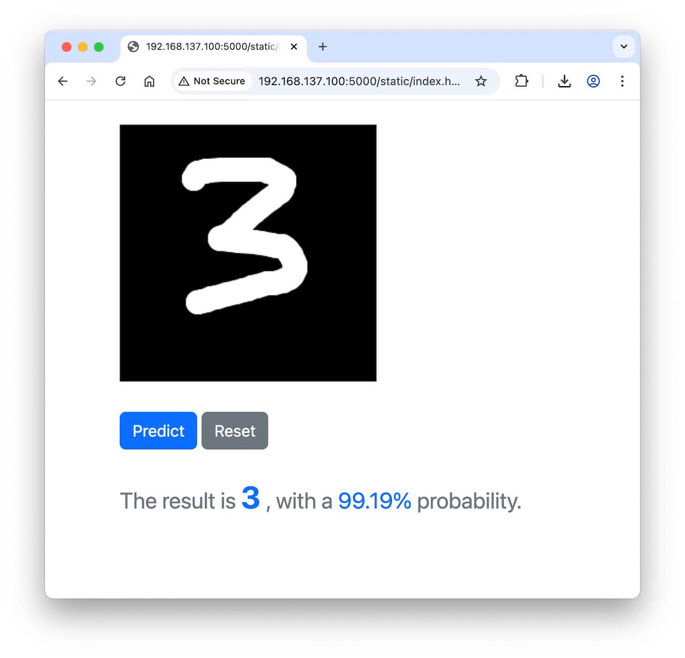
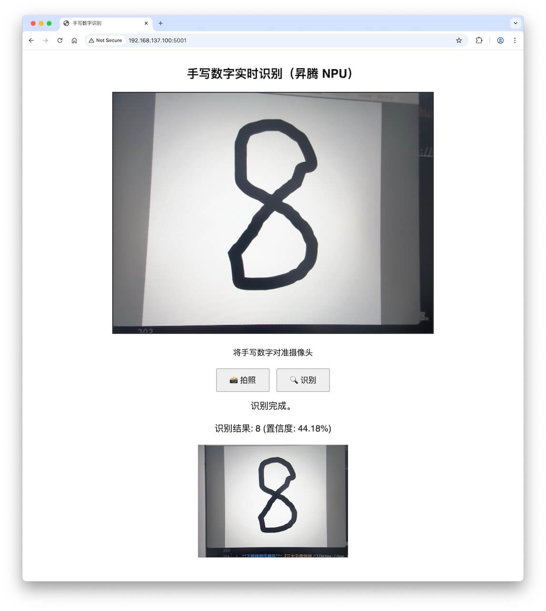

# 手写数字识别CNN-260519
{: .no_toc }
`更新-260519` \| `发布-260506`

<!--  -->
<!-- <details open markdown="block">
  <summary>
    目录
  </summary>
- TOC
{:toc}
</details> -->

<!-- <details>
    <summary>ℹ️ 更新历史</summary>
<br>

**260501：新增3个岗位**

- [产品运营-音乐方向](#产品运营-音乐方向)
- [前端开发工程师](#前端开发工程师)
- [移动端开发工程师-Android](#移动端开发工程师-android)

</details> -->

<details markdown="block">
  <summary>✳️ 目录</summary>
- TOC
{:toc}
</details>

---

## 实验简介

### 关于MNIST
<br>
MNIST（Modified National Institute of Standards and Technology）是一个广泛用于图像分类入门的手写数字数据集。它由 0 到 9 的灰度数字图像组成，每张图像的大小为 28×28 像素。数据集共包含 70,000 个样本，其中 60,000 个用于训练，10,000 个用于测试。每个样本均带有对应的真实数字标签。

MNIST 数据集因其规模适中、格式统一、预处理简单，被视为机器学习领域的“Hello World”基准。在人工智能实验课程中，它常用于演示从数据加载、模型训练到性能评估的完整流程。学生可以通过该数据集直观地理解分类任务的基本概念，例如特征提取、损失函数、优化算法以及过拟合现象，并验证不同模型（如全连接网络、卷积神经网络）的识别效果。尽管 MNIST 难度较低，但它为后续学习更复杂的图像识别任务奠定了扎实的基础。

### 关于开发板
<br>
本次实验将使用  **昇腾开发板** 和  **鲲鹏开发板**，完成 MNIST 模型构建、模型训练和推理验证。

本文主要参考资料：零基础AI入门指南 [^1]。在此致谢文章作者。

---

## 实验目的
<br>
通过本次实验，期望达成以下目的：

1. 了解 MNIST
2. 了解 CNN
3. 进一步掌握开发板的使用
4. 进一步熟悉 Linux 相关操作
5. 增加解决问题的经验

---

## 对号入座
<br>
请同学们对号入座、对号使用器材。
<details markdown="block">
  <summary>✳️ 座位安排，请对号入座</summary>

</details>
<details markdown="block">
  <summary>✳️ 器材安排，请对号使用</summary>

</details>

---

## 注意事项
<br>
敬请关注以下事项：

- 🚫 **禁止：水杯、水瓶等，不要放在桌上**。临时放桌上，则要拧紧盖子。液体泼洒会损坏开发板。

- ✅ **建议：书包等物品放实验室四周空闲处**。以提高效率，并防止器材跌落（已发生跌落）。

- ✅ **建议：电源线等，都从中间穿到桌面上**。以提高效率，并防止器材跌落（已发生跌落）。

---

## 0-上电开机
<br>
插上电源即可开机：

-  昇腾：开发板上电后，3个指示灯会依次绿色常亮，表示启动正常。

-  鲲鹏：前面板有2个 Type-C，电源插入➡️边上那个。
-  鲲鹏：拿掉顶部的磁吸盖子，看到2个绿灯亮，就表示开机完成。

---

## 1-连接外网
<br>
开发板上电开机后，先让开发板连接外网，即能访问互联网。后续创建本次实验所需的 Python 虚拟环境，需要开发板能访问外网。开发板如何连接外网，请参考：

-  昇腾：[连接外网↗](https://tnt.gdvzz.com/aikit/aidk.html#nets)
-  鲲鹏：[连接外网↗](https://tnt.gdvzz.com/aikit/dkoo.html#nets)

---

## 2-创建环境
<br>
在虚拟环境中开展实验，可做到和开发板的其他项目互不影响。

1. **HwHiAiUser 用户登录开发板**

    用 MobeXterm 软件登录，或在本地电脑执行：

    ```bash
ssh HwHiAiUser@192.168.137.100
    ```

    或者已用 root 登录开发板，则切换到 HwHiAiUser：

    ```bash
su - HwHiAiUser
    ```

    > 在权限满足实验要求的前提下，尽量不用超级用户 root 做实验。

2. **用 conda 创建 Python 3.10 的虚拟环境：**

    ```bash
conda create -n cnn0519 python=3.10
    ```

    > （1）在虚拟环境中开展实验，可做到和开发板的其他项目互不影响。<br>
    > （2）cnn0519 是虚拟环境的名字的样例。<br>


3. **激活刚创建的虚拟环境：**

    ```bash
    conda activate cnn0519
    ```

4. **在虚拟环境中安装相关包：**

    先安装 CPU 版本的 PyTorch 和 torchvision：
    
    ```bash
pip3 install torch torchvision numpy==1.24.0 --index-url https://download.pytorch.org/whl/cpu
    ```

    > 增加 `--index-url ...` 是避免安装不必要的 nvidia 相关的包。

    再安装其他可以一起安装的包：

    ```bash
pip3 install flask opencv-python onnxscript onnx
    ```

<br>

✅ 可以执行以下命令，删除虚拟环境。然后重复上述2、3、4步骤，重新创建虚拟环境。

- 如果当前在虚拟环境 cnn0519 中，则先去激活：

    ```bash
conda deactivate
    ```

- 删除虚拟环境：

    ```bash
conda remove -n cnn0519 --all
    ```

---

## 3-获取源码
<br>
下载样例压缩包（源码+数据），并上传开发板，然后解压缩。

1. **下载样例压缩包**：[江大云盘链接↗](https://pan.jiangnan.edu.cn/link/AAC267DFD123DD4F6FBC435A93E0B9AC2B)

    压缩包文件名是：cnn260519.zip

2. **在开发板上新建实验用目录：**

    ```bash
mkdir ~/cnn0519
    ```

    该实验目录的完整路径是：/home/HwHiAiUser/cnn0519

3. **上传压缩包到开发板的实验目录中**

    用 MobaXterm 软件传文件。请参考：[MobaXterm简要说明↗](https://tnt.gdvzz.com/aikit/mobaxtermug.html) \| 传文件

    或者在本地电脑敲命令传文件。请参考：[Linux常用操作↗](https://tnt.gdvzz.com/aikit/linuxug.html) \| scp 远程复制文件/目录。比如进入压缩包保存的目录后，执行：

    ```bash
scp cnn260519.zip HwHiAiUser@192.168.137.100:/home/HwHiAiUser/cnn0519
    ```

4. **在开发板上解压缩**

    先进入实验目录：

    ```bash
cd ~/cnn0519
    ```

    再解压缩：

    ```bash
unzip cnn260519.zip
    ```

    解压缩后生成子目录 mnist-master，完整路径应该是：/home/HwHiAiUser/cnn0519/mnist-master。

---

## 4-体验样例

### 训练模型
<br>
使用压缩包中的数据集，对CNN模型做训练。在开发板上执行 1个 epoch，大约需要 2 分钟左右。样例中 epochs = 5，因此建议先改小些，比如改成 1。

1. **先进入样例代码目录**

    ```bash
cd ~/cnn0519/mnist-master
    ```

2. **并确保虚拟环境已激活**

    命令行提示符首部有 `(cnn0519)` 字样，即表示本次实验用虚拟环境已激活。如需激活，可执行以下命令：

    ```bash
conda activate cnn0519
    ```

3. **（可选）修改 epochs 数字**

    修改 `train.py`，将 `epochs = 5` 改为 `epochs = 1`

    ```python
    ...
    def main():
        ...
        loss_fn = nn.CrossEntropyLoss()
        optimizer = optim.Adam(model.parameters(), lr=0.001)
        # epochs = 5
        epochs = 1   # 先改成 1 用于体验
        ...
    ```

4. **训练模型**

    ```bash
python3 train.py
    ```

    > （1）Python3.10 + 对应 PyTorch，完成 1 个 epoch 约需要 2 分钟。<br>
    > （2）开发板主要用于推理（用程序调用训练好的模型），不用做模型训练。

### 推理验证
<br>
样例中的目录 `input` 有 0 ~ 9 共 10 张图片。可执行以下命令体验推理验证：

```bash
python3 test.py
```

### 产品化
<br>
增加 Web 界面。可在 Web 界面手写数字、要求识别，并得到识别结果。

1. **微调样例代码**

    修改 `serve.py` 的最后一行，改为 `app.run(host='0.0.0.0', port=5000)` 

    ```python
    ...
    if __name__ == '__main__':
        # app.run(port=5000)
        app.run(host='0.0.0.0', port=5000) # 可在本地电脑浏览器访问“开发板IP:5000”
    ```
2. **开发板上启动 Web 服务端**

    在开发板上执行以下命令：

    ```bash
python3 serve.py
    ```

3. **本地电脑浏览器访问开发板**

    在本地电脑浏览器输入以下 **IP:端口** 访问：

    ```
192.168.137.100:5000
    ```

    在本地电脑的浏览器界面，用鼠标手逐个写 0 ~ 9 共 10 个数字，点击识别，并获得识别结果。

    

---

## 5-拍摄并识别
<br>
在样例代码基础上，新增以下功能：

- USB摄像头，接在开发板上
- 在连接开发板的个人电脑上，通过网页方式访问开发板
- 在网页上，可以使用接在开发板上的USB摄像头拍照，对手写的数字拍照
- 然后让开发板上的程序做识别，并反馈识别结果到个人电脑的浏览器上

### 参考过程
<br>
AI辅助编程可加快项目进度。重点是把要求说清楚，并不断测试和迭代，直至达到预定要求。参考过程如下：

1. 按上述要求，请AI输出代码。

2. 运行和AI交流后得到的程序后，针对AI给出的代码，再新增以下要求：

    - 浏览器有个窗口，可以看到摄像头的画面。
    - 拍摄窗口中，加个正方形的黄框，尽可能大。仅拍摄黄框内的画面。
    - 拍照和识别，拆成2个按钮。拍照后，显示被拍到的照片；识别，对照片识别
    - 处理为 28*28 的图片，送给推理程序识别的，也要显示在Web页面上

3. 得到阶段性成果如下：

    

✳️ 几点建议：

- 样例代码中的几个相关程序（`train.py` 、`test.py`、`model.py`），也发给AI做参考，可能给出的代码更符合和贴近要求。
- 可以不断给AI提出完整的全新要求。比如原始要求有3条，经过多次交流后，增加到了 7 条；可以一次性的给AI提出完整的7条的全新要求。

---

## 实验任务
<br>
本次实验主要完成以下任务：

### 完成体验
<br>
完成 [4-体验样例](#4-体验样例) 任务：

- 依次执行分步骤：[训练模型](#训练模型)、[推理验证](#推理验证)、[产品化](#产品化)
- 并截图保存各个步骤的执行结果

### 增加输出信息
<br>
修改训练 `train.py`，输出更多信息：

- 比如，batch被100整除时，输出一条信息：已用时多久，预计还要多久，等。

### 完成拍摄
<br>
完成 [5-拍摄并识别](#5-拍摄并识别) 任务：

- 输出源码
- 依次拍摄并识别 0~9 共 10 个数字，并截图保存

### 计算指标
<br>
计算相关指标：

- 比如获取 100 张手写图片，内容为 0-9，每个数字各 10 张
- 用训练好的模型进行识别
- 根据混淆矩阵计算相关指标：precision，accuracy，recall，f1-score

**猫狗识别**（补充读物）

在猫狗图片识别中，这是一个典型的二分类问题。通常我们可以把“猫”设为正类（Positive），“狗”设为负类（Negative），混淆矩阵就是一个2×2的表格，结构如下：

```
真实\预测   预测为猫    预测为狗
实际是猫    TP          FN
实际是狗    FP          TN
```

每个格子的具体含义（以猫为正类为例）：

- TP（真正例）：图片是猫，模型也正确识别为猫 → 正确识别出的猫的数量。
- TN（真负例）：图片是狗，模型也正确识别为狗 → 正确识别出的狗的数量。
- FP（假正例）：图片是狗，模型却错误地识别为猫 → 把狗误报成猫（“假警报”）。
- FN（假负例）：图片是猫，模型却错误地识别为狗 → 把猫漏掉了（“漏报”）。

实际应用解读
假设测试集有100张猫和100张狗，模型预测结果如下：

```
             预测猫 预测狗
实际猫(100)  90     10
实际狗(100)  15     85
```

那么：

- TP = 90，TN = 85，FP = 15，FN = 10

由此可以计算：

- 准确率 = (90+85)/200 = 87.5% — 整体判断正确的比例。
- 精确率（猫） = 90/(90+15) ≈ 85.7% — 模型说“这是猫”的结果中，真正是猫的比例。高精确率意味着假警报少。
- 召回率（猫） = 90/(90+10) = 90% — 真实的所有猫中，模型成功找出了多少。高召回率意味着漏报少。
- F1分数（猫） = 2×0.857×0.9/(0.857+0.9) ≈ 87.8% — 精确率和召回率的调和平均。

如果用户更关心“不要把狗误认为猫”（例如猫咖门禁只让猫进），就应优先提高精确率；如果更关心“不要漏掉任何一只猫”（例如寻找走失的猫），就应优先提高召回率。混淆矩阵能直观地帮助你在两者之间做权衡。

**参考过程：**

1. **随机抽取MNIST数据集中1000张图片，0-9各100张**

    和AI多次交流如下，得到符合要求的样例代码。

    ```
    1、对mnist的数据集中的测试集，随机抽取0-9个数字，各100张
    2、数据集已下载到本地，如下：
    ~/tmp26/05/cnn260519/data/MNIST/raw % tree
    .
    ├── t10k-images-idx3-ubyte
    ├── t10k-images-idx3-ubyte.gz
    ├── t10k-labels-idx1-ubyte
    ├── t10k-labels-idx1-ubyte.gz
    ├── train-images-idx3-ubyte
    ├── train-images-idx3-ubyte.gz
    ├── train-labels-idx1-ubyte
    └── train-labels-idx1-ubyte.gz

    3、用numpy实现
    4、抽取出来的图片，保存到目录中
    5、保存下来的图片，在文件名中记录在测试集中的位置
    ```

2. **计算指标**

    和AI多次交流如下，得到符合要求的样例代码。

    ```
    trainv2.py -- 训练
    test.py -- 推理
    sample.py -- 抽取0-9各100张图片

    1、请推理0-9各100张图片
    2、请输出混淆矩阵
    3、请输出混淆矩阵的相关指标
    ```

    得到相关指标如下：

    ```
    (cnn0519) ~/tmp26/05/cnn260519 % python3 ev.py            
    using cpu
    Loaded model from mnist.pth

    共测试 1000 张图片，每个数字应各 100 张

    混淆矩阵 (行=真实, 列=预测):
    [[ 99   0   0   0   0   0   0   1   0   0]
    [  0 100   0   0   0   0   0   0   0   0]
    [  0   0 100   0   0   0   0   0   0   0]
    [  0   0   2  98   0   0   0   0   0   0]
    [  0   0   0   0 100   0   0   0   0   0]
    [  0   0   0   1   0  99   0   0   0   0]
    [  0   0   0   0   0   0 100   0   0   0]
    [  0   0   2   0   0   0   0  97   0   1]
    [  0   0   1   0   0   0   0   0  99   0]
    [  0   0   1   0   0   0   0   0   0  99]]


    分类报告:
                precision    recall  f1-score   support

            0     1.0000    0.9900    0.9950       100
            1     1.0000    1.0000    1.0000       100
            2     0.9434    1.0000    0.9709       100
            3     0.9899    0.9800    0.9849       100
            4     1.0000    1.0000    1.0000       100
            5     1.0000    0.9900    0.9950       100
            6     1.0000    1.0000    1.0000       100
            7     0.9898    0.9700    0.9798       100
            8     1.0000    0.9900    0.9950       100
            9     0.9900    0.9900    0.9900       100

        accuracy                         0.9910      1000
    macro avg     0.9913    0.9910    0.9911      1000
    weighted avg     0.9913    0.9910    0.9911      1000

    总体准确率: 0.9910
    ```

3. **实际分析建议**

    - 观察混淆矩阵的非对角线高亮格子：例如数字 1 经常被预测为 7，可能说明 1 和 7 的特征相似或数据标注有误。
    - 关注召回率低的数字：比如数字 5 的召回率只有 70%，意味着 30% 的真实 5 被误识别了，需要重点调优。

### 输出注释
<br>
输出样例源码功能说明，用于加深对参考样例的理解（可课后完成）：

- 主要是 `train.py` 和 `test.py` 的功能说明
- 比如：定义了一个xxxx的人工智能网络，输入了xxxx训练数据，经过xxxx，最终得到xxxx指标的模型，……

### 输出代码
<br>
输出个人独特版本的程序（可课后完成）:
    
- 建议结合AI辅助编程
- 包括模型训练程序，以及推理程序
- 可在个人电脑上完成
- 如有条件使用 GPU 进行训练和推理，请尽量使用 GPU
- 截图保存训练结果和推理结果

### （可选）使用NPU推理

参考 [AscendCL 应用开发指南（Python）- 快速入门↗]，改写推理程序，使用开发板 NPU 算力推理。

<!-- ---

pip3 install onnxscript onnx -->

<!-- atc --model=mnist.onnx --framework=5 --output=mnist --soc_version=Ascend310B4 --input_shape="input:1,1,28,28" --log=debug -->
---

## 关机断电复位离开
<br>
实验结束后，请完成以下事项，再离开实验课。

1. **关机断电**

    开发板要先关机、再断电。🚫 **严谨开机状态直接断电（拔电源）！**

    -  **昇腾**：[关机断电↗](https://tnt.gdvzz.com/aikit/aidk.html#onoff) 
    -  **鲲鹏**：[关机断电↗](https://tnt.gdvzz.com/aikit/dkoo.html#onoff) 

2. **归还实验器材，给实验室老师**

    - 开发板（每组1个）
    - 开发板电源（每组1个）
    - 网线（每组1个）
    - USB摄像头（每桌共用1个）
    - 借用的其他器材

3. **椅子复位**

    - 每个桌子，配套 6 个椅子。请将椅子推到桌子下面。
    - 西侧玻璃门，前中后靠墙，各 6 个。共 18 个。请按此数量靠墙摆放。

4. **带齐随身物品**

✅ 上述事项完成后，可离开实验室。

<!-- 参考资料 -->
[^1]: [零基础AI入门指南↗](https://liaoxuefeng.com/blogs/all/2023-05-08-mnist/index.html)

<!--  -->

[AscendCL 应用开发指南（Python）- 快速入门↗]: https://www.hiascend.com/document/detail/zh/Atlas200IDKA2DeveloperKit/23.0.RC2/Application%20Development%20Guide/aadgp/aclpythondevg_0001.html

<!--  -->
<span style="font-size:12px; color:#999">THE END</span>
