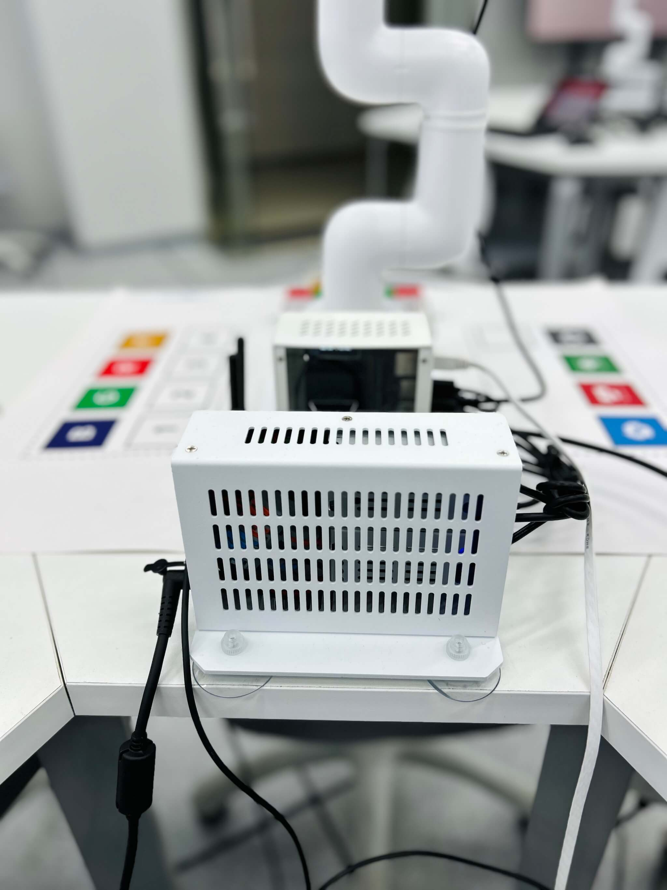
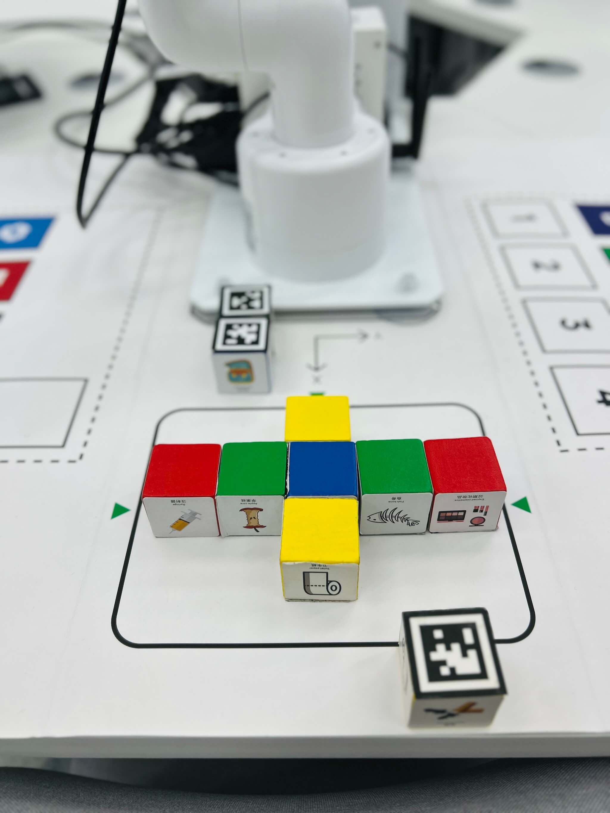
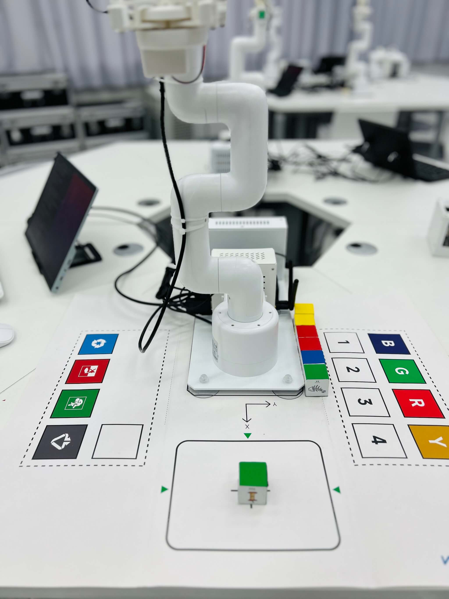
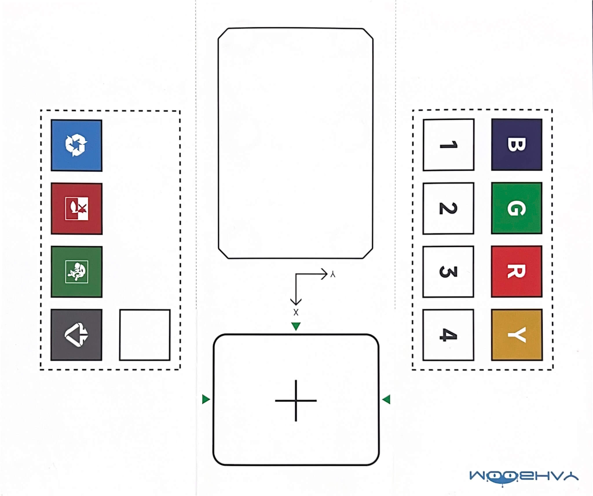

# 机械臂体验
{: .no_toc }
`更新-260330` \| `发布-260330`

<!--  -->
<details open markdown="block">
  <summary>
    目录
  </summary>
  <!-- {: .text-delta } -->
- TOC
{:toc}
</details>

---

## 注意事项

🚫 禁止：不要搬动机械臂。否则机械臂会抓不准。

🚫 禁止：机械臂在运动时，不要用肢体去触碰机械臂。以防人体受到伤害，或者损坏机械臂。

✅ 建议：机械臂抓取时如果不大准确，可用手微微移动积木以辅助。（也可通过修改样例程序的配置文件来实现）

---

## 上电开机

- 机械臂配有 1 个电源，一端连机械臂，另一端插头插在桌子下面的插座上。
- 桌子下面有个带开关的的立方体插座。按下开关，电源指示灯亮，即表明接通电源。
- 稍等片刻可完成启动。机械臂站立起来，且屏幕显示 Ubuntu 的主界面，就启动完成。

---

## 启动和退出样例demo

- 进入样例demo程序所在目录

    ```bash
cd ~/viki
    ```

- 执行 `conda activate viki` 激活体验虚拟环境
<!-- 如果命令行提示符行首有 `(base)`（有带括号的一串字母，不一定是 base），则执行以下命令退出 Python 虚拟环境。命令执行后，行首就没有带括号的一串字母了。 -->

    ```bash
jetson@jetson-Yahboom:~/viki$ conda activate viki
(viki) jetson@jetson-Yahboom:~/viki$ 
    ```

    > 虚拟环境激活后，命令行提示符首部有 `(viki)` 字样：`(viki) jetson@jetson-Yahboom:~$ 
`

- 执行 `python3 agent.py` 启动样例demo。

    ```bash
    (viki) jetson@jetson-Yahboom:~/viki$ python3 agent.py
    WARNING: Carrier board is not from a Jetson Developer Kit.
    WARNNIG: Jetson.GPIO library has not been verified with this carrier board,
    WARNING: and in fact is unlikely to work correctly.
    <USER>:
    ```

- 按 `ctrl` + `c` 键，可退出样例demo程序。

---

## 体验-抓颜色积木

- 先在机械臂前面的桌面上放置待抓取的积木。✅ 颜色面朝上。

    （待补充照片）

- 目标区域没有积木。

    （待补充照片）

- 抓取蓝色积木。输入 `grab blue cube and move to -80,200`

    ```bash
    <USER>:grab blue cube and move to -80,200
    ...
    #################### <函数执行> ####################
    *************
    [-80, 200]
    Objects arranged successfully
    #################### <函数执行> #################### 
    
    <USER>:
    ```

- 抓取绿色积木。输入 `grab green cube and move to 0,200`

    ```bash
    <USER>:grab green cube and move to 0,200
    ...
    #################### <函数执行> ####################
    *************
    [0, 200]
    Objects arranged successfully
    #################### <函数执行> #################### 

    <USER>:
    ```

🚫 禁止：**如果目标 {xy坐标} 已有积木，不能让机械臂抓积木再移动到相同坐标。否则可能导致机械臂损坏。**

---

## 体验-堆叠积木

- 先在机械臂前面的桌面上放置待抓取的 **2** 个积木。

- ✅ 提前清空坐标 y 正方向空间。因为稍后积木将堆叠在此。

- 然后在样例demo程序启动后的 `<USER>:` 提示符后，输入：

    ```bash
    stack two cubes together
    ```

    ```bash
    <USER>:stack two cubes together
    ...
    #################### <函数执行> ####################
    *************
    [-80, 200]
    Objects arranged successfully
    #################### <函数执行> #################### 
    ...
    #################### <函数执行> ####################
    *************
    [-80, 200]
    Objects arranged successfully
    #################### <函数执行> #################### 

    <USER>:
    ```

🚫 禁止：**坐标 y 正方向空间如已有积木，不要体验堆叠积木，要清空目标空间后体验。否则可能导致机械臂损坏。**

---

## 关机

1. 屏幕右上角：电源标志 → power off。
2. 观察开发板小机箱的散热风扇。风扇停止后，按桌子下面的立方体插座上的开关，电源指示灯熄灭。
3. 起身正对机械臂，将竖立的机械臂向前轻轻推倒，水平卧在 Jetson 开发板小机箱上即可。

🚫 电源线：不必从机械臂拔下来；也不必从桌子下面的插座上拔下来。<br>
🚫 机械臂：水平自然卧倒在小机箱上即可。不必整理、扭成很好看的造型（可能导致下次启动时无法站立）。

---

## 椅子复原

椅子推到桌子下面。1 个桌子配备 6 个椅子。多余的椅子放到实验室的左右两侧。

---

## 带走物品

请带走个人物品。

---

## 附录

### 获取样例demo

1. 在 Jetson 开发板上启动 **浏览器**

2. 点击下载：[e江南云盘链接↗](https://pan.jiangnan.edu.cn/link/AABDB5A8A5A9C8487181B611D6C87259AD) 

3. 执行以下命令将下载的文件移动到 jetson 用户的 HOME 目录。浏览器下载文件通常存放在 jetson HOME 目录的 Downloads 子目录中。

    ```bash
mv ~/Downloads/viki2604.zip ~/.
    ```

3. 执行以下命令解压缩 zip 文件。解压缩完成后生成子目录 viki。

    ```bash
unzip viki2604.zip
    ```

==========

### 搭建Python虚拟环境

1. 创建并激活 Python 3.9 虚拟环境

    ```bash
conda create -n viki python=3.9
conda activate viki
    ```

    > 虚拟环境激活后，命令行提示符首部有 `(viki)` 字样：`(viki) jetson@jetson-Yahboom:~$ 
`

2. 安装样例demo需要的 Python 包

    ```bash
(viki) jetson@jetson-Yahboom:~$ pip3 install openai pyaudio numpy soundfile requests Pillow pymycobot==3.4.9 opencv-python Jetson.GPIO scipy
    ```

    > 机械臂相关的 pymycobot 安装 3.4.9 版本。否则后续运行样例demo会报错。

    > 在激活的虚拟环境中安装 Python 包，不要安装到非虚拟环境或其他虚拟环境中。

> 如果 Jetson 开发板上没有 conda，请参考 [第1步：安装conda](https://tnt.gdvzz.com/ailab/imrobot260304.html#%E7%AC%AC1%E6%AD%A5%E5%AE%89%E8%A3%85-conda)。


### 相关说明

- 机械臂底座背部，和六角形空洞平齐。


    <a href="./labkit.assets/irobot3.jpg"></a>
    <!--  -->

    <!-- [](./labkit.assets/irobot3.jpg) -->


    <!-- <a href="./labkit.assets/irobot2.jpg"></a> -->

    <!-- [](./labkit.assets/irobot2.jpg) -->

- 整体外观如下。✅ 坐标原点，是机械臂底座上方圆柱体中心和底座的交点。

    <a href="./labkit.assets/irobot1.jpg"></a>

    <!-- [](./labkit.assets/irobot1.jpg) -->

- 图纸样式如下。X、Y的箭头方向是正方向。Z的正方向是水平朝上。以 `-80,200` 为例：移动到 X=-80、Y=200。Z默认是110。

    <!-- <a href="./labkit.assets/map.jpg"></a> -->
    <a href="./labkit.assets/map.jpg"></a>
    <!-- <a href="./labkit.assets/map.jpg"></a> -->

    <!-- [](./labkit.assets/map.jpg) -->

- ✅ 如果抓取不大准，可略微移动机械臂的位置。或者修改 config.json 中的 xyz 的数值。

    ```json
{
    "points_pixel": [
        [320,220],
        [590,430],
        [72,31],
        [590,26]
    ],
    "points_arm": [
        [210,0],
        [140, -80],
        [280,80],
        [280,-80]
    ],
    "x": 0,
    "y": 0,
    "z": 0,
    "voice":false,
    "threshold": 110
}
    ```

    可执行 `vim config.json` 编辑文件。用 vim 打开文件后，

    **删除字符**：光标先移动到待删除字符，再按 `esc` 键，再按 `x` 键。

    **插入字符**：光标先移动到待插入位置，先按 `esc` 键，再按 `i` 键，然后输入字符。

    **保存修改**：先按 `esc` 键，再输入 `:wq`，再按 `回车` 键。

    **放弃修改**：先按 `esc` 键，再输入 `:q!`，再按 `回车` 键。


<!-- ## 搭建环境

先执行：

pip3 install flask openai voice pyaudio soundfile -i https://mirrors.aliyun.com/pypi/simple/ 

还缺：

pip3 install requests
pip3 install Pillow
pip3 install pymycobot
pip3 install opencv-python
pip3 install Jetson.GPIO
<!-- Jetson.GPIO -->

<!-- ModuleNotFoundError: No module named 'jetcobot_utils'
(vkai3810) vkai@jetson-Yahboom:~/elephant-ai$ export PYTHONPATH=/home/jetson/jetcobot_ws/devel/lib/python3/dist-packages:/home/jetson/software/ar_track_ws/devel/lib/python3/dist-packages:/opt/ros/noetic/lib/python3/dist-packages

pip3 install scipy -->


<!-- ## 演示程序

可访问以下链接获得演示程序源码：

- NLP演示程序：[链接↗](https://gitlab.educg.net/cg_zmy/Jetson_ai.git)
- 机械臂演示程序：[链接↗](https://pan.educg.net/s/QlQ0UX)
- 机械臂演示程序：[e江南云盘链接↗](https://pan.jiangnan.edu.cn/link/AA9E7A15CF025A49F9B9299B21A5448A83) --> 
