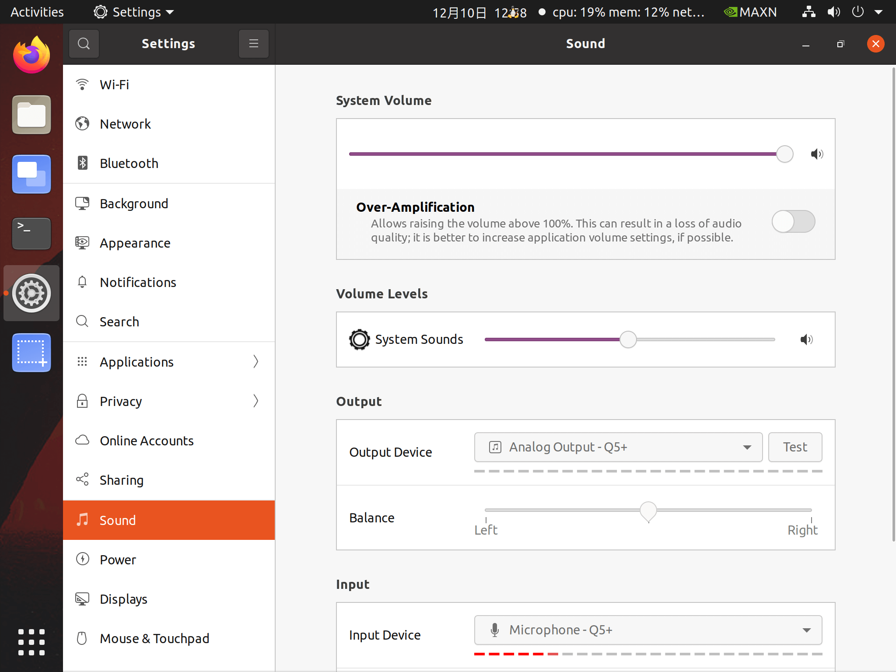

# 机械臂开发示例-251211
{: .no_toc }

在现有机械臂样例程序基础上，增加语音控制，而不是通过界面输入 `grab green cube and move to -80,200`。

期望的实验结果。对着连接机械臂（开发板）的麦克风说话，比如：`抓取绿色方块，并移动到 -80 200`，期望机械臂能按照语音指令，抓取绿色方块，并移动到指定坐标位置。

<details open markdown="block">
  <summary>
    目录
  </summary>
  {: .text-delta }
1. TOC
{:toc}
</details>

<hr>

## 相关说明

**相关信息获取**

- elephant-ai 源代码。[点击下载](./imrobot251211.assets/elephant-ai-251211.zip)
- 开发板账号密码（如需要用到）：`jetson` / `yahboom`
- 开发板IP地址。开发板透明窗口顶部的小屏幕显示的 `IPA: 172.18.xxx.xxx`，就是IP地址。或者在 `终端(terminal)` 执行命令 `ifconfig | grep 172` 也可获得。

**建议事项**

- 接电源线时，从六边形桌子的中央六边形孔洞穿线到桌面上。不要从桌子边缘穿线到桌面上。
- 机械臂电源拔出时，用手扶着机械臂，自然卧倒在开发板上面即可。不要折叠机械臂。
- 断电时，拔掉桌面上相关设备的电源接口即可。不必拔下桌子下面的插头。

{: .important-title}
> 实验结束离开时：
>
> 1、椅子复位。放到桌子下面。<br>
> 2、关机并拔掉电源。在开发板 `终端(terminal)` 执行命令 `shutdown -h now` 后，从开发板透明窗口观察并等待散热风扇停止，然后拔掉机械臂电源、开发板电源、显示屏电源。 

<hr>

## 参考方案

`agent.py` 中，会读取配置文件 `config.json` 中的 `voice` 的取值。如果是  `voice: true`，就会根据录音文件 `Recording.flac` 做相关处理，替代在界面上输入指令。

以下是 `agent.py` 的相关代码片段：

```python
# ...
if __name__ == "__main__":
    # ...
    with open("config.json", "r") as config_file:
        config_data = json.load(config_file)

    use_voice = config_data.get("voice", False)
    recording_file_path = "Recording.flac"
    last_mtime = None

    while True:
        time.sleep(5)
        if use_voice:
            if last_mtime is None:
                # 第一次直接识别
                user_input = voice.record_auto()
                last_mtime = os.path.getmtime(recording_file_path)
            else:
                # 等待文件更新
                last_mtime = wait_for_file_update(recording_file_path, last_mtime)
                user_input = voice.record_auto()
        else:
            user_input = input("<USER>:")
        agent.chat(user_input)
```


`agent2.py` 和 `agent.py` 类似。可以读配置文件 `config.json` 中 `voice` 的配置，或者启动时带命令行参数 `sudo python3 agent2.py -v` 。

以下是 `agent2.py` 的相关代码片段：

```python
# ...
def parse_arguments():
    """解析命令行参数"""
    parser = argparse.ArgumentParser(description='React Agent with command-line input')
    parser.add_argument('user_input', nargs='*', 
                       help='用户输入内容，多个词会被合并成一句话')
    parser.add_argument('--interactive', '-i', action='store_true',
                       help='交互模式，忽略命令行输入，等待用户输入')
    parser.add_argument('--voice', '-v', action='store_true',
                       help='强制使用语音模式，覆盖配置文件设置')
    return parser.parse_args()

if __name__ == "__main__":
    # 解析命令行参数
    args = parse_arguments()
    
    # ...
    
    with open("config.json", "r") as config_file:
        config_data = json.load(config_file)
    
    # 语音设置：命令行参数优先，否则使用配置文件
    use_voice = args.voice or config_data.get("voice", False)
    recording_file_path = "Recording.flac"
    last_mtime = None
    
    try:
        # 如果提供了命令行输入且不是交互模式
        if args.user_input and not args.interactive:
            # 将命令行参数合并成一句话
            user_input = ' '.join(args.user_input)
            print(f"<USER>: {user_input}")
            agent.chat(user_input)
        else:
            # 交互模式或没有提供命令行输入时的原有逻辑
            print("进入交互模式...")
            while True:
                time.sleep(5)
                if use_voice:
                    if last_mtime is None:
                        # 第一次直接识别
                        user_input = voice.record_auto()
                        last_mtime = os.path.getmtime(recording_file_path)
                    else:
                        # 等待文件更新
                        last_mtime = wait_for_file_update(recording_file_path, last_mtime)
                        user_input = voice.record_auto()
                else:
                    user_input = input("<USER>:")
                agent.chat(user_input)
    finally:
        exit_function()
```

因此参考方案如下：
 
- （和下面的方法，二选一即可）**[方法1]** 在开发板上启动一个 `终端(terminal)`，执行 `sudo python3 agent2.py -v`。（命令行参数 `-v`  是告知开发板处理语音文件的意思。）
- （和上面的方法，二选一即可）**[方法2]** 或者，在开发板上启动一个 `终端(terminal)`，修改 `config.json` 中 `voice` 配置为 `voice: true`，然后执行 `sudo python3 agent.py`。

- 在开发板上，再启动一个 `终端(terminal)`，运行 `q5.py`（待编写），实现将麦克风说的话，生成 `Recording.flac` 语音文件，供机械臂识别语音并执行相关动作。

<hr>

## 新建目录获取 elephant-ai 代码（建议）

1、用 `jetson` 账号登录开发板后，在 `jetson` 账号的 HOME 目录新建子目录 `ailab`，并切换到子目录 `ailab`。

```bash
jetson@jetson-Yahboom:~$ cd
jetson@jetson-Yahboom:~$ pwd
/home/jetson
jetson@jetson-Yahboom:~$ mkdir ailab
jetson@jetson-Yahboom:~$ cd ailab
jetson@jetson-Yahboom:~/ailab$ pwd
/home/jetson/ailab
```

2、下载 elephant-ai 源码：[点击下载](./imrobot251211.assets/elephant-ai-251211.zip)

3、从 HOME 目录下的 `Downloads` 子目录，复制 `elephant-ai-251211.zip` 到当前目录 `ailab` 中，然后执行 `unzip` 解压缩。

```bash
jetson@jetson-Yahboom:~/ailab$ cp ~/Downloads/elephant-ai-251211.zip .
jetson@jetson-Yahboom:~/ailab$ unzip elephant-ai-251211.zip
```

4、验证样例代码是否工作正常。放几个积木到带 + 的方框中（比如绿色、蓝色积木，颜色面朝上），执行 `python3 agent2.py` （或者 `python3 agent.py`）启动样例程序。稍后出现 `<USER>:` 提示符，然后输入比如  `grab green cube and move to 0,200`，查看机械臂动作是否符合预期。

```bash
jetson@jetson-Yahboom:~/ailab/elephant-ai-251211$ python3 agent2.py
WARNING: Carrier board is not from a Jetson Developer Kit.
WARNNIG: Jetson.GPIO library has not been verified with this carrier board,
WARNING: and in fact is unlikely to work correctly.
进入交互模式...
<USER>:grab green cube and move to 0,200
<LLM>:✿FUNCTION✿: grab_object
✿ARGS✿: {"object_name": "绿色方块"}
✿FUNCTION✿: move_to
✿ARGS✿: {"target_coord": [0, 200], "target_height": 110}
functions_and_args: [('grab_object', {'object_name': '绿色方块'}), ('move_to', {'target_coord': [0, 200], 'target_height': 110})]
#################### <函数执行> ####################
Image saved as captured_image.jpg
[{'x1': 408, 'x2': 589, 'y1': 745, 'y2': 980}]
像素坐标 (319.04, 414.0) 对应的机械臂坐标为: [144.7   2.1]
#################### <函数执行> #################### 

#################### <函数执行> ####################
*************
[0, 200]
Objects arranged successfully
#################### <函数执行> #################### 

<USER>:
```

{: .important}
如果抓取不大精确，可参考：[抓不准该如何调整](./ailabkit.md/#抓不准该如何调整) 做调整。

<hr>

## 录音（和播放）

### 尝试录音

1、和大模型（比如 DeepSeek 等）交互，比如：`jetson开发板，ubuntu系统，接了USB麦克风和喇叭，怎么把对麦克风说的话，保存为音频文件，保存为wav格式，并回放。请输出python代码样例。`

2、大模型建议首先安装依赖的库：

```bash
sudo apt-get update
sudo apt-get install libportaudio2 portaudio19-dev python3-dev  # sounddevice的依赖
pip3 install sounddevice numpy scipy
```

3、并给出了样例代码。新建文件 `q5test.py` ，保存到开发板的 `/home/jetson/ailab/elephant-ai-251211` 目录中，先录音试试。

```python
import sounddevice as sd
import numpy as np
from scipy.io.wavfile import write as write_wav
import subprocess
import os

# ========== 核心参数配置 (根据你的设备信息已优化) ==========
# 录音设备参数
INPUT_DEVICE = 'pulse'  # 使用你的USB麦克风硬件地址
OUTPUT_DEVICE = 'pulse'  # 使用你的USB麦克风硬件地址
# INPUT_DEVICE = 'plughw:3,0'  # 使用你的USB麦克风硬件地址
SAMPLE_RATE = 44100          # 采样率 (Hz)，与你的设备匹配
DURATION = 5                 # 录音时长 (秒)
CHANNELS = 1                 # 声道数，单声道兼容性最好
OUTPUT_FILENAME = 'recording.wav'

# ========== 主程序：录音、保存、回放 ==========
def record_and_playback():
    print(f"准备录音 {DURATION} 秒...")
    print(f"输入设备: {INPUT_DEVICE}, 采样率: {SAMPLE_RATE}Hz")
    
    try:
        # 1. 录制音频
        print("▶️ 开始录音...")
        audio_data = sd.rec(int(DURATION * SAMPLE_RATE),
                            samplerate=SAMPLE_RATE,
                            channels=CHANNELS,
                            dtype='int16',        # 16位PCM格式[citation:5]
                            device=INPUT_DEVICE)
        sd.wait()  # 等待录音结束
        print("✅ 录音结束。")
        
        # 尝试播放刚录制的音频
        print("正在播放录音...")
        sd.play(audio_data, SAMPLE_RATE, device=OUTPUT_DEVICE)
        sd.wait()
        print("播放结束。")
        
        # 2. 处理数据形状 (避免后续问题)
        if audio_data.ndim > 1 and audio_data.shape[1] == 1:
            audio_data = audio_data.squeeze()
        
        # 3. 保存为WAV文件
        write_wav(OUTPUT_FILENAME, SAMPLE_RATE, audio_data)
        print(f"💾 音频已保存为: {OUTPUT_FILENAME}")
        
        # 4. 验证并回放
        print("\n正在尝试播放录音...")
        if os.path.exists(OUTPUT_FILENAME):
            # 方法1: 使用系统命令aplay播放 (最可靠)[citation:4]
            print("🎵 使用系统音频设备播放...")
            try:
                subprocess.run(['aplay', '-D', 'default', OUTPUT_FILENAME], check=True)
            except subprocess.CalledProcessError:
                # 方法2: 备用方案，使用sd.play进行Python内部播放
                print("⚠️  系统播放失败，尝试内部播放...")
                sd.play(audio_data, SAMPLE_RATE)
                sd.wait()
            print("✅ 播放完成。")
        else:
            print("❌ 错误：录音文件未生成。")
            
    except Exception as e:
        print(f"❌ 程序出错: {e}")

if __name__ == "__main__":
    # 可选：运行前列出所有音频设备，方便调试
    print("=== 可用的音频设备 ===")
    print(sd.query_devices())
    print("=" * 30)
    
    record_and_playback()
```

假定没有录音不成功，可以检查 `Settings | sound` 相关设置是否恰当。
- System Volume 是否足够大
- Volume Levels 是否足够大
- Output 是否选择合适的设备，并点击 `Test` 做测试，听听是否有声音播放。
- Input 是否选择合适的设备，并对着麦克风说话，查看下方红色虚线是否足够长。期望红色虚线较长。



### 录音文件保存为 `flac` 格式

- 继续和大模型交互，尝试将语音录制为 `flac` 文件。一种可行的选项是用 `ffmpeg` 将 `wav` 文件转换为 `flac` 文件。

- 可积极尝试其他可行的方法。

- 参考样例代码：[q5flac.py](./imrobot251211.assets/q5flac.py)

### 录制为 `Recording.flac`

参考样例代码：[q5.py](./imrobot251211.assets/q5.py)

<hr>

## 用语音指挥机械臂

1. 在开发板上启动 `终端(terminals)`，并切换到实验目录中，然后运行 `python3 agent2.py -v`。也可以运行 `python3 agent.py`，运行之前先修改 `config.json` 中 `voice` 为 `voice:true`。

2. 在开发板上再新启动 `终端(terminals)`，并切换到实验目录中，然后运行 `python3 q5.py`，开始录音说话。比如，`抓取蓝色方块，并移动到 -80,200`。

3. 可以尝试更多语音，比如：
  - `抓取鱼骨头，并移动到0,200`
  - `把 6 个积木排成圆圈`
  - ……

{: .note}
至此，实验主要任务基本完成。

<hr>

## 拓展任务（可选）

1. 完善录音代码 `q5.py`，比如：
  - 执行 `python3 q5.py` 后，就一直运行。直到同时按下 `ctrl` 和 `c` 退出。
  - 按某个键开始录音，然后说话录音，录音完成后按某个键此次结束录音。当前录音固定长度 x 秒。

2. 优化机械臂代码 `agent2.py` （或 `agent.py`），比如：
  - 提示正在等待 `Recording.flac`。当前界面提示不友好。
