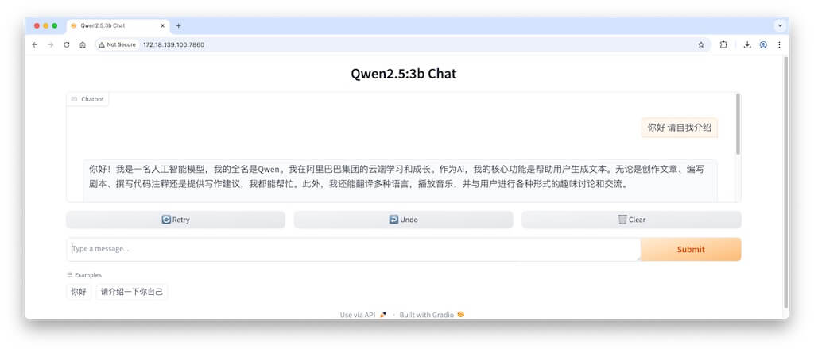
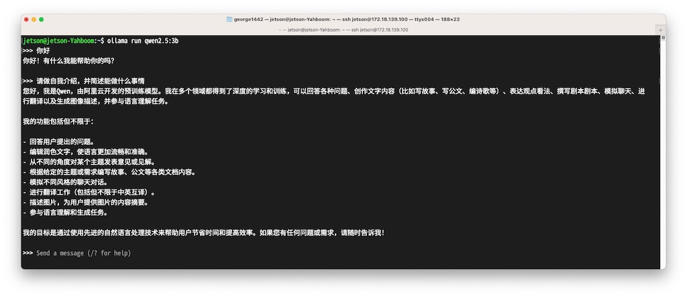
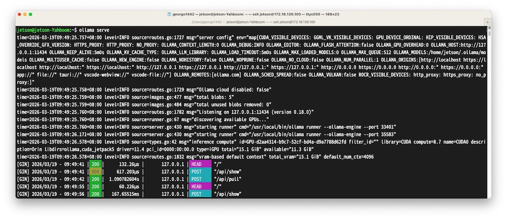

# 大模型Gradio编程-260320
{: .no_toc }
`更新-260320` \| `发布-260319`

本实验演示使用Gradio框架构建基于Web界面的聊天机器人应用，调用OpenAI兼容接口的大模型服务实现智能对话功能。实验要点如下：

- 熟悉Gradio框架的基本使用方法
- 掌握使用gr.ChatInterface构建聊天界面
- 掌握Python requests库发送RESTful API请求
- 了解流式响应（streaming）的处理方式

原理和代码解读，可参考 CG 平台相关说明（对应“61725. 实验4-4：Gradio大模型应用开发”）。本文档主要描述操作相关。

相关信息请参考：[大模型API编程-260320↗](https://tnt.gdvzz.com/ailab/imrobot2603201.html)。

<!--  -->
<details open markdown="block">
  <summary>
    目录
  </summary>
  <!-- {: .text-delta } -->
- TOC
{:toc}
</details>

---

## 实验箱简介

请参考：[大模型API编程-260320 \| 实验箱简介↗](https://tnt.gdvzz.com/ailab/imrobot2603201.html#实验箱简介)。

--- 

## 上电开机

请参考：[大模型API编程-260320 \| 上电开机↗](https://tnt.gdvzz.com/ailab/imrobot2603201.html#上电开机)。

---

## 熟悉 Linux 命令

请参考 [视觉实验-260304 \| 熟悉 Linux 命令↗](https://tnt.gdvzz.com/ailab/imrobot260304.html#%E7%86%9F%E6%82%89-linux-%E5%91%BD%E4%BB%A4)

---

## 启动qwen

1. 新启 **终端 Terminal** #1，在终端中执行以下命令：

    ```bash
    ollama serve          # 启动 API 服务（默认 11434 端口）
    ```

2. 再启 **终端 Terminal** #2，在终端中执行以下命令：

    ```bash
    ollama run qwen2.5:3b # 加载qwen2.5:3b量化模型，没有则下载
    ```

    > Jetson 开发板上若没有 qwen2.5:3b，会从网上下载。下载大约需要几分钟。

更多信息请参考：[大模型API编程-260320 \| 安装 Ollama↗](https://tnt.gdvzz.com/ailab/imrobot2603201.html#安装-ollama)。

---

## 搭建 Python 虚拟环境

**大模型API编程** 实验中的虚拟环境，可以用于本实验。如需要搭建 Python 虚拟环境，请参考：[大模型API编程-260320 \| 搭建 Python 虚拟环境↗](https://tnt.gdvzz.com/ailab/imrobot2603201.html#搭建-python-虚拟环境)。

新建的虚拟环境还需要安装一些 Python 包，主要是：gradio，huggingface_hub。请执行如下命令安装：

```bash
(py0320) jetson@jetson-Yahboom:~/ailab/260320$ pip3 install gradio==4.44.1 huggingface_hub==0.36.2 -i https://mirrors.tuna.tsinghua.edu.cn/pypi/web/simple
```

> 执行 `pip3 install ...` 即可。列出行首是`(py0320)`的命令行提示符是提醒要在虚拟环境中执行。

---

## Gradio简介

Gradio是一个用于构建机器学习Web应用的Python库，能够快速创建交互式的演示界面。它由Hugging Face开发，支持多种输入输出组件，如文本框、滑块、图像上传等，并且可以轻松与各种机器学习模型集成。

Gradio的主要特点是无需编写HTML、CSS或JavaScript即可创建美观的Web界面，支持实时更新和流式输出。其设计理念是让研究者和技术人员能够快速分享和测试他们的模型，只需编写少量Python代码即可部署可交互的Web应用。

Gradio提供了丰富的组件，以下是常用组件介绍：

|组件|	用途|	主要参数|
|---|---|---|
|gr.Textbox|	文本输入|/输出	lines行数、placeholder提示文本|
|gr.Button|	按钮|	variant样式、size大小|
|gr.Slider|	滑动条|	minimum最小值、maximum最大值、step步长|
|gr.Image|	图像输入|/输出	type图像类型、source来源|
|gr.Audio|	音频输入|/输出	type音频类型|
|gr.File|	文件上传|	file_count文件数量|
|gr.Dropdown|	下拉选择|	choices选项列表|

本实验使用 `gr.ChatInterface` 组件来构建聊天机器人应用。1ChatInterface1 是 Gradio 提供的高级组件，专门用于快速创建对话界面，它封装了常见的聊天功能，包括用户输入、历史记录显示、流式输出等。

`gr.ChatInterface` 的主要参数：

- `fn`: 处理用户消息的函数
- `title`: 界面标题
- `examples`: 示例问题列表
- `description`: 描述文本


## 运行样例程序

1. 在 **终端** #3，建议新建目录存放样例程序：

    ```bash
    mkdir -p ~/ailab/260320
    cd ~/ailab/260320
    ```

2. 新建 app.py

    可在 Jetson 开发板上新建 app.py：

    - 在终端执行：`vim app.py`
    - 复制 app.py 样例程序的代码
    - 在终端 vim 窗口中按 `i` 键
    - 鼠标 `右键`，选 `paste`
    - 在终端 vim 窗口中，先按 `esc` 键，再输入 `:wq`，并按 `回车` 键

    新建文件 app.py 完成后，还可以执行 `cat app.py` 看看文件内容。

    还可以用 MobaXterm 软件或 powershell 等 ssh 方式登录 Jetson 开发板，然后新建 app.py。或在本地电脑新建 app.py，再通过 scp 命令复制到 Jetson 开发板指定目录中。此处从略。

3. 在虚拟环境 py0320 中运行样例程序：

    ```bash
    (py0320) jetson@jetson-Yahboom:~/ailab/260320$ python3 app.py
    ```

    > 执行 `python3 app.py` 即可。列出行首是`(py0320)`的命令行提示符是提醒要在虚拟环境中执行。

4. 在开发板上打开里浏览器访问：`127.0.0.1:7860` 或 `localhost:7860`。在 Web 界面中和 Qwen 交流。


**结果样例截图：**

[](./imrobot260320.assets/t4.jpg)
[](./imrobot260320.assets/t2.jpg)
[](./imrobot260320.assets/t1.jpg)

### app.py样例程序

样例程序如下：

```python
import gradio as gr
import requests
import json

API_URL = "http://127.0.0.1:11434/v1/chat/completions"
MODEL = "qwen2.5:3b"
API_KEY = "EMPTY"

def chat(message, history):
    headers = {
        "Content-Type": "application/json",
        "Authorization": f"Bearer {API_KEY}"
    }
    
    messages = [{"role": "user" if msg[0] == "user" else "assistant", "content": msg[1]} for msg in history]
    messages.append({"role": "user", "content": message})
    
    data = {
        "model": MODEL,
        "messages": messages,
        "stream": True
    }
    
    response = requests.post(API_URL, headers=headers, json=data, stream=True)
    
    full_response = ""
    for chunk in response.iter_lines():
        if chunk:
            line = chunk.decode('utf-8')
            if line.startswith('data: '):
                if line.strip() == 'data: [DONE]':
                    break
                try:
                    content = json.loads(line[6:]).get('choices', [{}])[0].get('delta', {}).get('content', '')
                    full_response += content
                    yield full_response
                except:
                    pass

demo = gr.ChatInterface(
    fn=chat,
    title="Qwen2.5:3b Chat",
    examples=["你好", "请介绍一下你自己"]
)

if __name__ == "__main__":
    demo.launch()
```

---

## 实验任务

1. 修改示例代码，可以在局域网访问，比如 `http://172.18.139.100:7860/`。其中 `172.18.139.100` 是 Jetson 开发板的 IP 地址。

2. 修改示例代码，将流式输出改为非流式输出（stream=False），补充非流式输出处理程序，运行程序验证非流式输出的效果。

3. 查阅Gradio官方文档，尝试为聊天界面添加更多功能，如添加系统提示（system_prompt参数）或自定义输入输出组件以及使用Block Diy自己的聊天机器人应用。

---

## 关机&复原&离开

‼️实验结束离开前，请各位同学完成相关事项。详见：[视觉实验-260304 \| 关机&复原&离开↗](https://tnt.gdvzz.com/ailab/imrobot260304.html#%E5%85%B3%E6%9C%BA%E5%A4%8D%E5%8E%9F%E7%A6%BB%E5%BC%80)