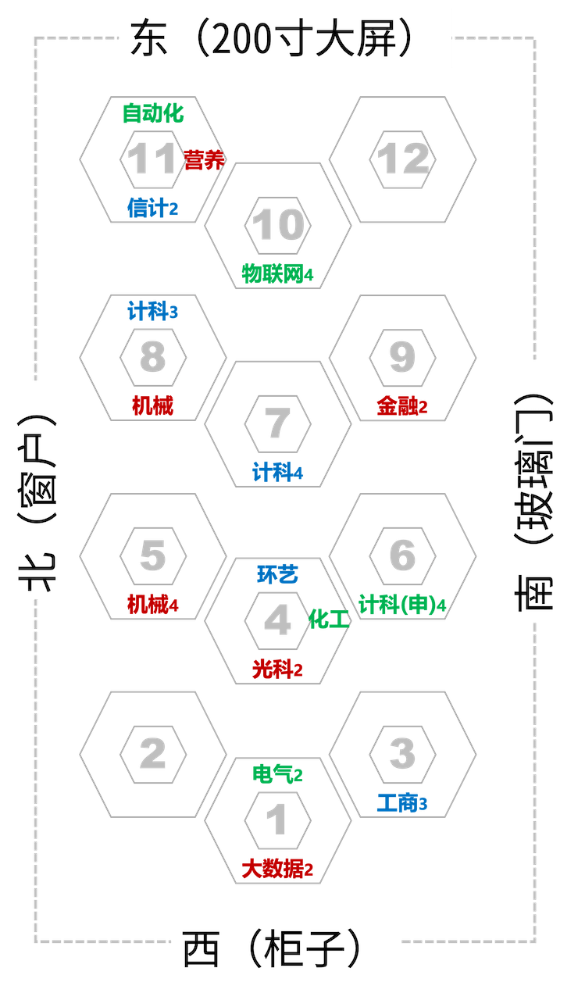
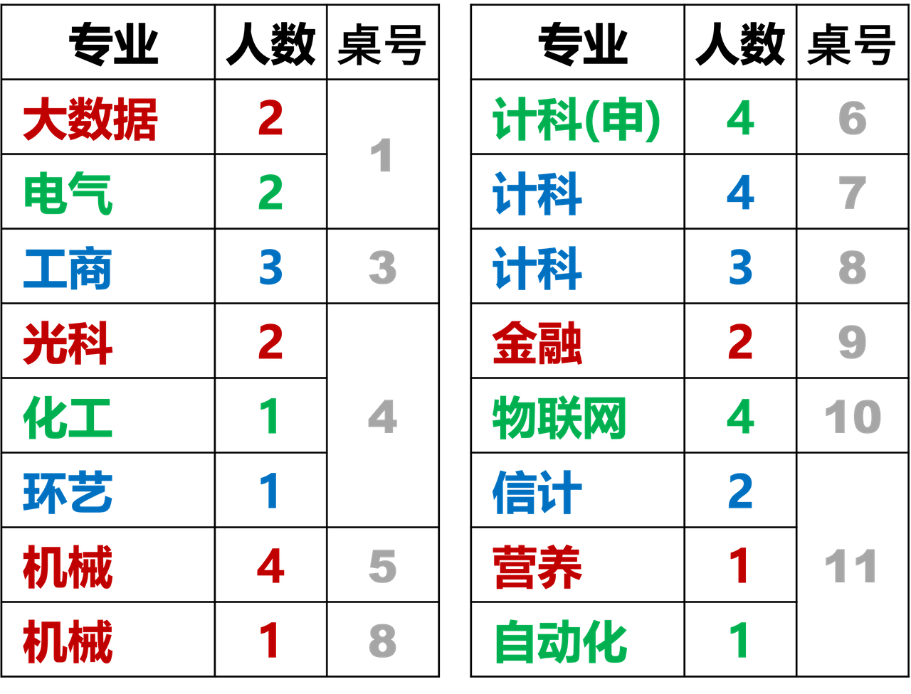

# 人脸手势识别-260526
{: .no_toc }
`更新-260524` \| `发布-260522`

<!--  -->
<details markdown="block">
  <summary>✳️ 目录</summary>
- TOC
{:toc}
</details>

---

## 简介

### 实验内容
<br>
本次实验将使用 Jetson 开发板体验 3 个视觉功能：

- 76285 实验1-3：面部检测 
- 76286 实验1-4：人脸检测
- 76287 实验1-5：手势识别

原理和代码解读，可参考 CG 平台相关说明。

### 开发板
<br>
使用 2 种 Jetson 开发板。一种是带机械臂的，一种是不带的。

和常见的台式机很相似：

- 主机。有个小小机箱，内部是英伟达开发板（Nvidia Jetson）。
- 屏幕。支持 HDMI 接口的屏幕，都可以通过 HDMI 线连接到 Jetson 开发板。
- 鼠标和键盘。常见的鼠标和键盘，通过 USB 连接 Jetson 开发板。
- 操作系统。Ubuntu，Linux 的发行版的一种。（常见操作系统有： Windows、MacOS、Linux，等）
- 机械臂（部分有）。由 Jetson 开发板控制的一个外部设备。本次实验不使用。

### 相关信息
<br>
Jetson 开发板的默认账号密码如下：

- 账号：jetson / 密码：yahboom
- 账号：cg / 密码：cgremote

---

## 对号入座

## 对号入座
<br>
请同学们对号入座。
<details markdown="block">
  <summary>✳️ 座位安排 (按桌子)</summary>

</details>
<details markdown="block">
  <summary>✳️ 座位安排 (按专业)</summary>

</details>

---

## 上电开机
<br>
**Jetson 开发板（带机械臂的）：**

- 配有 1 个电源，一端连 Jetson 开发板，另一端插头插在桌子下面的插座上。
- 桌子下面有个带开关的的立方体插座。按下开关，电源指示灯亮，即表明接通电源。
- 稍等片刻可完成启动。机械臂站立起来，且屏幕显示 Ubuntu 的主界面，就启动完成。

**Jetson开发板：**

- 鼠标、键盘：连接开发板的 **USB** 口
- 屏幕 \| 电源线：连接开发板的 **USB** 口
- 屏幕 \| 视频线：连接开发板的 **视频输出** 口
- 开发板电源线：连接开发板的 **电源** 口
<!--  -->
- 电源线插到桌子下面的插座上。稍等一会显示登录界面。
- 鼠标点击，输入密码：`cgremote`

---

## 连外网
<br>
创建实验用的 Python 虚拟环境，需要开发板能访问互联网（外网）。

**Jetson 开发板（带机械臂的）：**

- 大多已经插网线了 
- 可打开左侧 Dock 栏的 FireFox 浏览器，输入 `www.baidu.com`。如可以访问百度，则表示已连外网。

**Jetson开发板：**

- 大多没有连网线
- 点击屏幕右上角 **喇叭+电源+箭头** 连在一起的区域。（如果连了网线，还有**网络**标志，即 4 个图标连在一起的区域）
- 选择 **WiFi**相关的那行，点开。（WiFi Off，或 WiFi Not Connected，或某个已连接的 WiFi）
- 点击 **Turn On**（如果 WiFi Off）。然后重复上述第1、2 步，点击 **Select Network**，选择要连接 WiFi，输入 WiFi 密码等，就可以连接 WiFi 了。
- 连 `b102`，密码：`b102b102`

---

## 2-创建环境
<br>
在虚拟环境中开展实验，可做到和开发板的其他项目互不影响。

1. **用 conda 创建 Python 3.9 的虚拟环境：**

    ```bash
conda create -n fgh0526 python=3.9
    ```

    > （1）在虚拟环境中开展实验，可做到和开发板的其他项目互不影响。<br>
    > （2）fgh0526 是虚拟环境的名字的样例。<br>


2. **激活刚创建的虚拟环境：**

    ```bash
conda activate fgh0526
    ```

3. **在虚拟环境中安装相关包：**

    ```bash
pip3 install mediapipe==0.10.9 opencv-python==4.12.0.88 numpy==2.0.2
    ```

    > 和 CG 平台上要求的 Python 版本不一致（本文-3.9，CG-3.8），相关包的版本也不完全一样。可尝试参考本文的版本。

✅ 至此 Python 环境准备已完成。如何查看虚拟环境列表、进入/退出、删除虚拟环境，请参考 [Conda指南↗]。

---

## 下载解压样例代码
<br>
将本次实验使用的样例代码，下载解压到 Jetson 开发板上。

1. **下载 zip 压缩包**

    样例代码下载链接如下：
    
    - [76285. 实验1-3：面部检测 - face_mesh.zip](./imrobot260304.assets/face_mesh.zip)
    - [76286. 实验1-4：人脸检测 - haar_detection.zip](./imrobot260304.assets/haar_detection.zip)
    - [76287. 实验1-5：手势识别 - gesture_recognizer.zip](./imrobot260304.assets/gesture_recognizer.zip)
    
    > 样例代码也可从 CG 平台相关链接下载。CG 平台下载的 zip 包的名字是一长串数据字符，可从文件的时间确认哪个是哪个。

2. **创建实验目录**

    ```bash
mkdir ~/fgh0526
    ```

3. **zip 包移到实验目录**

    ```bash
mv ~/Downloads/face_mesh.zip ~/fgh0526 && mv ~/Downloads/haar_detection.zip ~/fgh0526 && mv ~/Downloads/gesture_recognizer.zip ~/fgh0526
    ```

    > 在 Jetson 开发板上通过 Firefox 浏览器下载，默认存放在用户家目录（HOME目录）的 Downloads 子目录下（即 ~/Downloads，~ 表示 HOME 目录。HOME 目录的绝对路径可执行 `echo $HOME` 得到）。按 CG 平台手册建议，先新建子目录，再将样例代码从 Downloads 子目录移动到子目录。

4. **进入实验目录**

    ```bash
cd ~/fgh0526
    ```

5. **解压缩**

    ```bash
unzip face_mesh.zip && unzip haar_detection.zip && unzip gesture_recognizer.zip
    ```

    > 解压缩后，会生成 3 个子目录：face_mesh， gesture_recognizer，haar_detection

---

## 连接USB摄像头
<br>
**Jetson 开发板（带机械臂的）：**

1. 先将机械臂的摄像头的 USB 连接线，从 Jetson 开发板上拔下来。
2. 再把桌子上的单目摄像头的 USB 连接线，插入实验箱的 USB 扩展坞中。也可以直接插在 Jetson 开发板上。
3. 在 Jetson 开发板启动 **终端 Terminal** App，在终端中执行 `cheese` 命令，可在弹出的窗口中看到图像，即表明摄像头能正常工作。

> 也可以用机械臂的摄像头做本次几个实验。但该摄像头固定在机械臂的顶部，不大方便移动而已。

**Jetson 开发板：**

- USB 摄像头：连接开发板的 **USB** 口

---

## 体验视觉功能
<br>
在 Jetson 开发板上启动 **终端 Terminal** App，并激活本实验所需的 Python 虚拟环境。然后可体验以下视觉功能：面部检测，人脸检测，手势识别。

### 面部检测 

1. **确保已激活本次实验所需 Python 虚拟环境**

2. **启动程序**

    进入目录：

    ```bash
cd ~/fgh0526/face_mesh
    ```

    执行程序：

    ```bash
python3 main.py
    ```

    程序启动后会自动打开摄像头，实时检测画面中的人脸，并在窗口中显示检测结果。窗口被分为左右两部分：

    - 左侧窗口: 原始的摄像头画面（已做镜像翻转），并叠加了检测到的人脸轮廓线（绿色线条）和所有468个关键点（红色微小圆点）。左上角实时显示帧率（FPS）。
    - 右侧窗口: 在纯黑背景上只显示人脸网格和关键点，可以更清晰地观察细节。
    - 按 q 键（或 ctrl + c）退出程序。

    更多信息请参考 CG 平台之“76285 实验1-3：面部检测”。

### 人脸检测 

1. **确保已激活本次实验所需 Python 虚拟环境**

2. **启动程序**

    进入目录：

    ```bash
cd ~/fgh0526/haar_detection
    ```

    执行程序：
    
    ```bash
python3 main.py
    ```

    程序启动后会自动打开摄像头，并进入默认的“人脸检测”模式。你可以通过键盘进行交互：

    - 按 f 键: 在三种模式间循环切换：face (仅人脸检测)，eye (仅眼睛检测)，face_eye (同时检测人脸和眼睛)。
    - 按 q 键（或 ctrl + c）退出程序。

    窗口中会实时显示检测结果：

    - 人脸: 会被一个带有装饰性边角的紫色矩形框标出。
    - 眼睛: 会被一个红色的圆形框標出。
    - 左上角: 实时显示当前的FPS（帧率）和检测模式(Mode)。

    更多信息请参考 CG 平台之“76286 实验1-4：人脸检测”。

### 手势识别 

1. **确保已激活本次实验所需 Python 虚拟环境**

2. **启动程序**

    进入目录：

    ```bash
cd ~/fgh0526/gesture_recognizer
    ```

    执行程序：
    
    ```bash
python3 main.py
    ```

    程序启动后会自动打开摄像头，实时检测画面中的单只手并识别其手势。窗口被分为左右两部分：

    - 左侧窗口: 原始的摄像头画面（已做镜像翻转），并叠加了检测到的手部骨架（绿色线条）和关键点（红色圆点）。左上角会实时显示识别出的手势名称（如 "Five", "OK", "Thumb_up"），右上角显示FPS（帧率）。
    - 右侧窗口: 在纯黑背景上只显示手部骨架，方便观察。
    - 按 q 键（或 ctrl + c）退出程序。

    更多信息请参考 CG 平台之“76287 实验1-5：手势识别”。

---

## 关机断电复位离开
<br>
实验结束后，请完成以下事项，再离开实验课。

1. **关机断电**

    开发板要先关机、再断电。🚫 **严谨开机状态直接断电！**

    - 点击屏幕右上角 **电源标志** → power off → power off
    - 观察开发板的散热风扇。风扇停止后，表示已关机。
    <!--  -->
    - **Jetson开发板（带机械臂）**：桌子下面有个带开关的的立方体插座。按下开关，电源指示灯熄灭，即表明断开电源。
    - **Jetson开发板**：拔电源。

2. **归还实验器材，给实验室老师**

    **Jetson开发板（带机械臂）**

    - USB摄像头（每人1个）
    - 借用的其他器材

    **Jetson开发板**

    - 开发板（每人1个）
    - 开发板电源（每人1个）
    - 屏幕（每人1个）
    - 屏幕电源线（每人1个）
    - 键盘+鼠标（每人1套）
    - USB摄像头（每人1个）
    - 借用的其他器材

3. **椅子复位**

- 每个桌子，配套 6 个椅子。请将椅子推到桌子下面。
- 西侧玻璃门的前中后靠墙，各 6 个，共 18 个。请按此数量靠墙摆放。

4. **带齐随身物品**

✅ 上述事项完成后，可离开实验室。

<!--  -->
<span style="font-size:12px; color:#999">THE END</span>

<!--  -->
[Conda指南↗]: https://tnt.gdvzz.com/aikit/condaug.html