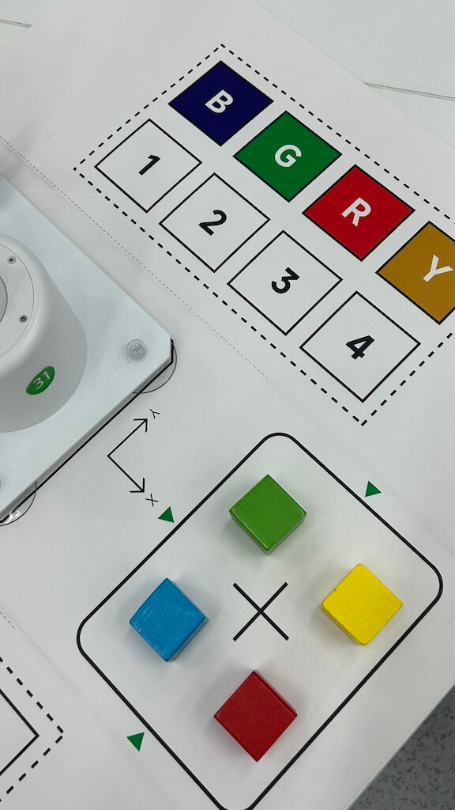
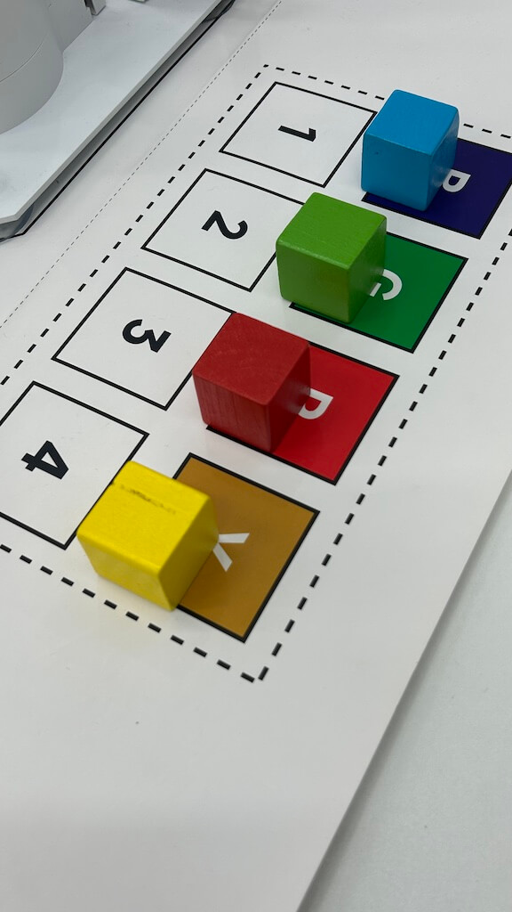
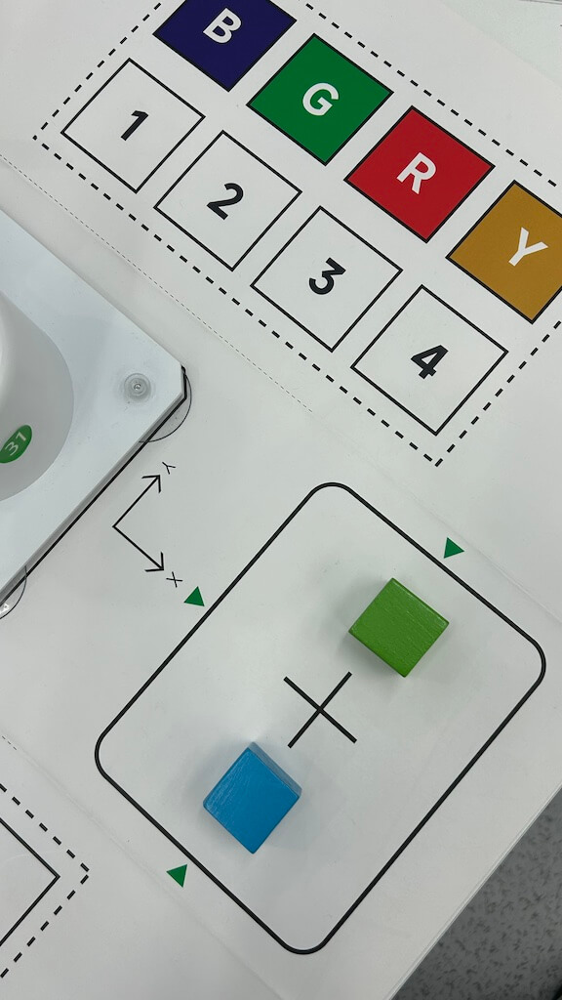
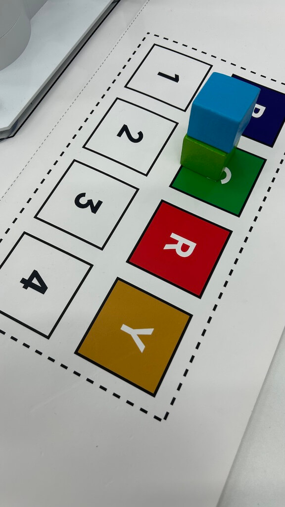
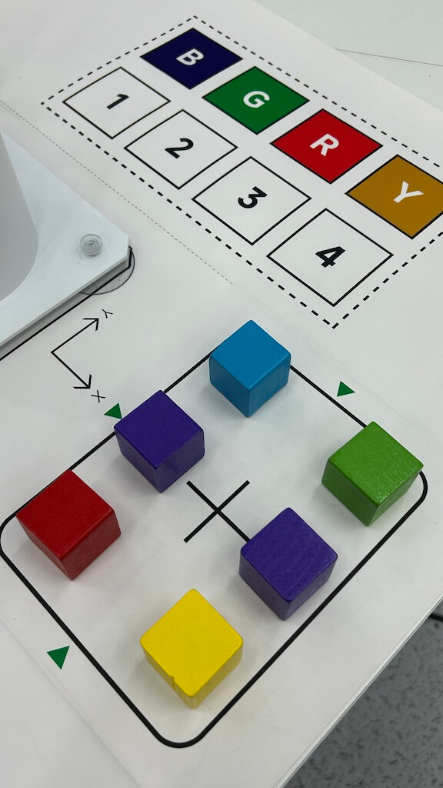
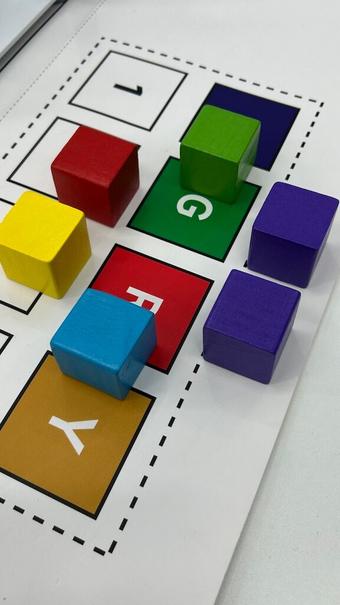

# RobotArm Demo-260529
{: .no_toc }
`update-260529` \| `release-260528`

<!--  -->
<details markdown="block">
  <summary>✳️ TOC</summary>
- TOC
{:toc}
</details>

---

## 1-Launch Demo
<br>
Launch demo with the following steps:

1. **Activate Pythone virtual envierment:**

    ```bash
conda activate viki
    ```

    After activated, information shown on the screen like:

    ```bash
jetson@jetson-Yahboom:~/viki$ conda activate viki
(viki) jetson@jetson-Yahboom:~/viki$ 
    ```

2. **Change diretory:**

    ```bash
cd ~/viki
    ```

3. **Run demo:**

    ```bash
python3 agent.py
    ```

information shown on the screen after demo launched:

    ```bash
    (viki) jetson@jetson-Yahboom:~/viki$ python3 agent.py
    WARNING: Carrier board is not from a Jetson Developer Kit.
    WARNNIG: Jetson.GPIO library has not been verified with this carrier board,
    WARNING: and in fact is unlikely to work correctly.
    <USER>:
    ```

---

## 2-Grab and move cube
<br>
Grab color cube and move to specific position.

1. **Put cubes like:**

    

2. **Grab and move blue cube:**

    ```bash
new task, grab blue cube and move to -80,200
    ```

3. **Grab and move green cube:**

    ```bash
new task, grab green cube and move to 0,200
    ```

4. **Grab and move red cube:**

    ```bash
new task, grab red cube and move to 80,200
    ```

5. **Grab and move yellow cube:**

    ```bash
new task, grab yellow cube and move to 160,200
    ```

Cubes moves to specific position like:



---

## 3-Stack cubes
<br>
Stack two cubes together.

1. **Put cubes like:**

    

2. **Stack cubes together:**

    ```bash
new task, stack two cubes together
    ```

Cubes moves to specific position like:



---

## 4-Put cubes as circle
<br>
Grab and put 6 cubes as a circle.

1. **Put cubes like:**

    

2. **Grab and put as a circle:**

    ```bash
new task, put six cubes as a circle
    ```

Cubes moves to specific position like:



<!--  -->
<span style="font-size:12px; color:#999">THE END</span>