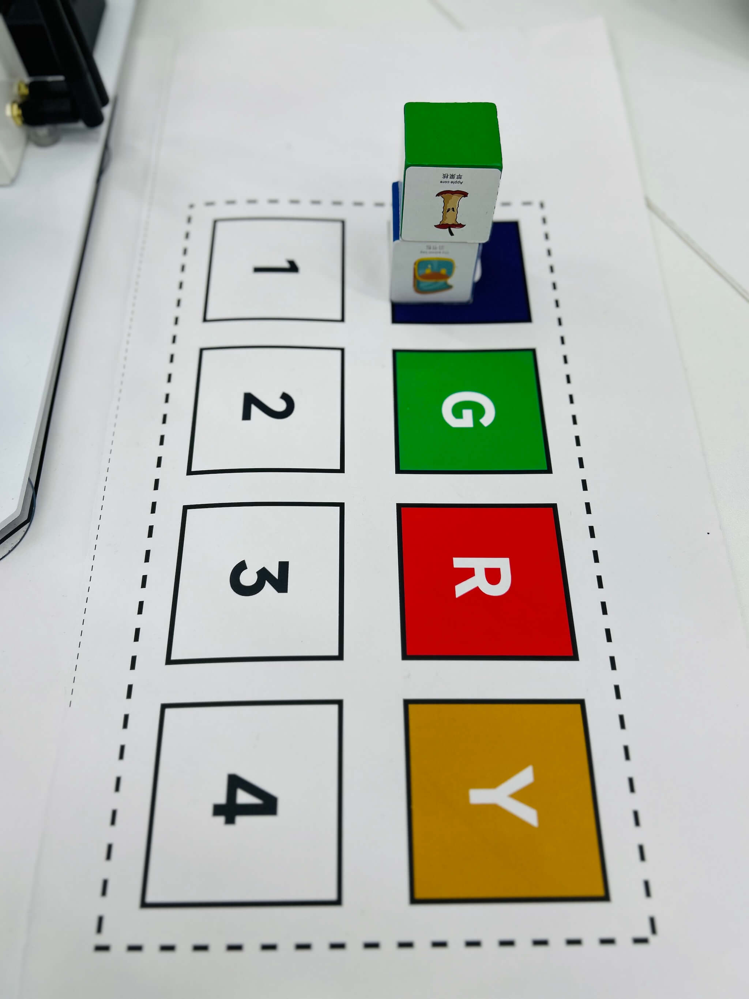

# Play with A Robotic Arm
{: .no_toc }
`Update-260714` \| `Release-260714`

<!--  -->
<details markdown="block">
  <summary>✳️ TOC</summary>
- TOC
{:toc}
</details>

<!--  -->
<!-- <details markdown="block">
  <summary>ℹ️ 更新历史</summary>
<br>

</details> -->


---

## Precautions

🚫 Prohibited: Do not move the robotic arm. Otherwise, it will not be able to make accurate grasping.

🚫 Prohibited: Do not move the robotic arm. Otherwise, the robotic arm may fall through the hexagonal hole of the table and cause damage.

🚫 Prohibited: Do not touch the robotic arm while it is operating. This is to prevent injury to you or damage to the robotic arm.

🚫 Prohibited: Do not play with the paper under the machine. Doing so may damage it.

🚫 Prohibited: Do not peel off the stickers on the building blocks. Otherwise, the robotic arm may not be able to recognize the blocks, causing damage to the blueprints.

🚫 Prohibited: Do not place water cups, bottles, etc., on the table. If you must temporarily place them on the table, make sure the caps are tightly closed. Otherwise, spilled liquids may damage the robotic arm.

✅ Recommendation: If the robotic arm's grasping accuracy is not perfect, you can gently move the block by hand to assist. 

---

## Power on

- The robotic arm is equipped with a power supply, one end of which is connected to the robotic arm, and the other end is plugged into a socket under the table.
- There's a cube-shaped socket with a switch under the table. Pressing the switch will illuminate the power indicator light, indicating that the power is on.
- The startup will be complete in a short while. Once the robotic arm stands up and the screen displays the Ubuntu main interface, the startup is complete.

---

## Startup and Exit Sample Demo
<br>
Open the terminal, then use command line to start the demo and use natural language to complete the task by following the guidelines below.

- **Navigate to the directory containing the sample demo program.**

    ```bash
cd ~/viki
    ```

- **Activate the virtual environment**

    ```bash
conda activate viki
    ```

    After the virtual environment is activated, the command prompt will display the following text at the beginning:

    ```text 
(viki) jetson@jetson-Yahboom:~$
    ```

- **Start the demo**

    ```bash
python3 agent.py
    ```

    The following information is displayed on the screen:

    ```text
    (viki) jetson@jetson-Yahboom:~/viki$ python3 agent.py
    WARNING: Carrier board is not from a Jetson Developer Kit.
    WARNNIG: Jetson.GPIO library has not been verified with this carrier board,
    WARNING: and in fact is unlikely to work correctly.
    <USER>:
    ```

- You can press the `ctrl` + `c` key to exit the sample demo program.


---

## Experience - Grab Colored Blocks

- **First, place the building block to be grasped on the table in front of the robotic arm.**
    
    🚫 There are no blocks in the area outlined by the dashed arrow.
    
    As shown in the image below:

    [](https://tnt.gdvzz.com/aikit/irobots.assets/irobot6.jpg)

- **Grab the BLUE block** (input the following command after the prompt \<USER\>:)

    ```bash
new task, grab blue cube and move to -80,200
    ```

    The following information is displayed on the screen:

    ```text
    <USER>:grab blue cube and move to -80,200
    
    ...
    ...

    #################### <函数执行> ####################
    *************
    [-80, 200]
    Objects arranged successfully
    #################### <函数执行> #################### 
    
    <USER>:
    ```

- **Grab the GREEN block** (input the following command after the prompt \<USER\>:)

    ```bash
new task, grab green cube and move to 0,200
    ```

    The following information is displayed on the screen:

    ```text
    <USER>:grab green cube and move to 0,200
    ...
    ...

    #################### <函数执行> ####################
    *************
    [0, 200]
    Objects arranged successfully
    #################### <函数执行> #################### 

    <USER>:
    ```

After the blue and green blocks are picked up and moved, the result is shown in the image below:

[](https://tnt.gdvzz.com/aikit/irobots.assets/irobot4.jpg)

---

## Experience - Stacking Blocks

- **First, place the <ins>two</ins> blocks to be grasped on the table in front of the robotic arm**

    🚫 There are no blocks in the area outlined by the dashed arrow
    
    As shown in the image below:

    [](https://tnt.gdvzz.com/aikit/irobots.assets/irobot6.jpg)


- **Stack blocks** (input the following command after the prompt \<USER\>:)

    ```bash
stack two cubes together
    ```

    The following information is displayed on the screen:

    ```text
    <USER>:stack two cubes together
    ...
    ...

    #################### <函数执行> ####################
    *************
    [-80, 200]
    Objects arranged successfully
    #################### <函数执行> #################### 
    ...
    #################### <函数执行> ####################
    *************
    [-80, 200]
    Objects arranged successfully
    #################### <函数执行> #################### 

    <USER>:
    ```

The result of stacking two blocks is shown in the image below:

<!-- <a href="./irobots.assets/irobot5.jpg"></a> -->

[](https://tnt.gdvzz.com/aikit/irobots.assets/irobot4.jpg)

---

## Chair restoration

Push the chairs under the table. One table serves six chairs. Place any extra chairs on the left and right sides of the lab.

---

## Take away items

Please take all your personal belongings with you before leaving the lab.

<!--  -->
<span style="font-size:12px; color:#999">THE END</span>

