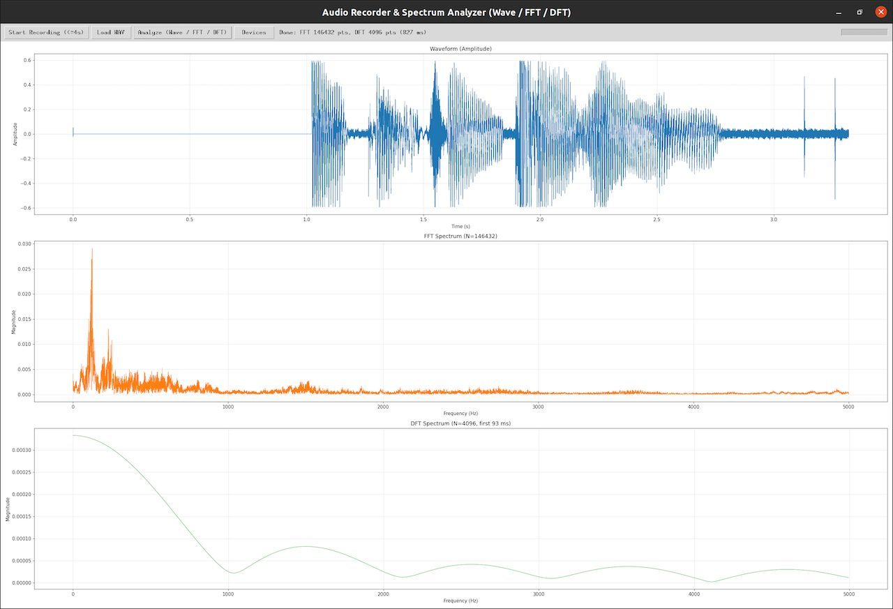

#  搭建NLP Agent-260918
{: .no_toc }
`更新-260918` \| `发布-260918`

<!--  -->
<details markdown="block">
  <summary>✳️ 目录</summary>
- TOC
{:toc}
</details>

---

## 简介

### 实验内容
<br>
本次实验将使用 Jetson 开发板完成以下任务：

- 搭建 NLP Agent
- 看声音的波形

### 开发板
<br>
和常见的台式机很相似：

- 主机。有个小小机箱，内部是英伟达开发板（Nvidia Jetson）。
- 屏幕。支持 HDMI 接口的屏幕，都可以通过 HDMI 线连接到 Jetson 开发板。
- 鼠标和键盘。常见的鼠标和键盘，通过 USB 连接 Jetson 开发板。
- 操作系统。Ubuntu，Linux 的发行版的一种。（常见操作系统有： Windows、MacOS、Linux，等）
- 机械臂。由 Jetson 开发板控制的一个外部设备。本次实验不使用。

### 喇叭麦克风
<br>
圆形的喇叭+麦克风，插在 USB 扩展坞（在底板上有很多 USB 口的黑色长方体），就可以使用。

### 摄像头
<br>
如 Agent 中使用摄像头，可借用机械部顶部的摄像头。或联系实验室老师领取 USB 摄像头。

### 相关信息
<br>
Jetson 开发板的默认账号密码如下：

- 账号：jetson / 密码：yahboom

### Linux 速成
<br>
有需要同学，可先参考：

- [Linux指南↗]
- [机械臂-260801↗](https://tnt.gdvzz.com/misc/viki260801.html) 的相关章节

[🔝](#top)

---

## 操作规范
<br>
敬请按照以下要求操作开发板：

- 🚫 **禁止：水杯、饮料瓶等放在桌上**。以免液体泼洒导致教具等损坏。
    
    可放在实验室四周或地上或书包中。

- 🚫 **禁止：电源线、网线等，从桌子四周穿到桌面上**。以免磕碰导致教具等跌落损坏。

    从桌子中间空洞穿到桌面上。

<!-- - 🚫 **禁止：开机状态直接拔电源断电**。以免开发板意外损坏。

    可先按关机键关机。确认关机后再拔电源断电。 -->

- ✴️ **书包等物品远离开发板**。以免磕碰导致教具等跌落损坏。<br>

    可放在实验室四周或地上。

**‼️未按操作规范使用教具导致损坏的，要照价赔偿‼️**

[🔝](#top)

---

## 任务一：看声音的波形
<br>
用麦克风录制一小段声音，然后查看声音的时域信息（振幅），以及频域信息（FFT 快速傅立叶变换，和 DFT 离散傅立叶变换）。

用大模型 LLM 辅助生成实验代码，并进行必要的调试，完成最终代码。比如：

```text
输出python程序样例，实现：
1、录制语音文件
2、语音文件不超过 4 秒
3、在图形界面上查看该语音文件的波形（振幅）
4、对语音文件做 FFT 变换
5、在图形界面上查看该语音文件的 FFT 波形
6、对语音文件做 DFT 变换
7、在图形界面上查看该语音文件的 DFT 波形
```

### 详细要求
<br>
详细要求如下：

- 输出样例代码
- 波形截屏
- 输出对波形的说明文字

### 1.1-创建环境 
<br>
在虚拟环境中开展实验，可做到和开发板的其他项目互不影响。

**✴️ 以下操作针对样例代码。要运行同学们的代码，可能有所不同。**

1. **用 conda 创建 Python 3.10 的虚拟环境：**

    ```bash
conda create -n nlp9i python=3.10
    ```

    > （1）在虚拟环境中开展实验，可做到和开发板的其他项目互不影响。<br>
    > （2）nlp9i 是虚拟环境的名字的样例。<br>

2. **激活刚创建的虚拟环境：**

    ```bash
conda activate nlp9i
    ```

3. **在虚拟环境中安装相关包：**

    ```bash
pip3 install numpy matplotlib sounddevice scipy
    ```

✅ 至此 Python 环境准备已完成。如何安装，查看、进入/退出、删除虚拟环境，请参考 [Conda指南↗]。

✳️ 虚拟环境，不需要每次重复创建。

### 1.2-看波形
<br>
参考以下步骤，在实验目录中生成代码文件。

1. **创建实验目录**

    ```bash
mkdir ~/nlp9i
    ```

    > 实验目录如已存在，可考虑复用。或删除目录后，重新创建。<br>

2. **进入实验目录**

    ```bash
cd ~/nlp9i
    ```

3. **生成代码文件**
    
    可以有多种方式生成代码文件。比如：

    方法一：用个人电脑的 VSCode 连接开发板。更多信息请参考：[VSCode指南-远程连接↗]

    方法二：将个人电脑上的代码文件，复制到开发板。更多信息请参考：[Linux指南-scp远程复制文件/目录↗]，[MobaXterm指南-传文件↗]

    方法三：用开发板上的 vim 直接编辑生成文件。更多信息请参考：[Linux指南-vim文本编辑↗]

    方法四：用开发板上的 VSCode 生成文件。如果开发板上没有 VSCode，可以装一个，更多信息请参考：[VSCode指南-Jetson安装↗]

    ……

4. **调试代码**

    略

5. **截图**

    Jetson 开发板自带截图 App。可在左边导航栏找到。或者点击左下 **Show Applications**（九宫格图标），输入 “screenshot” 查找

6. **输出对波形的说明文字**

    略

<br>
<details markdown="block">
  <summary>样例程序和样例截图</summary>
[wave.py](./viki260918.assets/wave.py)<br>
<br>
</details>

[🔝](#top)

---

## 搭建agent
<br>
搭建 agent 的方式有很多。比如，可以连云上大模型，也可以连本地大模型。比如，可以使用免费的[商汤科技-日日新↗](https://platform.sensenova.cn/) `5小时内免费调用 500次`

agent 也可以做很多有意思的事情。同学们可自行设计希望完成什么任务的 agent。

以下以连接本地大模型为例，搭建一个agent。

### 详细要求
<br>
详细要求如下：

- 搭建一个agent，能完成一定的功能
- 大模型LLM可以本地部署，或连接云上大模型
- 确保是agent，而不是和大模型LLM的对话
- 加语音播报。可以使用 edge-tts，或其他方式。
- 课后了解：当今agent落地到真实业务场景中，需要解决哪些问题？如何解决的？

### 样例agent简介
<br>
【桌面小管家：Jetson 环境感知 + 生活助手 Agent】

一句话定位：一块放在窗边 / 书桌旁的 “智能小台子”，能看懂环境、听懂自然语言指令，主动给生活小建议。

**适合演示：**

- 素材都是**现实生活**，听众一看就懂，不用脑补抽象业务；
- 既有**感知（真实硬件）**，又有**思考决策（本地 LLM Agent）**，不是纯文本玩具；
- 不用机器人、机械臂，**外设便宜易得**；代码量可控，适合 Demo。

**需要的硬件（Jetson 已有，只加少量低成本配件）**

- Jetson（你现有的，Ollama 跑大模型）
- USB 摄像头（笔记本那种就行，或者 Jetson CSI 相机）
- BME280 温湿度气压传感器（I2C，十几块钱，插 GPIO） -- 写个python程序模拟

**期望功能：**

1. 用户用自然语言在终端发请求，例如：
   - “看看现在房间环境怎么样，给我一点居家建议”
   - “外面光线够不够，要不要开台灯？”
   - “帮我总结一下今天房间里发生了什么”
2. Agent 接收自然语言 → 交给本地 Ollama LLM；
3. LLM**决定要不要调用可用工具**（工具是你预先写好的简单 Python 函数）：
   - `get_temphum()`：读取 BME280，返回温度、湿度、气压
   - `capture_light_estimate()`：调用摄像头拍一张照片，简单取画面平均亮度（**不用训练复杂 YOLO！只算像素亮度统计**，非常轻量；不做人脸识别、物体检测也行，省算力）
   - `take_photo()`：保存当前画面快照
4. 工具把真实数据返回给 LLM；
5. LLM**基于真实、刚采集到的数据**，而不是瞎编，生成口语化生活建议；
6. 结果打印在终端 / OLED 屏上。

### 2.1-创建环境 
<br>
在虚拟环境中开展实验，可做到和开发板的其他项目互不影响。

**✴️ 以下操作针对样例代码。要运行同学们的代码，可能有所不同。**

1. **用 conda 创建 Python 3.10 的虚拟环境：**

    ```bash
conda create -n nlp9i python=3.10
    ```

    > （1）在虚拟环境中开展实验，可做到和开发板的其他项目互不影响。<br>
    > （2）nlp9i 是虚拟环境的名字的样例。<br>
    > （3）如果先做“看声音的波形”，则无需再次创建。<br>
    
2. **激活刚创建的虚拟环境：**

    ```bash
conda activate nlp9i
    ```

3. **在虚拟环境中安装相关包：**

    ```bash
pip3 install ollama opencv-python numpy
    ```

✅ 至此 Python 环境准备已完成。如何安装，查看、进入/退出、删除虚拟环境，请参考 [Conda指南↗]。

✳️ 虚拟环境，不需要每次重复创建。

### 2.2-安装ollama
<br>
如需在本地部署大模型LLM，可使用 ollama （或其他熟悉的框架）。

Ollama是一款面向大语言模型（LLM）的本地化部署与运行时管理框架，支持在个人计算设备或服务器端高效运行开源预训练模型。

其采用容器化架构实现模型的标准化封装与分发，通过动态量化技术优化内存占用，并提供与OpenAI API兼容的RESTful接口，便于集成至现有AI应用生态。

Ollama支持Llama、Qwen、DeepSeek等主流架构的模型仓库管理，具备异构计算资源调度能力，可基于CPU或GPU实现低延迟推理。

该工具广泛应用于数据隐私敏感场景的私有化部署、边缘计算环境下的离线推理及学术研究的模型微调与评测，为大规模语言模型的本地化应用提供了轻量级技术基座。

1. **是否已安装 ollama**

    在开发板**终端APP**中运行以下命令：

    ```bash
ollama --version
    ```

2. **安装ollama**

    可复制到 172.18.145.90 的目录 /home/jetson/ollama-0.34.1 中的安装文件，到自己的 Jetson 开发板，然后安装。

    如何安装，可咨询大模型LLM。

**ollama 常用管理**

```bash
ollama list           # 查看已下载模型
ollama pull <模型名>   # 仅下载不运行
ollama rm <模型名>     # 删除本地模型
ollama ps             # 查看正在运行的模型进程
ollama serve
```

### 2.3-调测agent
<br>
参考以下步骤，在实验目录中生成代码文件。

1. **创建实验目录**

    ```bash
mkdir ~/nlp9i
    ```

    > 实验目录如已存在，可考虑复用。或删除目录后，重新创建。<br>

2. **进入实验目录**

    ```bash
cd ~/nlp9i
    ```

3. **生成代码文件**
    
    可以有多种方式生成代码文件。比如：

    方法一：用个人电脑的 VSCode 连接开发板。更多信息请参考：[VSCode指南-远程连接↗]

    方法二：将个人电脑上的代码文件，复制到开发板。更多信息请参考：[Linux指南-scp远程复制文件/目录↗]，[MobaXterm指南-传文件↗]

    方法三：用开发板上的 vim 直接编辑生成文件。更多信息请参考：[Linux指南-vim文本编辑↗]

    方法四：用开发板上的 VSCode 生成文件。如果开发板上没有 VSCode，可以装一个，更多信息请参考：[VSCode指南-Jetson安装↗]

    ……

4. **调试代码**

    略

<br>
<details markdown="block">
  <summary>样例程序</summary>
[deskagent.py](./viki260918.assets/deskagent.py)<br>
[语音播报-adesk.py](./viki260918.assets/adesk.py)<br>
</details>

[🔝](#top)

## 关机断电复位离开
<br>
实验结束后，请完成以下事项，再离开实验课。

1. **关机断电**

    开发板要先关机、再断电。🚫 **严谨开机状态直接断电！**

    - 点击屏幕右上角 **电源标志** → power off → power off
    - 观察开发板的散热风扇。风扇停止后，表示已关机。
    <!--  -->
    - 桌子下面有个带开关的的立方体插座。按下开关，电源指示灯熄灭，即表明断开电源。

2. **归还实验器材，给实验室老师**

    - 喇叭麦克风
    - 借用的其他器材

3. **椅子复位**

    - 每个桌子，配套 6 个椅子。请将椅子推到桌子下面。

4. **带齐随身物品**

✅ 上述事项完成后，可离开实验室。


<!--  -->
<span style="font-size:12px; color:#999">THE END</span>

<!--  -->
[VSCode指南-远程连接↗]: https://tnt.gdvzz.com/aikit/vscodeug.html#remote-ssh
[Linux指南-scp远程复制文件/目录↗]: https://tnt.gdvzz.com/aikit/linuxug.html#scp
[Linux指南-vim文本编辑↗]: https://tnt.gdvzz.com/aikit/linuxug.html#vim
[MobaXterm指南-传文件↗]: https://tnt.gdvzz.com/aikit/mobaxtermug.html#sftp
[MobaXterm指南-ssh登录↗]: https://tnt.gdvzz.com/aikit/mobaxtermug.html#ssh
[Linux指南↗]: https://tnt.gdvzz.com/aikit/linuxug.html
[VSCode指南-Jetson安装↗]: https://tnt.gdvzz.com/aikit/vscodeug.html#jetson
[Conda指南↗]: https://tnt.gdvzz.com/aikit/condaug.html