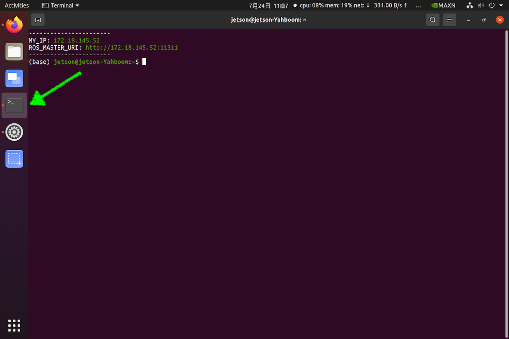
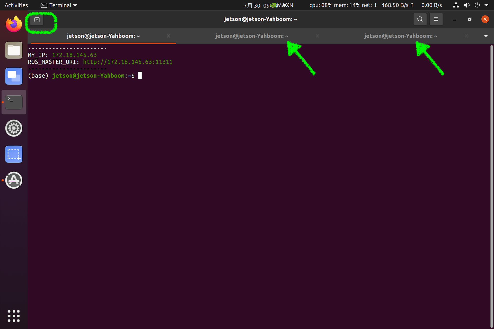
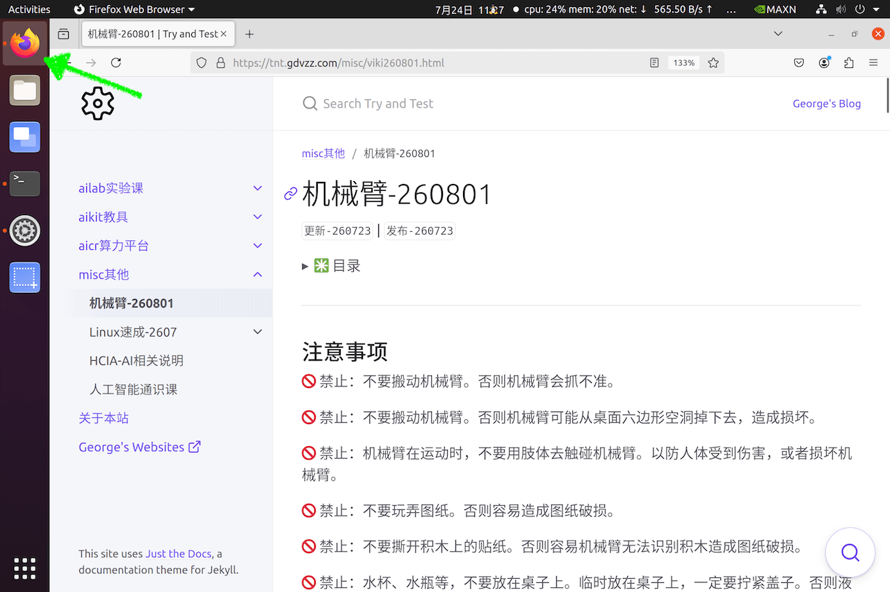
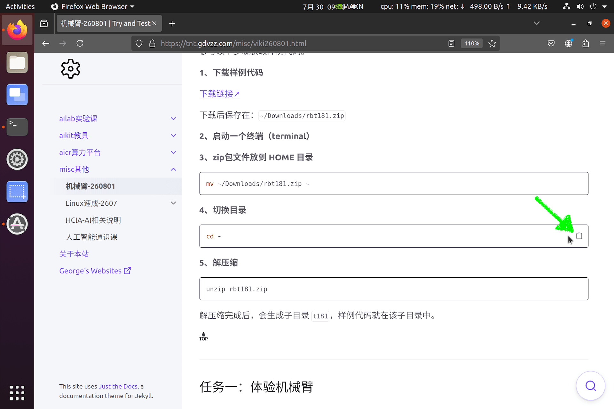
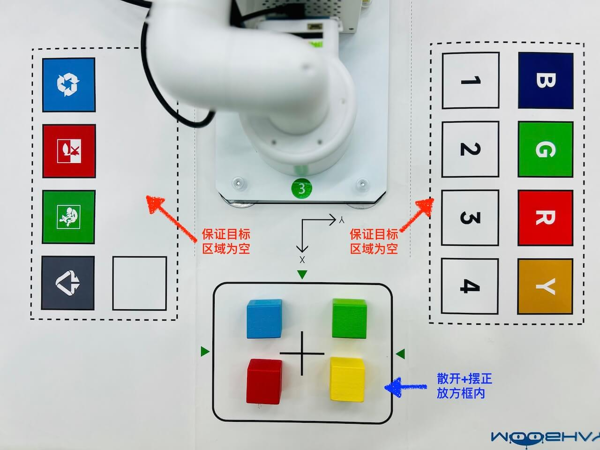
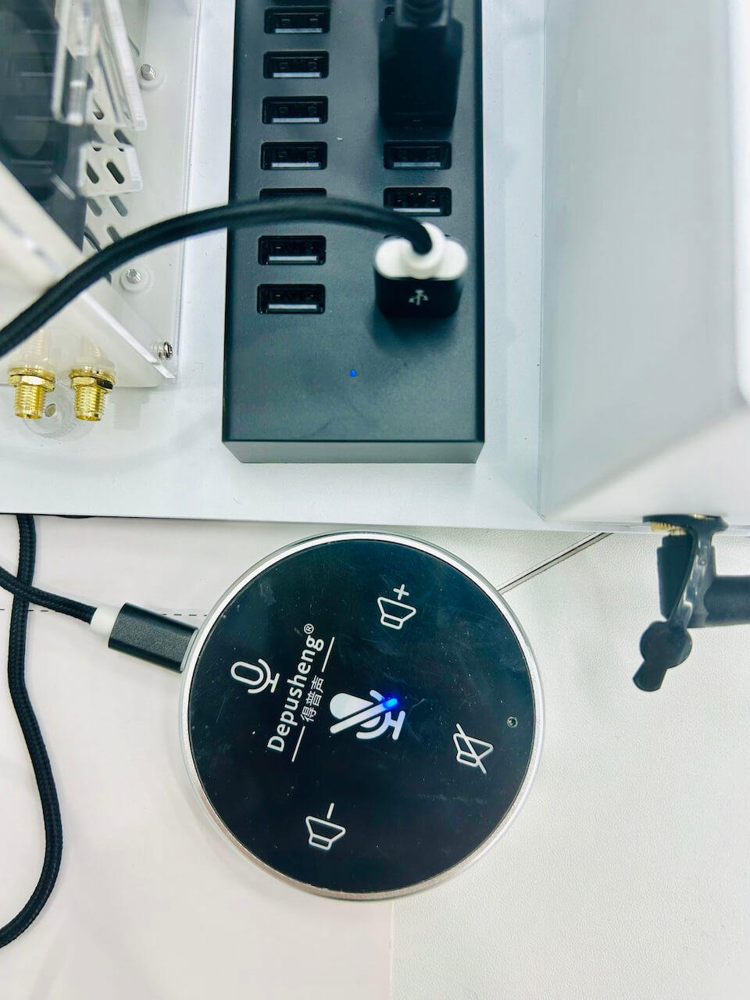
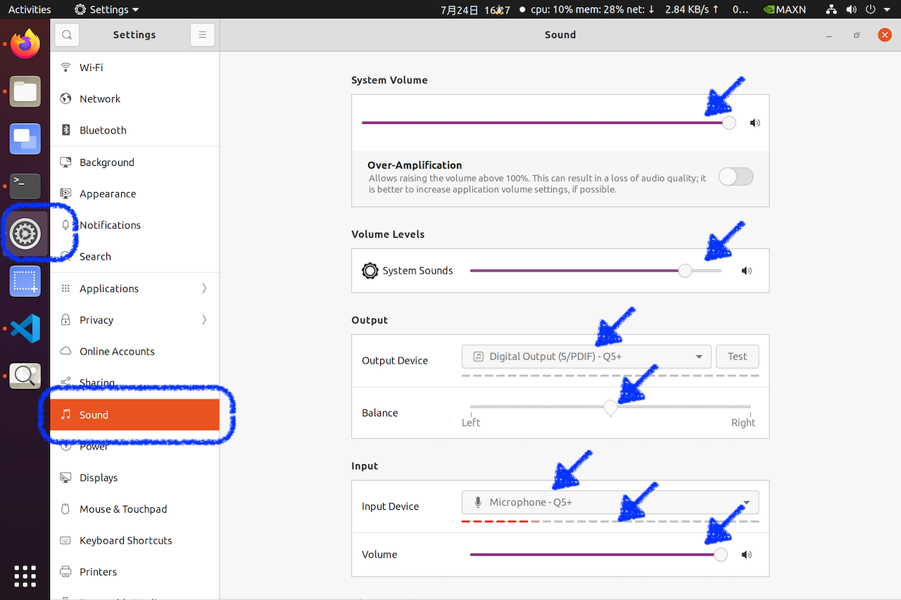
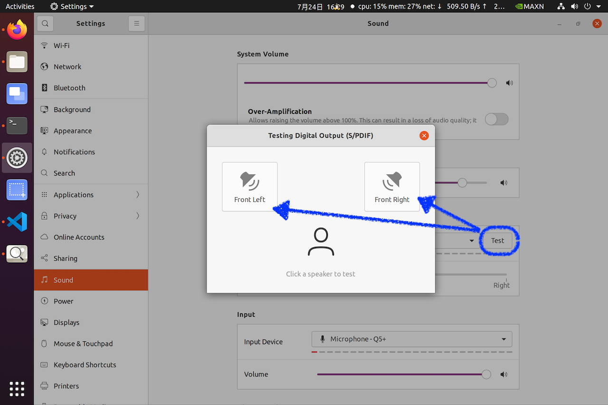
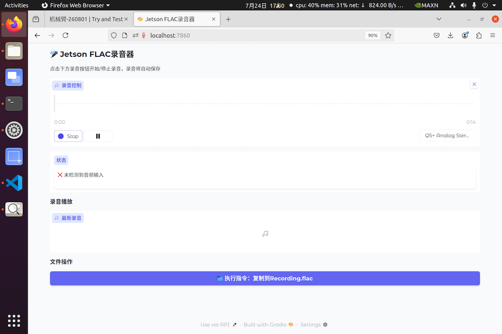
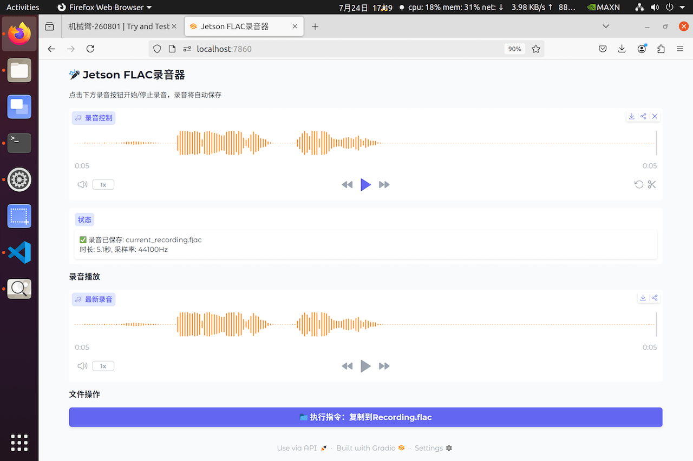

# 机械臂-260801
{: .no_toc }
`更新-260730` \| `发布-260723`

<!--  -->
<details markdown="block">
  <summary>✳️ 目录</summary>
- TOC
{:toc}
</details>

<!--  -->
<!-- <details markdown="block">
  <summary>ℹ️ 更新</summary>
<br>

**260630**
- 新增：[多人同时使用开发板（昇腾）](#多人同时使用开发板昇腾)
- 新增：[多人同时使用开发板（鲲鹏）](#多人同时使用开发板鲲鹏)
</details> -->

---

## 注意事项

- 🚫 不要搬动机械臂。否则机械臂会抓不准。
- 🚫 不要搬动机械臂。否则机械臂可能从桌面六边形空洞掉下去，造成损坏。
- 🚫 机械臂在运动时，不要用肢体去触碰机械臂。以防人体受到伤害，或者损坏机械臂。
- 🚫 不要玩弄图纸。否则容易造成图纸破损。
- 🚫 不要撕开积木上的贴纸。否则容易机械臂无法识别积木造成图纸破损。
- 🚫 不要在桌子上放置水杯和水瓶等。否则液体泼洒出来，会损坏机械臂。

[🔝](#top)

---

## Linux 速成
<br>
用于熟悉 Linux 相关操作。

### 运行APP

<br>

**s1-终端（terminal）**

点击左侧 <ins>终端（terminal）</ins> 图标，可启动终端：

[](./viki260801.assets/s2-terminal.png)

点击 <ins>终端（terminal）</ins> 左上角 + 号，可新建终端窗口：

[](./viki260801.assets/s10-3t.png)

或者，鼠标右键左侧 <ins>终端（terminal）</ins> 图标 → 选 `New Window`，也可以新建终端窗口。

复制粘贴：

- 复制：鼠标选中要复制的内容，然后按 `Ctrl` `Shift` `C`（3个键同时按下）。或者鼠标右键 → `Copy`
- 粘贴：按 `Ctrl` `Shift` `V`（3个键同时按下）。或者鼠标右键 → `Paste`

<br>

**s2-浏览器**

点击左侧 <ins>浏览器</ins> 图标，可启动浏览器：

[](./viki260801.assets/s1-firefox.png)

输入网址 **tnt.gdvzz.com**  → 左侧点击 **misc 其他** → **机械-260801**，找到今天的参考手册。

鼠标移到代码或命令上，右侧出现 **剪贴板** 图标，鼠标点击该图标，可复制代码或命令。

[](./viki260801.assets/s11-cpcode.png)

<br>

**s3-切换APP**

点击左侧的对应的 APP 图标，可在应用之间切换。比如，

- 从 **终端（terminal）** 切换到 **浏览器**
- 从  **浏览器** 切换到 **终端（terminal）**

<br>

**s4-调节字体大小**

- 放大：`Ctrl` `Shift` `+`（3个键同时按下；最后一个键是加号键）
- 缩小：`Ctrl` `-`（2个键同时按下；最后一个键是减号键）
- 恢复：`Ctrl` `0`（2个键同时按下；数字0，不是字母o）

---

### 快捷操作

- ✳️ 按 `tab` 键可补齐文字，加快输入。假定当前目录下有 3 个子目录（face_mesh，gesture_recognizer，haar_detection），输入 `cd ges` 后按 `tab` 键，则补齐为 `cd gesture_recognizer/`。

- ✳️ 按 `esc` 键后，再按 `↑↓箭头` 键，可以找到输入过的命令。不必每次都重复敲命令。

<!-- ### 平铺窗口

### 常用命令 -->

[🔝](#top)

---

## 实验任务
<br>
有3个任务：

- 任务一：体验机械臂。在屏幕上输入自然语言，让机械臂抓取积木并移动到目标位置。
- 任务二：增加语音控制。通过麦克风说话，指挥机械臂抓取积木并移动到目标位置。
- 任务三（可选）：奇思妙想。在屏幕上输入自然语言（或通过麦克风说话），指挥机械臂做更多事情。

[🔝](#top)

---

## 获取样例代码
<br>
参考以下步骤获取样例代码。

**1、下载样例代码**

[下载链接↗](https://pan.jiangnan.edu.cn/link/AA9D55438A44C140A185DA4B88F9A08137)

下载后保存在：`~/Downloads/rbt181.zip`

<br>

**2、启动一个终端（terminal）**

**3、zip包文件放到 HOME 目录**

```bash
mv ~/Downloads/rbt181.zip ~
```

<br>

**4、切换目录**

```bash
cd ~
```

<br>

**5、解压缩**

```bash
unzip rbt181.zip
```

解压缩完成后，会生成子目录 `t181`，样例代码就在该子目录中。

[🔝](#top)

---

## 任务一：体验机械臂

### 1.1-启动机械臂程序
<br>
按以下步骤操作，启动机械臂程序。

**1、启动一个终端（terminal）**

**2、进入机械臂程序的目录**

```bash
cd ~/t181
```

<br>

**3、激活虚拟环境viki**

```bash
conda activate viki
```

在 Python 虚拟环境中运行程序，可以使得程序和机械臂上的其他程序，互不影响。

<br>

**4、运行程序**

```bash
python3 agent.py
```

启动完成后，可看到提示符 `<USER>:`。

---

### 1.2-抓取颜色积木
<br>
在 `<USER>:` 提示符后面，依次输入以下自然语言，让机械臂抓取颜色积木，并放到指定位置。

**1、放置积木，并确保目标区域为空**

[](./viki260801.assets/s4-map.jpg)

<br>

**2、抓取 blue（蓝色）积木**

在 `<USER>:` 提示符后面，输入以下自然语言：

```bash
grab blue cube and move to -60,220,110
```

<br>

**3、抓取 green（绿色）积木**

在 `<USER>:` 提示符后面，输入以下自然语言：

```bash
grab green cube and move to 10,220,110
```

<br>

**4、抓取 red（红色）积木**

在 `<USER>:` 提示符后面，输入以下自然语言：

```bash
grab red cube and move to 80,220,110
```

<br>

**5、抓取 yellow（黄色）积木**

在 `<USER>:` 提示符后面，输入以下自然语言：

```bash
grab yellow cube and move to 140,220,110
```

<br>

✳️ **指令说明：**

以 `grab blue cube and move to -60,220,110` 为例：

- 抓取蓝色方块
- 并移动到 x = -60，y = 220，z = 110 的位置

<br>

✳️ **坐标位置说明：**

- x 和 y 的原点，在机械臂圆柱形底座的中心，大致位于桌面上
- 桌面的 z 的坐标，大致是 110
- xy 的方向：箭头方向，是正方向。（（在机械臂和实线框之间，画有带箭头的 xy 方向）
- z 的方向：桌面朝上的方向，是正方向。
- 上述坐标的单位：mm（毫米）
- 因此（x,y）：（-60,220）≈ 蓝色 B 字母，（-10,220）≈ 绿色 G 字母，（80,220）≈ 红色 R 字母，（140,220）≈ 黄色 Y 字母

<br>

✳️ **调整偏移：**

教学用机械臂，相比工业用机械臂，精度要低一些，因此有时抓得不是很准。可通过修改 `~/t181/config.json`（如下所示） 的 x y z 的偏移值，让机械臂抓得准确些。

可用软件 VSCode 修改，或求助老师。

```yml
{
    "points_pixel": [
        [320,220],
        [590,430],
        [72,31],
        [590,26]
    ],
    "points_arm": [
        [210,0],
        [140, -80],
        [280,80],
        [280,-80]
    ],
    "x": -8,
    "y": -5,
    "z": -5,
    "voice":false,
    "threshold": 110
}
```

<br>

✳️ **样例程序逻辑简介**

1. **指令输入**

    相关文件/模块：agent.py	

    具体动作：用户输入 "grab blue cube and move to -60,220,110"，Agent 解析出需调用工具 grab_object，参数为 blue cube。

2. **拍摄照片**

    相关文件/模块：init.py (GetImage)	
    
    具体工作：调用 OpenCV 驱动摄像头，抓拍当前工作台画面，保存为 captured_image.jpg。
    
3. **视觉识别（找像素）**
	
    相关文件/模块：api.py
    
    具体动作：将图片 Base64 编码 + 文本 "一个blue cube" 发送给大模型。模型返回该物体在图片中的边界框坐标（如 x1,y1,x2,y2）。

4. **坐标转换（物理空间）**

	相关文件/模块：eyeonhand.py

    具体动作：计算边界框中心像素点，代入 pixel_to_arm()，利用 config.json 里的仿射矩阵，得出机械臂坐标系下的 X, Y 坐标。

5. **偏移矫正**
	
    相关文件/模块：tools.py (GrabObject)	
    
    具体动作：从 config.json 读取 x_offset, y_offset, z_offset，对坐标进行微调（例如针对方块大小调整抓取中心点）。

6. **运动执行**
	
    相关文件/模块：pymycobot + init.py	
    
    具体动作：机械臂先移动到上方安全高度，再垂直下降到 z 高度，闭合夹爪（close_gripper），抓取成功。

<br>

<ins>为什么这个设计很巧妙？</ins>

- **无需传统视觉库**：完全绕开了 OpenCV 的颜色阈值、轮廓查找、形状匹配等传统算法。只要大模型能“认出来”，机械臂就能“抓起来”。
- **离线标定，在线计算**：eyeonhand.py 只在程序启动时计算一次仿射矩阵（加载模块时），后续每次抓取只是做一次简单的矩阵乘法，运算极快，几乎无延迟。

---

### 1.3-堆叠积木
<br>
执行以下操作，完成堆叠积木。

**1、放置积木，并确保目标区域为空**

放 3 个积木在机械臂前面的实线方框中。颜色不论，散开放，要摆正。

<br>

**2、堆叠积木**

在 `<USER>:` 提示符后面，输入以下自然语言：

```bash
stack three cubes together
```

✳️ 或者可以堆叠 2 个积木。<br>
✴️ 不建议堆叠 4 个积木。堆叠 4 个积木，有点高。机械臂在摆放第 4 个积木时，会碰倒前 3 个。

---

### 1.4-排成圆圈
<br>
执行以下操作，将积木排成圆圈。

**1、放置积木，并确保目标区域为空**

放 6 个积木在机械臂前面的实线方框中。颜色不论；要摆正；**左右间距大些**，前后间距可小些，确保都在实线方框中。

<br>

**2、排成圆圈**

在 `<USER>:` 提示符后面，输入以下自然语言：

```bash
put cubes as a circle
```

[🔝](#top)

---

## 任务二：增加语音控制

### 2.1-新建录制程序
<br>
执行以下操作，完成新建录制程序。

<!-- - 运行 **VSCode**
- File → New File
- 文件名，输入：`grall.py`
- 保存到实验目录中
- 复制 [样例代码](#样例代码)
- 粘贴到 `grall.py`
- 保存 -->

**1、切换目录**

切换到 **终端（terminal）**，执行：

```bash
cd ~/t181
```

<br>

**2、新建文件**

```bash
vim grall.py
```

<br>

**3、在 <ins>浏览器</ins> 中复制样例代码**

- 点击调转到 [样例代码](#样例代码)
- 鼠标移到样例代码任意处，右上角出现一个小图标。
- 点击小图标，可复制整段代码

<br>

**4、粘贴**

切换到 **终端（terminal）**，执行：

- 按 `i` 键。（进入 `INSERT` 模式）
- 按 `Ctrl` `Shift` `V`（3个键同时按下）。或者鼠标右键 → `Paste` （粘贴从浏览器复制的代码）
- 按 `Esc` 键（在键盘的左上角） （进入 `命令` 模式）
- 输入 `:wq` 后，按 `Enter(回车)` 键 （`w` 写文件即保存，`q` 退出）

---

### 2.2-新建虚拟环境
<br>
执行以下操作，完成新建虚拟环境。

**1、开一个新的终端（terminal）**

切到终端（terminal），点击左上角的 **加号(+)**

<br>

**2、创建虚拟环境 `mike`**

执行以下命令：

```bash
conda create -n mike python=3.10 pip
```

在 Python 虚拟环境中运行程序，可以使得程序和机械臂上的其他程序，互不影响。

<br>

**3、激活虚拟环境 `mike`**

```bash
conda activate mike
```

<br>

**4、安装软件包**

依次执行以下指令：

```bash
sudo apt-get update && sudo apt-get install libsndfile1 libffi-dev -y
```

```bash
pip3 install gradio soundfile
```

---

### 2.3-启动录制程序
<br>
执行以下操作，启动录制程序。

**1、切换目录**

```bash
cd ~/t181
```

<br>

**2、启动程序**

```bash
python3 grall.py
```

启动程序前，确保虚拟环境 `mike` 已激活（即命令行提示符前有 `(mike)` 字样）。如果尚未激活，请执行以下指令先激活：

```bash
conda activate mike
```

---

### 2.4-测试录制程序
<br>
执行以下操作，测试录制程序。

**1、麦克风 + 喇叭 连接USB扩展坞**

[](./viki260801.assets/s5-mike.jpg)

<br>

**2、测试 麦克风 + 喇叭 工作正常**

[](./viki260801.assets/s6-sound1.png)
[](./viki260801.assets/s7-sound2.png)

✳️ 喇叭：要有声音<br>
✳️ 麦克风：说话有 **红色虚线** 显示

<br>

**3、测试录制**

- 切换到 **浏览器**
- 新建标签页
- 地址栏输入：
    
```text
localhost:7860
```

可看到如下界面：

[](./viki260801.assets/s9-rec1.png)
[](./viki260801.assets/s8-rec.png)

<br>

✳️ 界面简介如下：

- 上部“录音控制”。用于麦克风录制声音。
- 中间“状态”。显示相关信息。
- 下部“录音播放”。用于播放录制好的 flac 文件，确保内容是正确的。
- 底部“执行指令”按钮。将录制好的 flac 文件，复制到当前目录的 `Recording.flac`，供机械臂做后续处理。

当在另一个终端（terminal）运行了 agent2（参考 [启动 agent2](#启动agent2)），且确认录制内容是正确时，就可以点击底部按钮 **执行指令：复制到 Recording.flac**，然后就可以语音指挥机械臂做更多事情。

---

### 2.5-启动agent2
<br>
执行以下操作，启动能处理语音的 agent2.py。

**1、切换到机械臂程序的终端（terminal）**

**2、停止 agent.py**

如果程序还在运行（即有 `<USER>:` 提示符），可按 `Ctrl` `C`（2个键同时按下）停止程序并推出。

<br>

**3、切换目录**

```bash
cd ~/t181
```

<br>

**4、运行 agent2**

```bash
python3 agent2.py -v
```

程序启动后，将等待录音文件 `Recording.flac`。

可切回 **浏览器** 的录音界面，对着麦克风录音后，点击底部按钮 **执行指令：复制到 Recording.flac**，发送录音文件给 agent2。

---

### 样例代码
<br>
样例代码以及简要说明，如下：

```python
# grall.py

import gradio as gr
import numpy as np
import soundfile as sf
import shutil
import os

# 固定的文件名
FIXED_FLAC_FILE = "current_recording.flac"
TARGET_FLAC_FILE = "Recording.flac"

def save_and_process_audio(audio):
    """录音完成后自动保存为FLAC文件"""
    if audio is None:
        return "❌ 未检测到音频输入", None
    
    sample_rate, audio_data = audio
    
    try:
        # 保存为固定FLAC文件（覆盖模式）
        sf.write(file=FIXED_FLAC_FILE,
                 data=audio_data,
                 samplerate=sample_rate,
                 format='FLAC',
                 subtype='PCM_16')
        
        duration = len(audio_data) / sample_rate
        message = f"✅ 录音已保存: {FIXED_FLAC_FILE}\n时长: {duration:.1f}秒, 采样率: {sample_rate}Hz"
        
        return message, FIXED_FLAC_FILE
    except Exception as e:
        return f"❌ 保存失败: {str(e)}", None

def copy_to_recording():
    """复制文件到当前目录的Recording.flac"""
    if not os.path.exists(FIXED_FLAC_FILE):
        return f"❌ 找不到 {FIXED_FLAC_FILE}，请先录制音频"
    
    try:
        # 复制文件
        shutil.copy2(FIXED_FLAC_FILE, TARGET_FLAC_FILE)
        
        # 验证复制结果
        if os.path.exists(TARGET_FLAC_FILE):
            file_size = os.path.getsize(TARGET_FLAC_FILE) / 1024
            return f"✅ 复制成功: {TARGET_FLAC_FILE} ({file_size:.1f}KB)"
        else:
            return "❌ 复制失败：目标文件未创建"
    except Exception as e:
        return f"❌ 复制失败: {str(e)}"

# 创建精简界面
with gr.Blocks(title="Jetson FLAC录音器", theme=gr.themes.Soft()) as demo:
    gr.Markdown("## 🎤 Jetson FLAC录音器")
    gr.Markdown("点击下方录音按钮开始/停止录音，录音将自动保存")
    
    # 录音组件
    audio_input = gr.Audio(
        sources="microphone",
        type="numpy",
        label="录音控制",
        format="wav",
        interactive=True
    )
    
    # 状态显示
    status_display = gr.Textbox(label="状态", value="等待录音...", lines=2)
    
    # 播放界面（录音完成后自动显示）
    gr.Markdown("### 录音播放")
    audio_output = gr.Audio(label="最新录音", type="filepath", interactive=False)
    
    # 操作按钮
    gr.Markdown("### 文件操作")
    copy_button = gr.Button("📁 执行指令：复制到Recording.flac", variant="primary", size="lg")
    
    # 设置事件处理
    # 录音完成后自动保存并更新状态
    audio_input.change(
        fn=save_and_process_audio,
        inputs=[audio_input],
        outputs=[status_display, audio_output]
    )
    
    # 复制按钮
    copy_button.click(
        fn=copy_to_recording,
        inputs=None,
        outputs=[status_display]
    )

# 启动应用
if __name__ == "__main__":
    print("启动Jetson FLAC录音器...")
    print(f"录音文件: {FIXED_FLAC_FILE}")
    print(f"目标文件: {TARGET_FLAC_FILE}")
    
    demo.launch(
        server_name="0.0.0.0",
        server_port=7860,
        share=False
    )
```

[🔝](#top)

---

## （可选）任务三：奇思妙想
<br>
同学们有什么奇思妙想，可举手找实验室老师商讨，实验室老师可协助同学完成。

比如：

- 抓取印有鸡蛋壳图案的积木，并移动到 x等于-80，y等于200。
- 抓取印有鱼骨头图案的积木，并移动到 x等于0，y等于200。
- ……

期待同学们提出更多奇思妙想。

[🔝](#top)

---

## 附录
<br>

- 如需要安装中文输入法，请参考：[安装Google拼音↗]
- 如需要安装VSCode，请参考：[安装VSCode-Jetson开发板↗]
- 虚拟环境创建一次即可，无需反复创建。更多信息请参考：[Conda指南↗]

可自行操作，或者实验室老师协助。

[🔝](#top)

---

## 离开
<br>
实验结束后，请完成以下事项，再离开实验课。

1. **椅子复位：** 每个桌子，配套 6 个椅子。请将椅子推到桌子下面。
2. **带齐随身物品**

<!--  -->
<span style="font-size:12px; color:#999">THE END</span>

<!--  -->
[安装Google拼音↗]: https://tnt.gdvzz.com/aikit/viki.html#install-pinyin
[安装VSCode-Jetson开发板↗]: https://tnt.gdvzz.com/aikit/vscodeug.html#jetson
[Conda指南↗]: https://tnt.gdvzz.com/aikit/condaug.html