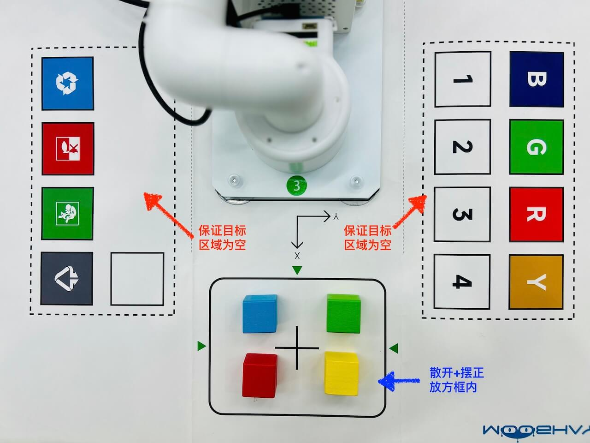

# 机械臂-261006
{: .no_toc }
`更新-260923` \| `发布-260923`

<!--  -->
<details markdown="block">
  <summary>✳️ 目录</summary>
- TOC
{:toc}
</details>

<!--  -->
<!-- <details markdown="block">
  <summary>ℹ️ 更新</summary>
<br>

**260630**
- 新增：[多人同时使用开发板（昇腾）](#多人同时使用开发板昇腾)
- 新增：[多人同时使用开发板（鲲鹏）](#多人同时使用开发板鲲鹏)
</details> -->

---

## 注意事项

- 🚫 不要搬动机械臂。否则机械臂会抓不准。
- 🚫 不要搬动机械臂。否则机械臂可能从桌面六边形空洞掉下去，造成损坏。
- 🚫 机械臂在运动时，不要用肢体去触碰机械臂。以防人体受到伤害，或者损坏机械臂。
- 🚫 不要玩弄图纸。否则容易造成图纸破损。
- 🚫 不要撕开积木上的贴纸。否则容易机械臂无法识别积木造成图纸破损。
- 🚫 不要在桌子上放置水杯和水瓶等。否则液体泼洒出来，会损坏机械臂。

[🔝](#top)


## 体验机械臂

### 1.1-启动机械臂程序
<br>
按以下步骤操作，启动机械臂程序。

**1、启动一个终端（terminal）**

**2、进入机械臂程序的目录**

```bash
cd ~/106v
```

**3、激活虚拟环境viki**

```bash
conda activate viki
```

在 Python 虚拟环境中运行程序，可以使得程序和机械臂上的其他程序，互不影响。

**4、运行程序**

```bash
python3 agent.py
```

启动完成后，可看到提示符 `<USER>:`。

---

### 1.2-抓取颜色积木
<br>
在 `<USER>:` 提示符后面，依次输入以下自然语言，让机械臂抓取颜色积木，并放到指定位置。

**1、放置积木，并确保目标区域为空**

[](./viki260801.assets/s4-map.jpg)

**2、抓取 blue（蓝色）积木**

在 `<USER>:` 提示符后面，输入以下自然语言：

```bash
grab blue cube and move to -60,220,110
```

**3、抓取 green（绿色）积木**

在 `<USER>:` 提示符后面，输入以下自然语言：

```bash
grab green cube and move to 10,220,110
```

**4、抓取 red（红色）积木**

在 `<USER>:` 提示符后面，输入以下自然语言：

```bash
grab red cube and move to 80,220,110
```

**5、抓取 yellow（黄色）积木**

在 `<USER>:` 提示符后面，输入以下自然语言：

```bash
grab yellow cube and move to 140,220,110
```

✳️ **指令说明：**

以 `grab blue cube and move to -60,220,110` 为例：

- 抓取蓝色方块
- 并移动到 x = -60，y = 220，z = 110 的位置

<br>

✳️ **坐标位置说明：**

- x 和 y 的原点，在机械臂圆柱形底座的中心，大致位于桌面上
- 桌面的 z 的坐标，大致是 110
- xy 的方向：箭头方向，是正方向。（（在机械臂和实线框之间，画有带箭头的 xy 方向）
- z 的方向：桌面朝上的方向，是正方向。
- 上述坐标的单位：mm（毫米）
- 因此（x,y）：（-60,220）≈ 蓝色 B 字母，（-10,220）≈ 绿色 G 字母，（80,220）≈ 红色 R 字母，（140,220）≈ 黄色 Y 字母

<br>

✳️ **调整偏移：**

教学用机械臂，相比工业用机械臂，精度要低一些，因此有时抓得不是很准。可通过修改 `~/106v/config.json`（如下所示） 的 x y z 的偏移值，让机械臂抓得准确些。

可用软件 VSCode 修改，或求助老师。

```yml
{
    "points_pixel": [
        [320,220],
        [590,430],
        [72,31],
        [590,26]
    ],
    "points_arm": [
        [210,0],
        [140, -80],
        [280,80],
        [280,-80]
    ],
    "x": -8,
    "y": -5,
    "z": -5,
    "voice":false,
    "threshold": 110
}
```

[🔝](#top)

---

## 离开
<br>
实验结束后，请完成以下事项，再离开实验课。

1. **椅子复位：** 每个桌子，配套 6 个椅子。请将椅子推到桌子下面。
2. **带齐随身物品**

---

## 附录

### 获取样例代码
<br>
在开发板上启动浏览器，参考以下步骤获取样例代码。

**1、下载样例代码**

点击 [下载链接↗](https://pan.jiangnan.edu.cn/link/AAEDE40E2FAA024837ADB3D1AA2804522E)

下载后默认保存在：`~/Downloads/106v.zip`

<br>

**2、启动一个终端（terminal）**

**3、zip包文件放到 HOME 目录**

```bash
mv ~/Downloads/106v.zip ~
```

<br>

**4、切换目录**

```bash
cd ~
```

<br>

**5、解压缩**

```bash
unzip 106v.zip
```

解压缩完成后，会生成子目录 `106v`，样例代码就在该子目录中。

### 搭建Python虚拟环境
<br>
如没有虚拟环境 `viki`，可参考如下步骤搭建。

如果想重新创建虚拟环境，可先删除再创建。

更多信息可参考：[Conda指南↗]

**1、创建 Python 3.9 虚拟环境**

```bash
conda create -n viki python=3.9
```

**2、激活虚拟环境**

```bash
conda activate viki
```

> 虚拟环境激活后，命令行提示符首部有 `(viki)` 字样：`(viki) jetson@jetson-Yahboom:~$ `

**3、安装 Python 包**

```bash
pip3 install openai pyaudio numpy soundfile requests Pillow pymycobot==3.4.9 opencv-python Jetson.GPIO scipy
```

> 机械臂相关的 pymycobot 安装 3.4.9 版本。否则后续运行样例demo会报错。<br>
> 在激活的虚拟环境中安装 Python 包，不要安装到非虚拟环境或其他虚拟环境中。

[🔝](#top)

<!--  -->
<span style="font-size:12px; color:#999">THE END</span>

<!--  -->
[Conda指南↗]: https://tnt.gdvzz.com/aikit/condaug.html
